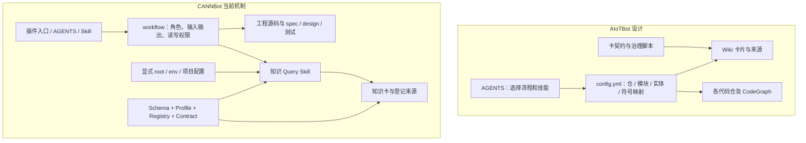
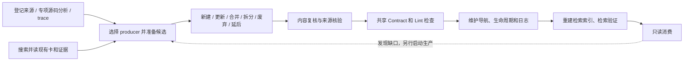

# AIoTBot 与 CANNBot：完整 workspace、资产边界和消费治理对照

日期：2026-09-30。对齐对象是 [主设计 §2.3 的完整 AIoTBot workspace](../架构设计.md#23-落地骨架aiotbot-workspace-与知识仓)，并对照其 §2.1 消费、§2.2 治理和 §3 配置路由。

**2026-10-01 更新**：用户已确定精简外层采用 `main/`、`aiot-skills/`、`aiot-knowledge/`，主设计 v1.3 已落实知识仓内部边界。本文第 1–10 节保留调研与前阶段建议；其中我们的旧 `codebase/docs/skills` 名称按阶段理解，当前路径以 [主设计 §2.3](../架构设计.md#23-落地骨架aiotbot-workspace-与知识仓) 和文末第 11 节为准。

**范围补正：本篇主体比较 CANNBot 工具/知识工作区，不覆盖全部 CANN 产品源码。** 后续已核验用户列出的 27 个组件源码仓，发现 GE 仓内已有关键词/目录到设计文档的路由，Runtime 技能支持有条件使用 CodeGraph，HCCL/HCOMM 有 RFC 流程。详见 [CANN 软件栈源码仓核验](cann-source-repositories-map-2026-09-30.md)；不能把本文核心插件范围的结论扩大成整个 CANN 没有这些能力。

**后续已实际拉取并组装工作区**：[本地工作区入口](../../.scratch/cann-research-20260930/workspace/README.md)、[磁盘扫描生成的真实目录树](../../.scratch/cann-research-20260930/actual-workspace-tree.txt)。初版第 1 节的 registry 树仍是工作流路径合同；实际安装的是 direct 插件 + 完整知识能力，见文末第 9 节。两者不混同。

**按用户确认的实际组成，两边代码侧都是多组件、多代码仓，不能再以“我们集中、他们多仓”区分。** AIoTBot 的 codebase 镜像 main 下各组件仓，职责对应 CANN 的各产品源码仓；中央 skills 对应其公共技能体系。知识侧应比较我们的 `docs/` 整体与整个 `cannbot-knowledge`，再比较 `docs/llmwiki/` 与 `knowledge/`。两边都可以在知识根下并列保存 raw 与知识卡；真正需要对齐的是知识卡、来源、SDD 真源、治理设施和派生索引的边界。当前建议见第 10 节。

这里比较的是“我们的设计蓝图”与“上游当前源码定义及已验证行为”，不把我们的规划当成已经部署，也不把 CANN 工作流声明当成已经完成真实 NPU 开发的现场。

上游冻结版本：`cannbot@918af01713a6ba074512e57ea1a431f1c5702b0e`、`cannbot-knowledge@e7c4942d27aa753cf0a98a1a3edf56aa1e4c8c35`。CANNBot 锁定的 skills 是 `9ae606b331085597f05b67cfa165f2dcd3369a2e`；独立 skills checkout 的 HEAD 是 `94216ba2f0b569cfad22c7794ad99426a07ab7b6`，两者不混用。

## 1. 先看一套完整的 CANNBot 开发环境

以下以官方 `ops-registry-invoke` 为主例，因为它显式串起需求、规格、设计、源码、测试、交付和知识消费。图中 **T 是工具 checkout，W 是一次任务的 WORK_DIR，K 是完整知识根**。这个例子中 `K = W/cannbot-knowledge`；W 的实际位置由调用方指定，并不强制在 T 外或 T 内。

这是从源码重建的完整路径合同，包含运行时才会生成的目录。三个核心仓已克隆到本地，W 的整套算子产物尚未生成。

```text
T = cannbot/                                    工具和方法的版本源
├── script/                                     CLI 安装器、客户端适配和组装
├── harness/workflow-orchestrator/              执行、状态、恢复、规则链接
├── vendor/cannbot-skills/                       Git 子模块锁定的公共技能
├── plugins-community/                          社区插件，各自定义工作区合同
├── plugins-official/ops-direct-invoke/          接入既有工程的另一模式
│   ├── AGENTS.md                               PM 工作入口
│   ├── plugin-sources.json / plugin-install.json
│   └── agents/ / skills/                       workflow 模板在对应 Skill 内
├── plugins-official/model-infer-optimize/       模型优化模式及其流程
└── plugins-official/ops-registry-invoke/        本例启动配置来源
    ├── agents/                                各专业角色和评审角色
    ├── skills/                                插件技能及公共技能链接
    ├── workflows/op-develop.yaml               任务图、I/O、验收、读写权限
    ├── .agents/{agents,skills}                 指向上面的角色和技能
    └── .codex/.claude/.opencode/.pi -> .agents  客户端入口

W = <本次算子任务工作区>/                         工程输入、过程和交付
├── .agents/.codex/... -> <启动目录的配置>       仅链接已存在的配置
├── AGENTS.md / CLAUDE.md                        仅启动目录有此文件时链接；
│                                               本例 registry 插件自身没有
├── .workflow/
│   ├── user_prompt.md                          原始任务输入
│   ├── status.json                             任务状态、恢复信息
│   ├── log.jsonl / sessions/*.jsonl             执行事件、子进程会话
│   └── design-sub-graph.yaml / kernel-sub-graph.yaml
├── orchestrator.log
├── requirements/
│   ├── REQUIREMENTS.md                         本任务的需求结论
│   ├── references/                             用于研究的真实源码仓
│   │   ├── cann/{ops-nn,ops-math,ops-transformer,ops-cv,ops-rand,canndev}/
│   │   ├── ascend/{op-plugin,torchair}/
│   │   └── competitor/{pytorch,tensorflow}/
│   └── research/cann/
│       ├── code_walkthrough.md                 既有实现的调用链分析
│       ├── code_design.md                      既有设计和覆盖分析
│       └── formula.md                          数学语义依据
├── spec/spec.yaml                              机器可检查的本任务规格
├── design/                                     本任务设计，不是 Wiki
│   ├── INDEX.md / Overview.md / Interface.md / InferShapeDtype.md
│   ├── Validation.md / DevView.md / TilingKey.md / TilingData.md
│   ├── BranchRoute.md / HostTiling.md / Kernel.md / API.md / BranchCatalog.md
│   └── branches/DESIGN-BRANCH-<key>.md
├── op/                                         本次真正开发、测试和交付的源码
│   ├── op_host/ / op_kernel/ / op_graph/ / op_api/
│   ├── CMakeLists.txt / build.sh / README.md
│   ├── tests/
│   └── docs/aclnn<OperatorName>.md               随代码交付的使用文档
├── docs -> op/docs                              交付文档入口，不是知识库
├── ops-test-kit/ / dev-package/                  测试工具与构建安装产物
├── golden.py / npu-arch.json / ttk.conf.yaml / xpu-run/
├── code-review/ / docs-consistency/ / perf-optimize/
└── cannbot-knowledge/ = K                       完整知识 checkout
    ├── AGENTS.md / CLAUDE.md                    知识仓工作规则
    ├── knowledge/                              唯一知识正文根 / OKF Bundle
    │   ├── index.md                            总导航
    │   └── {common,ops,model,graph,runtime,contrib}/
    │       └── <按 domain/route/Profile 规则形成的路径>/
    │           ├── index.md                    各级导航
    │           └── <card>.md                   Concept/API/Guide/Runbook 等卡
    ├── governance/
    │   ├── schemas/frontmatter.schema.json     字段类型与形状
    │   ├── schemas/profiles.yaml               路径类别、必选字段、卡类型
    │   ├── schemas/registries.yaml             平台、标签、来源根和版本等
    │   ├── contracts/                          共用的可执行检查逻辑
    │   └── specs/                              知识治理规则说明，非算子 SDD
    ├── .agents/skills/                         query / ingest / lint 和专项 producer
    ├── check.sh / evals/                       门禁、回归和检索评测
    ├── README.md / CONTRIBUTING.md / docs/ / recipes/
    ├── logs/YYYY-MM-DD.md                      知识/规则的维护日志
    ├── cann-docs-raw/                          下载后出现，Git ignored
    │   └── asc-devkit/docs/zh/{api,guide,...}   官方文档归档
    ├── cann-ops-raw/                           恢复后出现，Git ignored
    │   └── ascendc/<repo>/{.objects.git,<commit>/}
    │                                           固定提交源码证据，不是开发分支
    ├── .build/                                某些生产流程的候选、账本和中间件
    └── artifacts/                             派生/审计产物，Git ignored
        ├── indexes/knowledge.sqlite3           卡片词法检索索引
        ├── graphs/                            按需生成的卡片链接图
        └── preflight.md                       W 本次查库摘要；不进入 knowledge/
```

这张图回答了“外层 raw、spec、源码到底在哪”：**spec/design/op 在 W；知识来源 raw 在 K；规则既有 T 的工程流程规则，也有 K 的知识治理规则。知识仓只是整套开发环境中的一个组成部分。**

依据：[工作流的知识预检与只读边界](https://gitcode.com/cann/cannbot/blob/918af01713a6ba074512e57ea1a431f1c5702b0e/plugins-official/ops-registry-invoke/workflows/op-develop.yaml#L8)、[参考源码和需求](https://gitcode.com/cann/cannbot/blob/918af01713a6ba074512e57ea1a431f1c5702b0e/plugins-official/ops-registry-invoke/workflows/op-develop.yaml#L67)、[spec/op/design](https://gitcode.com/cann/cannbot/blob/918af01713a6ba074512e57ea1a431f1c5702b0e/plugins-official/ops-registry-invoke/workflows/op-develop.yaml#L203)、[交付文档](https://gitcode.com/cann/cannbot/blob/918af01713a6ba074512e57ea1a431f1c5702b0e/plugins-official/ops-registry-invoke/workflows/op-develop.yaml#L1022)、[知识仓完整边界与规则](https://gitcode.com/cann/cannbot-knowledge/blob/e7c4942d27aa753cf0a98a1a3edf56aa1e4c8c35/AGENTS.md#L5)。

### 接入已有代码仓时，哪些位置会变化

官方 direct 插件更接近“在现有 WiFi 工程上开发”的场景。它将规则安装到用户工程 P，任务过程放到 P 内的隐藏工作区；源代码留在工程正常位置：

```text
P = <既有业务代码仓>/
├── AGENTS.md                         插件 PM 规则块；原有内容保留
├── .agents/skills/                   已安装技能（以 Codex/OpenCode 为例）
├── <客户端角色目录>/                 已安装角色，如 .codex/agents/*.toml
├── <现有源码、测试、使用文档>/        最终交付的修改位置
└── .cannbot/
    ├── dependencies/ops-direct-invoke/<repo>/
    ├── 环境信息.md / 环境检查/
    └── <task>/workflow<N>/ = W
        ├── workflow<N>.yaml
        ├── 需求分析.md / 环境信息.md
        ├── 0.0-知识搜集.md / 0.1-黑盒测试设计.md / <节点>-报告.md
        └── .workflow/               状态和会话

若另行安装独立知识消费能力：
P/.cannbot/knowledge.env              指向完整知识根 K
P/AGENTS.md                          增加知识路由块
P/.agents/skills/                    链接到 K 中的知识 Skill
K                                   可在 P 外共享，不必每任务复制
```

**独立知识安装是可组合能力，不是声称 direct 默认必然执行此安装。** 模型优化插件还另有 `<model_dir>/agentic/`、`optimization-analysis/<case>/`；故上面的 registry 树是一个完整实例，不是所有插件的统一硬编码布局。

依据：[direct 的工作目录与交付边界](https://gitcode.com/cann/cannbot/blob/918af01713a6ba074512e57ea1a431f1c5702b0e/plugins-official/ops-direct-invoke/skills/ops-direct-invoke/SKILL.md#L16)、[项目知识配置与提示块](https://gitcode.com/cann/cannbot-knowledge/blob/e7c4942d27aa753cf0a98a1a3edf56aa1e4c8c35/install.sh#L364)。更多安装形态见 [workspace 调研](cannbot-workspace-layout-research-2026-09-30.md)。

## 2. 按 AIoTBot 的每一根目录逐项对应

以下沿用主设计的职责，不改动部门已确定的目录。P/W/K/T 均为上文定义的实际路径角色；“未找到”限于本次审计版本与链路。

| AIoTBot 位置/职责 | CANNBot 对应落点 | 对齐结果与差异 |
|---|---|---|
| `AGENTS.md` | P 的插件提示块、知识提示块；K 自身 `AGENTS.md`；W 链接启动规则 | 有同类入口，但不是单一文件统管所有规则；registry 自身无 AGENTS，仍可由 Skill/workflow 启动 |
| `config.yml` | `knowledge.env`、Plugin JSON、知识 Registry、workflow YAML 各管一部分 | 没有完整等价于 `repos/architecture/wiki_entities/symbol_aliases` 的四表总映射 |
| `codebase/device/wifi/{mp1x,mp12,...}`、`drivers/wifi` | 业务源码在 W/op 或 P 的现有源码目录 | 都保留实际源码；CANN 不强制聚合为统一多仓 codebase |
| 各仓 `.codegraph/` | 本次核心链路未找到等价的通用代码图索引层 | CANN 的 knowledge.sqlite3 与链接图均不能代替它 |
| `skills/third-party/common/domain/wifi` | T/vendor 与插件 skills；安装到客户端技能目录；K 的知识 Skill | 有方法/工具层；没有照搬同一部门 common/domain 命名空间 |
| `workflows/common/domain/wifi` | Plugin 的 YAML/Markdown 工作流、harness；direct 模板在其 Skill 内 | 有流程编排、依赖、I/O 和检查；所在层级因插件不同 |
| `hook/common/domain` | 安装器具有可选 hooks/settings 资产机制 | 是否存在取决于插件；不能视为已有统一知识增量 hook。本轮 direct 安装探针没有 hooks |
| `agent/common/domain` | 插件 `agents/`，安装/暴露为客户端角色 | 同类专业分工；目录命名与客户端适配不同 |
| `docs/raw0/` | K 的登记来源资源；W 的原始 prompt、日志和参考资料 | 未找到通用 PDF/DOCX 原件层与 raw1 一一配对的流程 |
| `docs/raw1/` | K/cann-docs-raw 内已有 Markdown 的官方文档；trace 生产中间件等 | 只能对应部分来源职责，不能等同于完整 raw1；保留我们已确定的 raw1 方案 |
| `docs/llmwiki/` 卡片正文 | **K/knowledge/** | 最直接的对应；整个 K 还包含规则、技能、来源和派生物 |
| `llmwiki/entities/` | 无相同实体目录契约；按领域/技术/路径 Profile 放 Concept、Guide、Operator 等 | CANN 不以模块实体页作为与代码架构的一张总映射表 |
| `llmwiki/concepts/` | K/knowledge 下的 concepts、guides 等 Profile | 主题职责部分相同；CANN 的 OKF Concept 是所有卡的总称，不等于 concepts 目录 |
| `llmwiki/runbooks/` | 对应领域/技术下的 runbooks Profile | 都沉淀调试经验；CANN 有专门 trace producer 与证据要求 |
| `llmwiki/index.md` | K/knowledge/index.md 及各层 index.md | 都是导航；CANN index 不参与搜索，不是标准 Query 必须读的第一文件 |
| `llmwiki/glossary.md` | glossaries Profile 和具体领域术语卡 | 有术语内容，未找到等价的唯一根 glossary 与全工程 symbol_aliases 表 |
| `llmwiki/log.md` | **K/logs/YYYY-MM-DD.md** | 维护日志在 Bundle 外，按天记录、当天倒序添加；不同于单个根 log.md |
| `llmwiki/purpose.md` | K/README、docs 中的定位和使用说明 | 对应说明职责，无相同固定文件；不作为领域知识卡 |
| `llmwiki/schema/schema.md` | **K/governance/{schemas,contracts,specs}** | 对应卡契约，但 CANN 将机器规则、执行器、解释文档分开，全部在 Bundle 外 |
| `docs/spec/changes/<change>/` | W/requirements、spec、design、各节点报告与状态 | 都有本次工程工件；CANN 不统一为 proposal/spec/design/tasks.md 套件 |
| `docs/spec/specs/<component>/` | 本次未找到跨插件统一的长期组件规格归档库 | W/spec 不能直接等同于组件 SSOT；K/governance/specs 更不是业务规格库 |
| `docs/dts/`、`docs/issue/` | 任务缺陷/评审报告、知识生产输入；外部 Issue/PR 流程 | 无相同强制本地目录；问题单原件与可复用 Runbook 仍应区分 |
| `docs/graphify/` | 无等价的 Graphify 对照实验目录 | K/artifacts/graphs 是卡片 Markdown 链接投影，不是 Graphify 基线或代码图 |
| `scripts/` | K/check.sh、contracts、Skill scripts、evals；T 的安装和 harness 脚本 | 有治理与执行设施，按所属仓/Skill 分散 |
| 顶层 README、LICENSE、部门命名规范 | 各仓 README、LICENSE、CONTRIBUTING、插件清单和规则 | 有各自规范，不存在同名部门命名空间规范的直接映射 |

**“他们的 knowledge 仓相当于我们的哪个目录”的准确回答是：**

```text
cannbot-knowledge/knowledge/  ≈ 我们 llmwiki 中的领域知识卡与导航
cannbot-knowledge 整仓       ≈ 我们文档来源 + Wiki 卡 + 知识规则 + 知识技能
                              + 治理脚本/回归 + 派生索引这一组职责
整个 CANNBot 开发环境        ≈ 上述知识设施 + 工程源码 + SDD 工件 + Agent/流程执行
```

尤其不能把我们整个 `docs/llmwiki/` 原样搬成 CANN 的 Bundle：**CANN 规定 Bundle 内每个非 index Markdown 都是卡片，log/purpose/schema 等支持文件在外面。** 如果保持我们现有目录，应在自己的卡片枚举和校验器中明确支持文件的排除边界，而非默认目录下所有 Markdown 一起索引。[Bundle 边界](https://gitcode.com/cann/cannbot-knowledge/blob/e7c4942d27aa753cf0a98a1a3edf56aa1e4c8c35/governance/specs/okf.md#L19)、[Profile 清单](https://gitcode.com/cann/cannbot-knowledge/blob/e7c4942d27aa753cf0a98a1a3edf56aa1e4c8c35/governance/schemas/profiles.yaml#L11)、[维护日志规则](https://gitcode.com/cann/cannbot-knowledge/blob/e7c4942d27aa753cf0a98a1a3edf56aa1e4c8c35/AGENTS.md#L89)。

## 3. 规则和路由：都有，但管理对象不同



- **执行规则**：AGENTS、Skill、workflow 说明怎么工作，Plugin 安装清单说明安装哪些能力；客户端 registry 记录装了什么。
- **知识定位**：标准 Query 按 `--knowledge-root > 环境变量 > 祖先 .cannbot/knowledge.env > 脚本所在完整 checkout` 定位 K。registry 工作流直接传入 W/cannbot-knowledge。
- **知识治理**：Schema 定字段类型，Profile 定组合，Registry 定受控值/来源，Contract 定跨字段、路径、链接等检查；多处共用同一实现。
- **业务语义路由**：在本文核心工具/知识链路未发现与我们四表同构、将 Host/Device 架构实体和代码图入口统一注册的机制。后续核实 GE 仓内已有关键词/源码目录→设计文档路由；它属于组件级路由，与统一跨仓配置还需分开比较。卡片 `aliases` 也不等于业务术语到代码符号的全局映射。

W 的规则传播也有明确边界：harness 链接已有客户端目录及 AGENTS/CLAUDE，**不链接整个 `.cannbot`**。W 若在 P 外，不能假定自动继承 P 的知识 env，需显式根/环境变量或有效的完整 Skill 来源路径。

依据：[知识根解析](https://gitcode.com/cann/cannbot-knowledge/blob/e7c4942d27aa753cf0a98a1a3edf56aa1e4c8c35/.agents/skills/knowledge-query/scripts/retrieval/root.py#L118)、[知识入口路由块](https://gitcode.com/cann/cannbot-knowledge/blob/e7c4942d27aa753cf0a98a1a3edf56aa1e4c8c35/install.sh#L445)、[规则链接实现](https://gitcode.com/cann/cannbot/blob/918af01713a6ba074512e57ea1a431f1c5702b0e/harness/workflow-orchestrator/scripts/link_agent_config.py#L21)、[机器规则所有权](https://gitcode.com/cann/cannbot-knowledge/blob/e7c4942d27aa753cf0a98a1a3edf56aa1e4c8c35/AGENTS.md#L29)。

## 4. 消费流程：知识检索与跨仓代码索引分别核验

```text
AIoTBot 设计
提问 → AGENTS + config 路由
     ├→ Wiki：实体页 / index / 可选检索 → 读卡 → sources
     └→ 代码：symbol_aliases / 卡内锚点 → 按仓查询 CodeGraph
           → 跨侧 concept-flow + 路由 → 另一仓源码/配置核验
     → 汇合证据、说明冲突和适用 Target → 回答
     → 可复用发现进入知识生产/复核（建议明确此门禁）

CANNBot 已审计主链路
提问或工程节点 → 确认平台 / 领域 / 技术 → 选择 Query 或 API Skill
     → 定位完整知识根 → discover / SQLite 词法召回
     → 返回候选路径、标题、摘要 → Agent 选卡阅读全文
     → 按需继续读关联卡、固定源码来源、本地 SDK 头文件
     → 形成带证据的回答，或供 requirements / design / 实现使用
     → 本次摘要或 receipt 留在任务/审计区；查询不回写卡片

例外入口：已知唯一卡路径时可直接全文读卡，无需先搜索。
```

其三个“索引”不能混为一谈：

| 设施 | 范围与用途 | 对应我们的哪部分 |
|---|---|---|
| 每级 `index.md` | 可读导航，不入搜索语料 | Wiki 导航 |
| `knowledge.sqlite3` | 一卡一文档的词法倒排；没有切块、embedding 或向量检索 | 我们尚待选择/实现的 Wiki 搜索设施 |
| `artifacts/graphs/` | 按需从最终 Markdown 链接生成 Concept → Concept 的 `links_to` | 只对应文档关系展示；不等于 `.codegraph/` 的符号/调用索引 |

标准 Query 默认只检索 stable；另有显式草稿/历史查询。索引丢失、损坏或识别为过期时停止，由维护/安装流程准备，不静默重建或全库扫描兜底。查询指纹只针对卡片/治理设施，**不能证明卡片引用的源码没有演进，也不能证明结论符合当前 Target**。

因此，双方都强调“检索只给入口，Agent 读全文并补证”；本文的 CANNBot/knowledge 默认链路没有展现我们的“Wiki + 多仓 CodeGraph 双轨汇合”层。后续发现 Runtime 仓技能明确要求存在 `.codegraph/` 时先用 CodeGraph，再用 `rg` 核查。这是组件级可选代码索引的正面证据；不能再概括为 CANN 不使用 CodeGraph，也不能由此认定已经具备同一套跨仓事件路由。

依据：[完整 Query 契约](https://gitcode.com/cann/cannbot-knowledge/blob/e7c4942d27aa753cf0a98a1a3edf56aa1e4c8c35/.agents/skills/knowledge-query/SKILL.md#L8)、[索引构建实现](https://gitcode.com/cann/cannbot-knowledge/blob/e7c4942d27aa753cf0a98a1a3edf56aa1e4c8c35/.agents/skills/knowledge-query/scripts/retrieval/index.py#L216)、[链接图边界](https://gitcode.com/cann/cannbot-knowledge/blob/e7c4942d27aa753cf0a98a1a3edf56aa1e4c8c35/governance/specs/okf.md#L69)。算法与实测详见 [索引调研](cannbot-knowledge-deep-research-2026-09-30.md#5-索引方案具体实现而非名称推测)。

## 5. 治理流程：相近的主线，不同的触发器与事实保证



这张图概括 CANN 的治理职责，并不表示所有来源共用同一自动 pipeline。源码 VV/CV、官方参考摄入、trace Runbook 等分别有自己的生产和审查过程；trace 中间事件、候选、账本等留在 `.build/`，入 Bundle 的是经选择的经验卡。

| 问题 | AIoTBot 主设计 | CANNBot 当前边界 |
|---|---|---|
| 何时更新知识 | 新 raw、代码 merge、配置/spec 变更、调试会话 | 有明确 ingest/专项 producer、增量工作约定；未证明存在通用于所有业务仓的 merge → 语义影响 → Wiki 更新服务 |
| 是否同步代码索引 | 计划按仓 sync CodeGraph | 核心知识链路无同构同步机制；组件侧 Runtime 有条件式 CodeGraph 使用规则 |
| 如何选受影响卡 | 来源锚点 + 配置/概念流 + 内容复查 | 已有来源/摄入账本和维护流程；不等于覆盖 WiFi 宏、事件、OPS 分发的影响传播 |
| 状态与验证 | draft/stable/deprecated，并要求复查 | 相同生命周期，但 `verified` 单独记录真实复核；stable、固定来源、lint 通过均不等于技术结论已验证 |
| 可否问答直接覆盖卡 | 主设计消费图写“结论回填”，门禁需说清 | Query 明确只读；修改走独立生产/维护流程 |
| 原文是否复制 | 主设计要求不复制来源正文 | 一般蒸馏；登记官方 API/Guide 有受控镜像例外，不可扩大到任意 SDD 原件 |
| 日志是否也是知识 | 主设计在 llmwiki 内放 log | 知识维护日志、执行日志、trace 原件分别在 Bundle 外 |
| lint 能证明什么 | 主设计简述“保证无矛盾、不过期” | 可执行结构、路径、元数据、链接等规则；内容正确性、当前适用性仍需复核 |

另有社区插件把经候选审核的内容写入用户本地知识层，写入条目仍标记 `trust=unverified`，其官方知识层保持只读。这不能作为“官方 SDD 工件自动进入 cannbot-knowledge”的证据；路径和代码见 [SDD 调研 §7](cannbot-knowledge-deep-research-2026-09-30.md#7-sdd-的-designspectask-是否进入-llm-wiki)。

治理依据：[Ingest 入口](https://gitcode.com/cann/cannbot-knowledge/blob/e7c4942d27aa753cf0a98a1a3edf56aa1e4c8c35/.agents/skills/knowledge-ingest/SKILL.md)、[状态与来源规则](https://gitcode.com/cann/cannbot-knowledge/blob/e7c4942d27aa753cf0a98a1a3edf56aa1e4c8c35/governance/specs/frontmatter.md#L56)、[查询只读](https://gitcode.com/cann/cannbot-knowledge/blob/e7c4942d27aa753cf0a98a1a3edf56aa1e4c8c35/.agents/skills/knowledge-query/SKILL.md#L71)、[官方镜像例外](https://gitcode.com/cann/cannbot-knowledge/blob/e7c4942d27aa753cf0a98a1a3edf56aa1e4c8c35/AGENTS.md#L51)。

## 6. SDD 的 design/spec/task：到底哪份进入哪一层

| 资产 | CANN registry 的确切落点 | 是否被本流程写成 Wiki 卡 | 与我们的映射 |
|---|---|---|---|
| 原始请求 | W/.workflow/user_prompt.md | 否 | 变更输入 |
| 需求结论 | W/requirements/REQUIREMENTS.md | 否 | docs/spec/changes 下需求材料 |
| 本次规格 | W/spec/spec.yaml | 否 | 变更规格；不是自动汇总的组件 SSOT |
| 本次设计 | W/design/*.md 与 branches/ | 否 | 变更设计 |
| 任务计划 | workflow YAML 的节点和依赖、动态子图 | 否；不要求生成统一 tasks.md | 变更 task 计划 |
| 执行状态/会话 | W/.workflow/status.json、log.jsonl、sessions | 否 | 运行证据，不是规范真源 |
| 最终实现及说明 | W/op 源码、README、op/docs | 否 | codebase 与交付文档；CANN 允许文档随代码 |
| 可复用机制、边界、经验 | 独立 producer/维护流程选择并提炼 | 可形成 K/knowledge 下卡片 | docs/llmwiki 中的派生知识 |
| 知识格式规范 | K/governance/specs | 不属于卡片 | 卡契约说明，绝不是 docs/spec/specs |

**“可以作为知识来源”与“整份工程文件被收录”是两个动作。** 语料中确有引用固定版本 `design.md` 的知识卡，例如 [APACE ReduceScatter Guide](https://gitcode.com/cann/cannbot-knowledge/blob/e7c4942d27aa753cf0a98a1a3edf56aa1e4c8c35/knowledge/ops/ascendc/guides/synchronization/apace_reduce_scatter_schedule_and_credit_audit.md#L1)；它证明设计材料可被选择为来源，不证明每次 SDD 的全部 design/spec/task 自动入库。

对我们应明确：`docs/spec/changes` 保留变更全量工件；`docs/spec/specs` 保留确认后的组件规范真源；Wiki 引用固定版本并提炼可复用知识。规范说明“要求怎样”，源码/构建/实验说明“在该版本和 Target 下实际怎样”；发现不一致时应报告偏差，而不是拿代码自动覆盖规格，或拿规格断言已经实现。

## 7. 当前主设计最值得澄清的六处

下列是基于对照提出的修订建议，本轮没有直接修改主设计，也不调整已经确定的 raw1 流程。

1. **主设计第 37 行“spec 进 wiki”**：应改成“spec 原件留规范真源；经确认版本中的可复用知识可提炼进 Wiki”。否则与第 264–266 行独立 spec SSOT 矛盾。
2. **第 243/280 行“docs 本质就是 LLM-Wiki 图谱仓”**：更准确是“文档与知识工作区”，其中来源、SDD 真源、派生卡和实验产物各有边界。它们可以统一访问，但不应自动混为卡片语料。
3. **第 254–262 行卡片与支持文件同层**：需要明确定义扫描范围，避免 schema、日志、purpose 被当成事实卡；CANN 将这些支持设施放在 Bundle 外。
4. **第 126–129 行“结论回填”**：加上“候选 → 查重/内容复核 → 门禁 → 入库”；只读 query 不应边答边覆盖稳定知识。
5. **第 38/89 行的相关链接与治理保证**：我们排除 related 检索是自己的策略，CANN 普通正文链接随正文索引、按需投影为图；lint 只能检查可执行约束，不能承诺没有矛盾或永不过期。
6. **第 297–327 行四表与第 173 行代码同步**：这是 WiFi 自己的核心实现工作，不能从 CANN 的 env/Registry/SQLite 自动获得。尤其跨 Host/Device 要有消息或事件身份、发送/分发/接收点和配置条件作为证据，映射表只负责定位。

CANN 最能直接借鉴的是“卡片边界明确、规则事实源明确、生产/查询/校验共用 Contract、工程工件与稳定知识分流”。我们仍需自己实现多仓代码索引路由、Target/宏条件、跨侧概念流、组件规格归档和来源变更后的知识复查。

## 8. 本地对应物与验证范围

核心 checkout 位于 `E:/FactumCore/.scratch/cann-research-20260930/`，目录通过本地 `.git/info/exclude` 排除，不纳入 FactumCore Git 内容。可从 [本地审计导航](../../.scratch/cann-research-20260930/README.md) 打开源码、安装探针、查询样例及执行状态样例。

此前已经实际验证：全知识索引构建与检索、知识根解析与项目 env 路由、原 Node 安装器在隔离工程生成并幂等更新入口、direct 模板展开和 `.workflow` 初始化。本轮在这些结果上逐项对照主设计，没有重复执行安装或 NPU 工作流。没有生成真实的整套 registry 算子工程，也没有下载所有业务参考仓；完整树中的运行产物来自上述固定工作流合同。

补充材料：[知识深度调研](cannbot-knowledge-deep-research-2026-09-30.md)、[安装与 workspace 调研](cannbot-workspace-layout-research-2026-09-30.md)、[SDD 逐文件审计](../../.scratch/cann-research-20260930/sdd-audit.md)、[运行目录审计](../../.scratch/cann-research-20260930/workspace-runtime-audit.md)。

## 9. 后续实装：从实际文件而非工作流推导补齐证据

用户要求实际拉一份工作区后，已在 `E:/FactumCore/.scratch/cann-research-20260930/workspace/` 完成 direct 插件的项目安装，并将相邻完整知识仓接入。全过程没有把业务任务未生成的 requirements/design/spec 伪造成完成产物。

实际执行与结果：

- 初始化应用仓锁定的 skills 子模块；用上游 `assemblePlugins` 完整组装 direct 插件，再运行原 Node 安装器，落盘 31 个工程 Skill、3 个 Agent、AGENTS 和插件清单。
- 按插件清单实际拉取 asc-devkit、cann-samples、ops-tensor、cann-bench；ops-tensor 的 tensor_api 子模块也已初始化。各版本见 [机器清单](../../.scratch/cann-research-20260930/local-workspace-manifest.json)。
- 原始 `get_resources.sh --all` 已恢复官方文档归档及 ops-nn、ops-math、ops-cv、ops-transformer 的登记提交，并通过脚本的来源/版本/工作区核验。
- 文档归档实际包含 34,271 个资源文件（其中 23,756 个 Markdown），不仅含 asc-devkit，还包括其他 CANN 组件资料和样例。归档文件集合、可登记引用的来源与最终选入知识卡的集合不是一回事。
- 原始知识 `install.sh` contributor 模式已完成，安装 6 个知识 Skill，写入真实项目 env，并在同一个 AGENTS 中添加知识路由块。
- 从真实工作区运行已安装 Query，不传知识根参数，DataCopyPad/a2 查询返回 3 张卡；首张卡的本地文档来源也已真实恢复。结果见 [查询输出](../../.scratch/cann-research-20260930/workspace/inspection/query-datacopypad.json)。

### 实物检查带来的补充与修正

**设计和规格不仅存在于一次任务工作目录，还会作为长期工程文档保存在具体源码仓中。** 初版已限定“未找到跨插件统一规格归档库”，但没有充分展开这部分实物：

| 实际源码仓 | 源码落点 | 同仓长期文档/规则 |
|---|---|---|
| cann-bench | `src/kernel_eval/`、`src/auto_pipeline/` 等 | `docs/spec/`、`docs/design/`、`docs/guide/`；根部还有 `retry_design.md` |
| asc-devkit | `include/`、`impl/`、`examples/` | `docs/zh/`、`docs/en/`；`.agent/skills/` 是仓内 Agent 技能事实源，另有客户端适配入口 |
| ops-tensor | `include/blaze/`、`include/tensor_api/`、`examples/` | `docs/API/`、QUICKSTART、编码与贡献规范 |
| ops-nn 固定源码快照 | `activation/`、`matmul/`、`norm/` 等算子目录 | 仓级 `docs/`，部分算子目录内同时有 `op_kernel/` 与 `docs/aclnn*.md` |

可直接打开 [cann-bench 文档目录](../../.scratch/cann-research-20260930/workspace/.cannbot/dependencies/ops-direct-invoke/cann-bench/docs/README.md)、[长期接口规范](../../.scratch/cann-research-20260930/workspace/.cannbot/dependencies/ops-direct-invoke/cann-bench/docs/spec/submission_spec.md)、[长期架构设计](../../.scratch/cann-research-20260930/workspace/.cannbot/dependencies/ops-direct-invoke/cann-bench/docs/design/evaluator_design.md)、[asc-devkit 仓内 Agent 规则](../../.scratch/cann-research-20260930/workspace/.cannbot/dependencies/ops-direct-invoke/asc-devkit/.agent/README.md)。这些均为真实上游 checkout 中的文件。

因此与 AIoTBot 的差别更具体：**我们规划把设计/规格集中于外层 docs；CANN 除任务工件外，还保留各源码仓自己的 docs/spec、docs/design、API 文档和 Agent 规则。共享知识仓在这些工程资产之外再提供受治理的知识卡层。** 不能把“没有统一外层 spec 仓”说成“没有长期设计/规格文档”。

### Windows 适配与验证范围

源码安装的目录符号链接因 EPERM 失败，工程 Skill 改走上游正式支持的打包复制模式。知识 Skill 的链接预先用 Windows junction 建立，原始 Bash 安装器识别并接受；没有修改上游执行逻辑。OpenCode 原生 CLI 注册被跳过，未修改用户全局配置。依赖 asc-devkit 的 Markdown 清理按上游脚本完成，会使该新 checkout 中 2,774 个文档出现可追溯的本地改动；其余记录的源码 checkout 在启用 Git longpaths 检查后干净。

此处证明本地文件、完整技能安装、资源恢复、配置路由和知识查询可用；没有证明真实 Agent/NPU 的端到端算子开发已通过。实际工作区是公开组件按官方入口组装的实例，不是获取了华为内部某个开发者的私人 workspace。

## 10. 按多仓实际布局对齐：保留外层结构，明确知识系统内部边界

本节回应用户进一步澄清：main 下的 platform、wifi、features 等组件对应不同源码仓，codebase 是这些仓的工作区呈现；skills 和知识资料也已有自己的组织。以下是职责映射及建议，不声称这些生产目录已在本机 FactumCore 全部部署，不实施移仓或修改主设计。

### 10.1 同层比较，避免把目录、Git 仓和知识 Bundle 混为一层

| 我们的资产 | CANN 对应物 | 判断 |
|---|---|---|
| `codebase/` 中各独立组件仓 | ops-*、hccl、ge、runtime、driver 等 | 多仓组织方式基本同类；索引、版本和路由实现另行比较 |
| 中央 `skills/` | cannbot-skills 及其公共工程能力 | 职责对应；CANN 另有插件内、组件仓内和知识仓内的专用 Skill |
| 外层 `agent/`、`workflows/`、`hook/` 等 | CANNBot 的 Agent、插件、harness/编排能力 | 这是工具和流程层，不属于产品源码或知识正文 |
| `docs/` 作为完整知识与工程资料根 | cannbot-knowledge 整仓的主要职责，加上我们的 SDD/工单管理扩展 | 是最接近的整层对应，不能只拿它对比 `knowledge/` 子目录 |
| `docs/llmwiki/` | cannbot-knowledge/knowledge/ | 受治理的知识正文及导航 |
| `docs/raw0/`、`docs/raw1/` | cannbot-knowledge/cann-docs-raw/ 等来源资源 | 同属知识根下、知识卡根外；CANN 没有严格同构的 raw0→raw1 两阶段，保留现有处理流程 |
| `docs/spec/` | CANN 各工程任务工件及组件长期设计/RFC 的部分职责 | 我们集中存放，这是可保留的额外职责，不是必须塞进 Wiki 的缺口 |

**目录放在同一个父目录，不等于必须同一个 Git 仓；同一个 Git 仓里有多类目录，也不等于必须进入同一个检索集合。** 本轮没有必要为对齐 CANN 先拆仓、合仓或改名。`docs/` 叫 `knowledge/` 只是可选命名，先固定知识根、卡片根和各自规则即可。

CANN 的 `cann-docs-raw/` 与 `cann-ops-raw/` 就在完整知识根内，由 Registry 登记，且 Git 忽略；“他们 raw 在知识仓外，我们在内”不成立。准确说是两边 raw 都应在**知识正文边界外**。[来源登记](https://gitcode.com/cann/cannbot-knowledge/blob/e7c4942d27aa753cf0a98a1a3edf56aa1e4c8c35/governance/schemas/registries.yaml#L85)、[忽略规则](https://gitcode.com/cann/cannbot-knowledge/blob/e7c4942d27aa753cf0a98a1a3edf56aa1e4c8c35/.gitignore#L10)。

### 10.2 建议的最小目录调整

下图是 WiFi 的建议布局，不是照搬上游路径。保留 main 多仓结构、中央技能位置、raw0/raw1、spec 和现有三类知识卡；只把管理资料与检索正文明确分开。

```text
AIoTBot/
├── codebase/                    # 按真实 main 多仓布局挂接，保持原样
├── skills/                      # 公共/领域技能与用户可发现的技能入口
├── workflows/、agent/、hook/     # 保持部门现有组织
├── docs/                        # 知识与工程资料根，不等于知识卡根
│   ├── raw0/                    # 原始资料；现有策展与存储方式保持
│   ├── raw1/                    # 初加工资料；保留与 raw0 的对应关系
│   ├── spec/
│   │   ├── changes/<change>/    # 本次需求、spec、design、tasks、验收等原件
│   │   └── specs/<component>/   # 确认后的组件规格/设计真源
│   ├── llmwiki/                 # 知识正文及导航；供默认知识检索枚举
│   │   ├── entities/
│   │   ├── concepts/
│   │   ├── runbooks/
│   │   ├── glossary.md          # 若保留此路径，必须是符合本仓契约的术语知识卡
│   │   └── index.md             # 导航，排除于知识卡检索
│   ├── governance/             # 从 llmwiki 中移出的契约与治理规则
│   │   ├── schemas/            # 字段、类型、Profile 等机器契约，按实际需要细化
│   │   ├── registries.yaml     # 来源登记与受控值；不复制 workspace 的仓路径表
│   │   └── policy.md           # 规则语义、边界、流程的说明
│   ├── logs/                   # 知识/治理维护记录，不参与事实检索
│   ├── artifacts/              # 可重建的知识索引/图等缓存，通常 Git 忽略
│   ├── README.md               # 定位、使用入口；可承接 purpose 内容
│   ├── dts/、issue/            # 既有工单/总结；按需作为来源，不全量自动变卡
│   └── graphify/               # 对照实验产物，排除于正式知识卡集合
├── scripts/                    # 可保留公共检查入口，调用知识侧同一契约
├── AGENTS.md                    # 外层任务与能力路由，显式指向知识规则
└── config.yml                   # 代码仓/模块/实体/符号及知识根定位
```

这不是增加新的内层 `wiki/`，也不改变已确定的 raw1 流程。若当前暂不移动支持文件，也可先明确枚举白名单（entities/concepts/runbooks + 正式术语卡）并排除日志、schema、purpose；但长期将支持设施移出卡片根更易维护。

需准确区分：glossary 是领域知识可以作为卡；schema/purpose/维护日志是系统设施。文件名不能单独判定角色。CANN 实际枚举 `knowledge/**/*.md` 只排除 `index.md`，任意自由格式 `glossary.md` 或管理日志放进去都会进入卡加载流程，不能期待自动豁免；合法术语 Profile 是 `glossaries → Glossary`。[枚举实现](https://gitcode.com/cann/cannbot-knowledge/blob/e7c4942d27aa753cf0a98a1a3edf56aa1e4c8c35/.agents/skills/knowledge-query/scripts/retrieval/index.py#L216)、[Glossary Profile](https://gitcode.com/cann/cannbot-knowledge/blob/e7c4942d27aa753cf0a98a1a3edf56aa1e4c8c35/governance/schemas/profiles.yaml#L54)。本建议的 `glossary.md` 和三类目录是 WiFi 自定义契约，不宣称能未经适配直接通过 CANN Profile。

### 10.3 Skills 对齐的是职责，知识规则只保留一个规范源

不能简化为“所有 Skill 都在 cannbot-skills，所以我们的知识实现也必须全部搬进中央 skills”。上游知识 query/ingest/lint 的规范源实际在知识仓 `.agents/skills/`；安装到工程的是链接，所依赖的治理契约与实现留在同一个 checkout。[知识 Skill 所有权](https://gitcode.com/cann/cannbot-knowledge/blob/e7c4942d27aa753cf0a98a1a3edf56aa1e4c8c35/AGENTS.md#L79)、[安装与同版本依赖](https://gitcode.com/cann/cannbot-knowledge/blob/e7c4942d27aa753cf0a98a1a3edf56aa1e4c8c35/governance/specs/skills.md#L128)。

对我们建议保留中央技能入口及部门命名空间。知识专用的 ingest/query/lint 实现和契约优先由知识系统一起维护、一起验证，再以链接或薄入口接入中央 skills；可复用的通用工作方法仍在中央 skills。若部门要求实现也集中在 skills 仓，则声明并校验所依赖的知识契约版本，而不是在两个仓复制 schema/受控词表。这里是实现选择，暂不要求新增同名目录或覆盖现有技能。

规则分工应固定：

- 根 `AGENTS.md`：选择任务、流程和能力，指向知识治理契约。
- 根 `config.yml`：仓/模块/实体/符号的定位数据，保留一个路由事实源。
- 知识 `governance/`：什么可成为卡、字段与路径怎么解释、来源怎么核验、生命周期与发布门禁。
- Skill：执行步骤与工具调用；Query/Ingest/Lint 调用同一份契约，不各自定义另一套边界。

### 10.4 SDD 原件、源码快照和知识卡如何流转

```text
raw0 → raw1 ───────────────────────┐
源码 repo@revision + Target ───────┤
spec/changes → 确认归档的 specs ───┼→ 选择可复用事实 → draft 卡
经核验的 issue / 调试轨迹 ────────┘                   ↓
                                             来源/适用条件复核
                                                   + lint
                                                     ↓
                                               stable → 更新索引

消费：路由 → 查知识候选 → 读卡 → 核 sources/规格/代码 → 回答
反馈：发现缺口或冲突 → 进入候选维护流程；Query 不直接改稳定卡
```

`spec/design/tasks` 原件留 `docs/spec/`，其中可复用的机制、决策或经验才提炼进 `llmwiki/`；任务计划本身不因生成就成为稳定知识。组件规范说明应有行为，源码/测试说明该版本的实际行为；有冲突要报告，不能自动用一方覆盖另一方。

不需要因为 CANN 有 `cann-ops-raw/` 就把 WiFi 源码再复制进 `docs/raw*`。保持既有代码不进 raw 的约定，卡片绑定 repo ID、固定 revision、路径/符号、Target/配置；需要旧证据时通过 Git 对象或独立证据快照解析。当前 checkout 与当前 CodeGraph 用于当前实现核查，不能冒充卡片引用的历史版本。`config.yml` 的当前基线变化也不能自动刷新旧卡的核验版本。

### 10.5 真正需要补齐的最小合同

1. **检索集合**：只有正式知识卡参与默认知识检索；导航、raw、spec 原件、治理、日志、实验和缓存各自排除。原始材料仍可在来源补证或专用检索中读取，不是变成不可访问。
2. **来源身份**：来源注册记录可恢复的位置和版本；raw1 保留 raw0 对应关系；开发代码基线与知识引用版本分开记录。CANN 的文档归档会滚动刷新，不能因其 Git 源码固定 commit 就声称所有 raw 都不可变。
3. **唯一规则源**：schema/受控值/关联约束由统一契约定义，三个知识 Skill 及公共检查调用它。
4. **派生索引边界**：`index.md` 是导航，机器检索索引另存 artifacts 并可重建；不把源文件、知识卡和索引视为三份可独立修改的事实源。可以先用现有检索，不要求为了目录对齐立即引入 SQLite 或向量库。
5. **入库门禁**：来源及内容复核与结构 lint 分开；Query 默认只消费符合可用条件的 stable 卡，发现冲突提交维护候选。

主设计若后续按此采纳，最小修订范围是 §1.3 的“spec 进 wiki”措辞、§2.3 的 docs/llmwiki 边界与支持文件位置、§3.2 的契约指针和知识技能所有权说明；不需要重排 codebase、raw0/raw1 或部门技能目录。当前仅更新本调研建议，主设计保持原样。

## 11. 已纳入主设计：aiot-knowledge 边界与 CANN raw 落点

2026-10-01。主设计 v1.3 保留用户精简的 main 子树，将公共/领域工程技能根确定为 aiot-skills，完整知识与工程资料根确定为 aiot-knowledge。知识正文仍名 llmwiki，按 wifi/platform 分类；这属于目标设计，不代表已安装其运行设施。

- llmwiki 只保存受治理的知识卡与导航；原维护日志进入 logs/wifi，purpose 进入本知识仓 docs/wifi，schema 进入共享 governance。正式术语卡保留，Profile 显式处理 WiFi 的三类路径与术语形态。
- governance/schemas、contracts、specs 分别负责机器声明、确定性校验和语义说明。不同领域消费同一套规则，不各自复制 schema。
- 知识 Query/Ingest/Lint 由 aiot-knowledge/.agents/skills 维护，与治理规则同版本；aiot-skills 通过入口引用或链接接入。config.yml 的 knowledge.root 定位完整知识仓，领域作为过滤范围。
- raw0/raw1 保留既有来源流程及存储策略；spec 保存 SDD 原件，dts/issue 保留问题材料，精选内容经过复核成为卡。artifacts 是本地派生/运行产物，evals 是版本化回归定义。

**CANN raw 不在 Git 文件树中，不等于不在完整知识仓的磁盘目录里。** 实际 `cann-docs-raw/`、`cann-ops-raw/` 位于完整 cannbot-knowledge 内并被 Git 忽略。知识仓可安装到业务工程外的 `~/.cannbot/cannbot-knowledge`；临时下载目录在系统临时空间；registry 任务参考在 WORK_DIR/requirements/references；插件依赖在 project/.cannbot/dependencies。主设计已添加逐项对应表和固定版本证据。[文档归档与临时目录](https://gitcode.com/cann/cannbot-knowledge/blob/e7c4942d27aa753cf0a98a1a3edf56aa1e4c8c35/get_resources.sh#L49)、[原始资源 Git 忽略](https://gitcode.com/cann/cannbot-knowledge/blob/e7c4942d27aa753cf0a98a1a3edf56aa1e4c8c35/.gitignore#L10)、[插件依赖落点](https://gitcode.com/cann/cannbot/blob/918af01713a6ba074512e57ea1a431f1c5702b0e/script/bin/cannbot.js#L448)。
