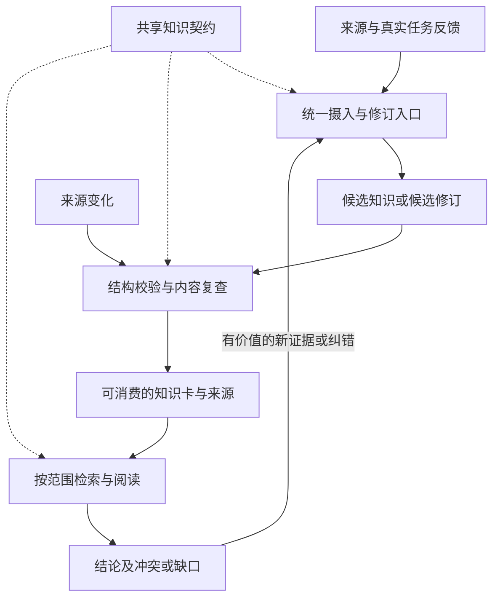

# 对照 CANNBot 的知识工程架构审阅

日期：2026-09-21。状态：架构补充建议，尚未并入主设计。

## 1. 范围与证据

从网上克隆 CANN 社区官方 [cann/cannbot-knowledge](https://gitcode.com/cann/cannbot-knowledge) 仓库，固定提交 `da6d4e6c21336cc2428b88c9b96e0e344d9b5939`。阅读 README、设计原则、治理规范、Query/Ingest 工作流程及部分 Contract 检查源码。搜索结果中的个人分叉未作为结论依据。第三方 Skill 文件仅作为被审阅设计资料，没有安装或执行它们。

对照对象为 [本项目总设计](../架构设计) 的当前 v1.1 工作副本（基于 `2dfb0b0`，包含已确认的修订）。未取得其引用的 01–05 说明书，因此“缺少”仅指主设计未明确该架构契约，不声称未来实现没有这项能力。

只讨论知识资产、知识生产、治理和消费。保留 AIoTBot 的 raw0/raw1 约定、concept-flow + 路由的跨仓机制，以及现有代码工具路线。本轮不评测代码工具、不提出服务部署或字段级实现方案。

官方仓库提供可检查的工程实现和规则，但本轮没有运行它，也没有完成本项目上的效果实验。CANNBot 的当前设计可作参考，不能自动视为最佳实践或性能证明。

## 2. 已对齐的方向

本项目已有知识与 Skill 分工、Markdown 卡、统一入口、ingest/lint/query、来源引用、三态生命周期、按需展开，以及来源变化后的内容复查。这些与 CANNBot 的方向一致。

实体、概念和 runbook 三类足够作为起点；concept-flow 承载跨仓机制适合本项目。无需为了与 CANNBot 目录一致而引入 API、Operator 等全部 Profile，也无需将 WiFi 流程改造成算子模型。

当前主要缺口是跨环节共享的知识契约，而非目录数量或图谱引擎。

## 3. 六项建议

### A. 卡契约应是生产、查询、检查共用的规则源

**现状**：§2.2、§3.1、§3.2 已分别列出 schema、config、AGENTS 和 check.sh，但没有明确同一规则由谁定义、其他环节如何引用；“唯一对齐真源”不等同于完整的知识规则职责划分。

**CANNBot 依据**：[schemas.md 第 5–20 行及执行关系](https://gitcode.com/cann/cannbot-knowledge/blob/da6d4e6c21336cc2428b88c9b96e0e344d9b5939/governance/specs/schemas.md#L5) 区分字段形状、类型组合、受控值和跨文件规则，Ingest、Query、Lint 共用 Contract。正文解释规则，Skill 不维护私有例外。

**建议补入总设计**：知识类型、适用范围、来源、生命周期与关系约定由同一知识契约定义；生产、查询和检查共同遵循。AGENTS/Skill 引用规则，config 负责路由数据，校验逻辑执行规则，不分别产生冲突定义。规则演进同时考虑已有卡片和消费流程的兼容。

这只要求明确职责，不要求首版照搬 JSON Schema、Registry、Contract 的文件拆分。

### B. 把适用范围提升为生产与消费共有的前置条件

**现状**：主设计提到来源 revision、Target 和正文适用条件，但缺少“共通知识、特定条件知识、范围未确认知识”之间的一致语义。术语和模块路由不负责证明结论适用性。

**CANNBot 依据**：[design_principles.md 第 30 行起](https://gitcode.com/cann/cannbot-knowledge/blob/da6d4e6c21336cc2428b88c9b96e0e344d9b5939/docs/design_principles.md#L30)、[frontmatter.md 第 141 行起](https://gitcode.com/cann/cannbot-knowledge/blob/da6d4e6c21336cc2428b88c9b96e0e344d9b5939/governance/specs/frontmatter.md#L141)。它明确区分平台无关与平台未知，跨技术的专属结论不能直接通用。其当前 Query 不按 CANN 版本过滤，版本仍需读卡核对，不应将其描述为全维度自动过滤。

**建议补入总设计**：卡片声明芯片、运行侧、版本与必要的功能条件；只有来源支持的共同行为才可共享。未知范围不视为通用。消费先确认目标范围，保留过滤条件，再读卡核对细粒度限制；差异比较分别取证。目录可以继续使用现有三类，不必复制每芯片一套 Wiki。

### C. 生命周期、来源、复核记录和新鲜度各自表达

**现状**：§3.4 已补来源变化后的待复查，但 stable、存在 sources、谁复核过仍未作为独立概念说明。

**CANNBot 依据**：[design_principles.md 第 55 行起](https://gitcode.com/cann/cannbot-knowledge/blob/da6d4e6c21336cc2428b88c9b96e0e344d9b5939/docs/design_principles.md#L55)、[frontmatter.md 第 56–80 行](https://gitcode.com/cann/cannbot-knowledge/blob/da6d4e6c21336cc2428b88c9b96e0e344d9b5939/governance/specs/frontmatter.md#L56)。status、sources、verified 分离，不能把固定来源或 lint 成功写成虚假的复核事件。

**建议补入总设计**：stable 表示按知识库规则可消费；sources 表示证据入口；复核记录说明真实发生的复核及其范围；待复查反映来源变化后的有效性疑问。它们不能互相推导，消费需共同判断。

不要求所有卡都经人工审批，也不要求复杂评分体系。来源变化复查已经完成的设计不需要重新立项。

### D. 问答回填应重新进入知识生产流程

**现状**：消费动态流程第 ⑧ 步直接写“可复用结论写回对应卡”，没有表达查重、候选修订与治理；与生产侧 draft 起步之间存在旁路。

**CANNBot 依据**：[design_principles.md 第 71–85 行](https://gitcode.com/cann/cannbot-knowledge/blob/da6d4e6c21336cc2428b88c9b96e0e344d9b5939/docs/design_principles.md#L71)、[knowledge-ingest/SKILL.md 第 20 行及通用建卡](https://gitcode.com/cann/cannbot-knowledge/blob/da6d4e6c21336cc2428b88c9b96e0e344d9b5939/.agents/skills/knowledge-ingest/SKILL.md#L20)。只读查询不直接改知识；生产先查重、读来源并创建候选，集中完成收尾。

**建议补入总设计**：消费可提出新增、纠错或补证建议；实际回填进入同一 ingest/修订与治理入口，通过后再成为共享知识。待审修订不提前覆盖已发布正文。原始问答和模型判断不因回填而升级为证据。

同一个 Agent 可以先查询再执行生产任务；区分的是两类操作及其生效条件，不强制增加 Agent 或审批服务。

### E. 生产不只有“新建卡”，还包括融合与保留原始观察

**现状**：已有 producer 路由和增量复查，但未交代新来源如何与现有主题融合、重复知识如何处理，以及调试轨迹的观察证据如何保留。

**CANNBot 依据**：[knowledge-ingest/SKILL.md 第 10 行起](https://gitcode.com/cann/cannbot-knowledge/blob/da6d4e6c21336cc2428b88c9b96e0e344d9b5939/.agents/skills/knowledge-ingest/SKILL.md#L10)、[incremental-sync.md](https://gitcode.com/cann/cannbot-knowledge/blob/da6d4e6c21336cc2428b88c9b96e0e344d9b5939/.agents/skills/knowledge-ingest/references/incremental-sync.md)、[frontmatter.md 第 102 行](https://gitcode.com/cann/cannbot-knowledge/blob/da6d4e6c21336cc2428b88c9b96e0e344d9b5939/governance/specs/frontmatter.md#L102)。它区分首次摄入、增量与升级，允许创建、更新、合并、拆分、废弃、跳过和延期；Runbook 保留触发、探针、原始观察和验证信号。

**建议补入总设计**：摄入以主题/问题为单位，先读旧卡再决定新建或融合；来源冲突保留条件和版本，不能静默覆盖。协议/spec、源码解释、调试轨迹可采用不同生产方法，但共享同一知识契约。没有足够证据时保留缺口。Runbook 要能区分观察、原因推断和验证结果，避免将聊天总结当作原始观测。

这里不改变 raw1，也不要求照搬 CANNBot 的 Runbook 空 sources 例外；原始观察可以引用 AIoTBot 现有归档。

### F. 明确实际知识覆盖、缺口与停止条件

**现状**：已有 index、purpose 和健康度看板，但没有明确“已规划领域”与“实际可回答问题”的区别，零命中及冲突如何回到知识积累也不够明确。

**CANNBot 依据**：[knowledge-query/SKILL.md 第 10–17 行及第 59 行起](https://gitcode.com/cann/cannbot-knowledge/blob/da6d4e6c21336cc2428b88c9b96e0e344d9b5939/.agents/skills/knowledge-query/SKILL.md#L10)、[query-workflows.md 的决策状态](https://gitcode.com/cann/cannbot-knowledge/blob/da6d4e6c21336cc2428b88c9b96e0e344d9b5939/.agents/skills/knowledge-query/references/query-workflows.md)。Query 区分注册分类和真实卡片覆盖；复杂任务区分证据足够、冲突、证据不足和缺口。零命中不等于否定性技术证据。

**建议补入总设计**：消费识别当前问题属于已覆盖、冲突、证据不足还是缺口；缺口形成后续摄入线索。不得为获得结果擅自扩大芯片/版本范围。证据足够、没有新增证据或预算到达时停止。健康度同时观察真实问题覆盖、冲突/待复查积压和缺口关闭，不能只计卡片、链接和门禁通过率。

不要求每次简单问答生成审计文件或照搬 receipt/state/outcome 全套机制。

## 4. 需要澄清但无需扩建的边界

- **知识正文与派生产物**：当前称为“知识图谱”，应明确正文和已确认链接是维护对象，导航、检索索引和可视化的职责不同；派生图不反向改写知识，不以语义相似自动建立技术事实。参考 [CANNBot 图谱规则](https://gitcode.com/cann/cannbot-knowledge/blob/da6d4e6c21336cc2428b88c9b96e0e344d9b5939/governance/specs/schemas.md#L69)。现有 related 不必改名，但需明确它与正文链接谁是关系来源。
- **三类页面的分工与粒度**：entities 放职责入口，concepts 放跨来源综合的机制/规则/flow，runbooks 放诊断处置闭环；同一主题用链接和条件差异组织，不随每次摄入重复建页。先明确这一原则，再按真实内容决定是否增加类型。
- **spec 与 Wiki**：本项目已有 spec SSOT，应继续保留预期行为与解释知识的区别，不能因为 CANNBot 单一 knowledge Bundle 而把 spec 也降为生成知识。该适配属于本项目需求，不是从 CANNBot 推出的能力。

## 5. 建议的架构表达

图中概括的是本项目可采用的职责关系，不表示新服务或已实现的能力。concept-flow 与仓/模块路由继续用于知识到代码的导航。

建议总设计补六项职责约定，具体字段和脚本留给 02/03/04 说明书。优先 A、B、D，其次 C、E、F；三环节、三类知识页和原有目录保持不变。