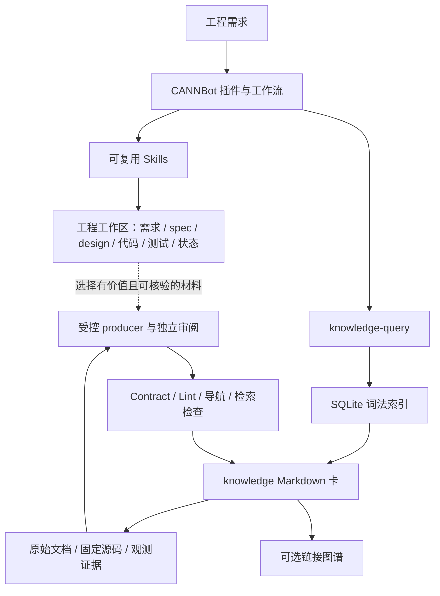

# CANNBot 知识系统深度调研：资产边界、索引、SDD 与 WiFi 适配

后续范围补充：[27 个 CANN 软件组件源码仓核验](cann-source-repositories-map-2026-09-30.md)。本文研究共享知识系统，不能代表所有组件仓自身的文档/Agent 规则；GE 有仓内设计路由，Runtime 技能支持条件式 CodeGraph，组件文档不因此自动进入本知识仓。

调研日期：2026-09-30。性质：上游源码审计与工程建议；不是 WiFi 实现方案的批准版本。

## 1. 核心结论与审计范围

**最值得借鉴的是“工程工件、来源证据、共享知识、工作流、派生索引”各自有明确职责，并由统一 Contract 连接生产、检索和检查。** 不能把它概括成“把所有开发文档放进一个 LLM Wiki，再做向量检索”。

针对本次问题，结论如下：

1. `knowledge/` 是唯一知识正文 Bundle；内容是带 Frontmatter 的 Markdown 卡。源码、原始文档资源、流程、治理、测试、运行日志均有独立位置。
2. 入库有两条内容路线：一般材料按语义实体蒸馏、融合；登记的官方 API/Guide 允许受控转换并保留技术正文。不是所有知识都必须由 LLM 重写，也不是原始材料全量镜像。
3. 索引分三种：提交到 Git 的逐层 `index.md`、可重建的 SQLite 词法倒排索引、按需生成的 Markdown 链接图。查询不依赖向量库，也不使用图谱自动扩展。
4. **没有发现统一的“SDD design/spec/task 产物自动进入官方知识库”链路。** 已审计工作流把需求、规格、设计和任务状态保留在工程工作目录；它们可以成为经过选择、取证和治理后的知识来源。
5. 有运行经验回流，但需区分：社区插件的用户本地知识层，与官方共享知识卡是不同写入目标。官方知识库也有手动触发的 trace → Runbook 生产流程。
6. 对 WiFi，应保留 `docs/spec/` 的规范真源职责，`docs/llmwiki/` 存可复用解释知识。SDD 原件可检索、可引用，不应因“进入知识体系”就变成 LLM 可自由改写的知识卡。

下文将**上游事实**、**本轮观测**和**WiFi 建议**分别表述。核心证据来自官方仓库克隆，不采用搜索结果中的个人 fork 或第三方教程作为架构依据。

| 审计对象 | 固定版本 | 深度 |
|---|---|---|
| `cann/cannbot-knowledge` | `e7c4942d27aa753cf0a98a1a3edf56aa1e4c8c35`，提交时间 2026-09-29 | 目录、治理、生产、查询、索引实现、图谱、样本卡与定向执行验证 |
| `cann/cannbot` | `918af01713a6ba074512e57ea1a431f1c5702b0e` | 应用架构、官方算子工作流、编排器和社区知识回流实现 |
| `cann/cannbot-skills` | `94216ba2f0b569cfad22c7794ad99426a07ab7b6` | 规格生成器、工作流参考、工件生命周期 |

上述是各仓快照，**不是一个统一发布版本**。`cannbot` 实际以 gitlink 锁定 `cannbot-skills` 的 `9ae606b331085597f05b67cfa165f2dcd3369a2e`；源码安装和 npm 打包使用锁定版本，不自动追随技能仓 HEAD。[应用仓版本接口](https://gitcode.com/cann/cannbot/blob/918af01713a6ba074512e57ea1a431f1c5702b0e/docs/repository-guide.md#L11)

本次完整追踪的是与知识系统有关的资产与读写链路；CANN 底层编译器、运行时、所有算子实现不属于逐文件审计范围。

## 2. CANN 与 CANNBot 的层次

CANN 是异构计算软件栈，官方文档覆盖 Ascend C/PyPTO、编译器、算子库、Runtime/GE API、通信库及调试分析工具。CANNBot 是其面向工程开发的智能体层。二者需要分层理解：WiFi 要借鉴的是智能体开发与知识治理机制，而不是移植 NPU 工具链。[CANN 官方文档入口](https://www.hiascend.com/cann/document)

在核心三仓中：

| 仓库 | 维护资产 | 与知识系统的关系 |
|---|---|---|
| `cannbot` | 场景 Plugin、Agents、Workflows、Hooks、安装与交付 | 决定什么时候查询知识、如何组织任务与工件 |
| `cannbot-skills` | 可复用 Skill、脚本、模板和参考材料 | 执行需求分析、规格生成、设计、开发、调试等能力；部分参考材料可作为知识来源 |
| `cannbot-knowledge` | 受治理知识卡，以及生产/查询/检查设施 | 跨任务复用技术事实、设计机制和诊断经验 |

应用仓使用 `plugin-sources.json` 选择技能，源码安装链接到锁定 submodule，npm 发布则组装自包含副本。因此“工作流”“技能”“知识”是不同版本化资产，不是一份巨型提示词。[源码架构与目录](https://gitcode.com/cann/cannbot/blob/918af01713a6ba074512e57ea1a431f1c5702b0e/docs/repository-guide.md#L5)、[知识仓职责](https://gitcode.com/cann/cannbot-knowledge/blob/e7c4942d27aa753cf0a98a1a3edf56aa1e4c8c35/README.md#L3)

对三个周边仓另做了第一方 README 和关键文件抽样核查，定位如下；这部分不是全仓执行验证：

| 仓库与冻结 commit | 职责与落盘边界 |
|---|---|
| `cannbot-dsl` / `e5f66414a59883500e115d621b7317acf4b3dd6c` | Agent 友好的算子编写接口；API 资料在 docs、样例在 samples、验证在 test；README 说编译后端随 wheel 提供，不能由此推断完整后端源码已开放。[源码说明](https://gitcode.com/cann/cannbot-dsl/blob/e5f66414a59883500e115d621b7317acf4b3dd6c/README.md#L35) |
| `cann-bench` / `c594a18801039f00498a50d1bd801a5a08b30f71` | 管评测任务、golden/proto/描述、评测执行；规范/设计在 docs，JSON/Markdown/HTML 结果输出 reports。[目录与结果](https://gitcode.com/cann/cann-bench/blob/c594a18801039f00498a50d1bd801a5a08b30f71/README.md#L70) |
| `cannbot-sentry` / `9ce8017ee71e4dd3ddaebc2f568f3ca041d0c837` | insight 管执行观察，cpx 管流量采集，sift 管审计/评估；共享运行产物契约，不等于把产物自动写进 knowledge。[模块定位](https://gitcode.com/cann/cannbot-sentry/blob/9ce8017ee71e4dd3ddaebc2f568f3ca041d0c837/README.md#L17) |

Sentry 还有一个能说明“必须读代码”的例子：根 README 说 sift 尚未迁入，但同一 commit 已有 `packages/sift` 的项目配置、CLI 注册和输出 scorecard/vet/HTML 的实现。准确说法是源码存在、集成完整性未在本轮运行验证；不能照根 README 判定完全未实现。[包配置](https://gitcode.com/cann/cannbot-sentry/blob/9ce8017ee71e4dd3ddaebc2f568f3ca041d0c837/packages/sift/pyproject.toml#L5)、[报告写入实现](https://gitcode.com/cann/cannbot-sentry/blob/9ce8017ee71e4dd3ddaebc2f568f3ca041d0c837/packages/sift/src/sift/cli/commands/run.py#L81)

知识仓部署也是外置复用：安装器保留完整知识仓，业务项目通过 `.cannbot/knowledge.env` 定位根目录、通过 Skill 链接消费，不复制一套知识正文到每个项目。共享 checkout 的更新会影响各消费项目，因此 WiFi 落地需明确版本升级策略。[安装位置与项目入口](https://gitcode.com/cann/cannbot-knowledge/blob/e7c4942d27aa753cf0a98a1a3edf56aa1e4c8c35/docs/installation_and_usage.md#L45)



虚线表示需要单独组织的知识生产，不表示所有工作流结束后自动执行。

## 3. 文档究竟放在哪里

### 3.1 Bundle 与仓库不是同一个边界

| 资产 | 上游位置 | 进入知识检索正文吗 | 管理方式 |
|---|---|---|---|
| 技术知识卡 | `knowledge/**/*.md`，排除 `index.md` | 是 | Git 维护，Profile/Contract 约束 |
| 逐层目录导航 | `knowledge/**/index.md` | 否 | Git 维护，每层仅列直接子项并带摘要 |
| 官方文档原始资源 | `cann-docs-raw/` | 否 | Registry 登记、获取脚本恢复、Git 忽略 |
| 固定版本源码 | `cann-ops-raw/ascendc/<repo>/<commit>/` | 否 | 按登记 commit 恢复、Git 忽略 |
| 机器治理规则 | `governance/schemas/`、`contracts/` | 否 | 字段、受控值与跨文件约束 |
| 治理文字规范 | `governance/specs/` | 否 | 解释知识库规则；不是业务需求 spec |
| Agent 操作流程 | `.agents/skills/` | 否 | 查询、摄入和检查流程 |
| 仓库说明与使用指南 | `docs/`、`recipes/` | 否 | 说明知识库如何工作和如何使用 |
| 实施变更记录 | `logs/` | 否 | 知识/治理修改日志 |
| 检索索引、链接图 | `artifacts/indexes/`、`artifacts/graphs/` | 否 | 可重建、Git 忽略 |
| trace、候选、审计中间件 | `.build/` 或任务实验目录 | 否 | 取证、去重、审阅后才可能产卡 |
| 一次开发的需求/spec/design/task | 工程 `$WORK_DIR` 等工作区 | 否，除非另行生产卡 | 工作流自身负责生成、消费和版本管理 |

`knowledge/` 内共享一个 Concept ID 命名空间。ID 是相对 Bundle 的路径去掉 `.md`；移动卡片会改变 ID。`ops/`、`model/` 等只是分类，不是多个嵌套 Bundle。Bundle 内的普通知识链接必须解析到同一 Bundle；登记的本地固定源码链接只是证据导航，不产生源码图节点。[Bundle 契约，L19–43](https://gitcode.com/cann/cannbot-knowledge/blob/e7c4942d27aa753cf0a98a1a3edf56aa1e4c8c35/governance/specs/okf.md#L19)

### 3.2 什么样的内容成为卡

卡的基本路径为 `knowledge/<domain>/<technology或scope>/<profile>/.../<card>.md`。technology 专属知识隔离，只有证据支持的通用结论才进 `shared`，跨技术适配使用 `interoperability`。路径 Profile 与 `type` 由规则确定映射，不自由混用。[路径与分类示例](https://gitcode.com/cann/cannbot-knowledge/blob/e7c4942d27aa753cf0a98a1a3edf56aa1e4c8c35/README.md#L55)

注册的 Profile 包括 Concept、API、Example、Guide、Operator、Optimization、Runbook、Interoperability、Glossary。**注册类型不代表已有内容。** 以知识卡为单位的解析统计如下：

| 维度 | 本轮快照计数 |
|---|---|
| 卡片 / 导航页 | 7,205 / 662 |
| domain | ops 6,590；model 426；contrib 180；common 9；graph/runtime 0 |
| type | API 2,993；Runbook 1,662；Guide 1,100；Operator 611；Optimization 611；Concept 205；Example 23 |
| status | stable 5,489；draft 1,716；deprecated 0 |
| 主来源为 `cann-docs-raw/` 的卡 | 3,138 |
| 非空 Frontmatter `verified` | 0 |

统计方法：枚举 `knowledge/**/*.md`，排除 `index.md`，按行分隔符解析 YAML Frontmatter 后计数。它不测量覆盖完整性、技术正确率、人工实际参与情况或最终回答质量。特别是缺少 `verified` 记录不能反推“从未有人看过”。原始计数保存在本地审计产物 `corpus-stats.json`。

### 3.3 不能漏掉的官方文档转换例外

一般生产要求多来源按一个语义实体融合成自包含卡，避免按上游文件机械建页。但是 Registry 中的 `mirror` 显式允许官方 API/Guide 受控转换：

- 选取含独立技术事实的页面；README、纯导航、接口清单等转成导航，不作为 Concept。
- 保留所选页面技术正文，添加 Frontmatter，修复因路径改变而失效的链接。
- 按登记策略处理冗余章节。例如先从“产品支持情况”提取平台，再从正文删除该章节。
- 可在末尾增加普通知识链接；这不授权任意重写来源正文。

这是“登记来源 + 明确转换策略 + 保真复验”，不是把任意 SDD 文档丢进目录就自动获得相同例外。[官方摄入规则，L25–53](https://gitcode.com/cann/cannbot-knowledge/blob/e7c4942d27aa753cf0a98a1a3edf56aa1e4c8c35/.agents/skills/knowledge-ingest/references/official-reference-ingest.md#L25)、[Registry mirror](https://gitcode.com/cann/cannbot-knowledge/blob/e7c4942d27aa753cf0a98a1a3edf56aa1e4c8c35/governance/schemas/registries.yaml#L118)、[转换实现入口](https://gitcode.com/cann/cannbot-knowledge/blob/e7c4942d27aa753cf0a98a1a3edf56aa1e4c8c35/.agents/skills/knowledge-ingest/scripts/fixed_archive_docs.py#L314)

## 4. 统一知识契约与可信边界

八个公共必选字段为 `type/title/description/tags/status/sources/created_at/updated_at`；多数 Profile 另外要求 `platforms`。`tags` 为受控的任务与主题标签，`aliases` 为稳定名字别名。路径、字段和过滤共同表达适用范围。[字段契约](https://gitcode.com/cann/cannbot-knowledge/blob/e7c4942d27aa753cf0a98a1a3edf56aa1e4c8c35/governance/specs/frontmatter.md#L5)

规则职责分为四层：

| 层 | 唯一职责 |
|---|---|
| JSON Schema | 字段白名单、类型与对象形状 |
| Profile | 公共/类型必选字段，路径 Profile → OKF type |
| Registry | domain、technology、平台、标签、来源根、转换策略 |
| Contract | 路径、字段、来源、链接、导航的组合检查 |

Ingest 写前、Query 构建/加载、Lint 检查及图谱生成共享这些规则。`governance/specs/` 是规则解释，Skill 不能自行维护另一套例外。[机器事实源与执行关系](https://gitcode.com/cann/cannbot-knowledge/blob/e7c4942d27aa753cf0a98a1a3edf56aa1e4c8c35/governance/specs/schemas.md#L5)

必须分清三件事：

- `status=stable`：在声明范围内可消费，默认检索可见。
- `sources`：证据入口，不保证证据充分或语义正确。
- `verified`：真实发生的复核事件，决定派生 trust tier；不是由固定 commit 或 lint 成功自动生成。

`agnostic` 表示有依据的平台无关；空平台只允许 draft，表示尚未确认。`cann_versions` 缺失不表示兼容所有版本；Runbook 不使用此字段，版本限制写正文。当前 Query 没有 CANN 版本过滤。[状态、信任与平台语义](https://gitcode.com/cann/cannbot-knowledge/blob/e7c4942d27aa753cf0a98a1a3edf56aa1e4c8c35/governance/specs/frontmatter.md#L49)

来源还有两种不同的版本保障：

| 来源类别 | 当前保证 | 不能推导的保证 |
|---|---|---|
| Git 文档/源码 | 40 位 commit；登记本地路径或固定远端 blob；恢复时核对来源/版本/工作区 | commit 存在不等于结论正确 |
| 官方滚动文档归档 | 登记 HTTPS URL、恢复完成信息、存在文件；转换时复验当前来源 | 当前设计明确不校验归档/内容树 SHA-256，不能说全部材料都可按内容哈希重放 |
| trace Runbook | 卡内触发、探针、原始观察、验证信号；中间账本有来源 hash/记录位置 | 允许 `sources: []` 不意味着无证据即可发布 |

Lint 离线执行；未恢复本地来源时主要验证登记路径形状，不证明源文件已经存在、更不证明支持正文。[来源规则，L82–117](https://gitcode.com/cann/cannbot-knowledge/blob/e7c4942d27aa753cf0a98a1a3edf56aa1e4c8c35/governance/specs/frontmatter.md#L82)

## 5. 索引方案：具体实现而非名称推测

### 5.1 三种索引分工

| 项目 | 导航 `index.md` | SQLite 检索索引 | 链接图谱 |
|---|---|---|---|
| 目的 | 逐层浏览和目录摘要 | 按问题召回候选卡 | 查看显式卡间连接 |
| 来源 | 直接子目录和卡片信息 | 非 index 卡的字段与完整正文 | 卡片普通 Markdown 链接 |
| 是否提交 | 是 | 否 | 否 |
| 是否搜索正文 | 否 | 是 | 否 |
| 是否自动推断语义 | 否 | 否 | 否 |
| Query 是否依赖 | Agent 可自行浏览 | 是 | 否 |

图谱只包含 Concept 节点和有向 `links_to` 边。API→Operator 链接也只是知识卡链接，不应解释成经过编译器证明的调用边。源码文件、目录 index、自链接不作为这里的卡间图边。构图不要求源代码扫描、不回写知识卡，不是日常入库必做步骤。[构图源码，L240–312](https://gitcode.com/cann/cannbot-knowledge/blob/e7c4942d27aa753cf0a98a1a3edf56aa1e4c8c35/.agents/skills/knowledge-ingest/scripts/knowledge_ingest.py#L240)

### 5.2 SQLite 实际存什么

默认产物是 `artifacts/indexes/knowledge.sqlite3`。一张卡是一份检索 document，**没有 chunk 切片、embedding、向量字段、FTS 虚表或模型 reranker**。普通 SQLite 表为：

- `meta`：schema/tokenizer 版本、语料和治理指纹、统计与仓状态。
- `manifest`：卡路径、大小、mtime、原文件 SHA-256。
- `documents`：Concept ID、路径推导的分类、状态、标题摘要、完整正文、metadata JSON 等。
- `postings`：term/document 对及 title/description/tags/aliases/body 各字段词频。

构建器完整读取和校验卡片，在临时数据库中生成后原子替换目标。**知识内容可增量维护，但索引构建当前是全量重建。** [表结构和构建源码，L216–410](https://gitcode.com/cann/cannbot-knowledge/blob/e7c4942d27aa753cf0a98a1a3edf56aa1e4c8c35/.agents/skills/knowledge-query/scripts/retrieval/index.py#L216)

### 5.3 分词、匹配与排序

默认 tokenizer 是 `v3`：英文/标识符保留整词（例如 `rms_norm_tiling`），中文连续串另生成重叠二元词。可选 `subword` 模式增加 snake/camel 子词和 IDF，需要显式选择，不是默认行为。[tokenizer 与版本，L22–38、L94–169](https://gitcode.com/cann/cannbot-knowledge/blob/e7c4942d27aa753cf0a98a1a3edf56aa1e4c8c35/.agents/skills/knowledge-query/scripts/retrieval/index.py#L94)

默认 `text` 每个命中 query term 的字段分数为：

```text
4 × title_tf + 2.5 × description_tf + 2 × tags_tf
  + 2 × aliases_tf + 0.5 × min(body_tf, 4)
```

求和后，完整 query 子串命中再加 4。任一 term 命中即可成为候选，**不是所有词 AND**。可选 subword 使用 BM25 风格 IDF，但没有完整 BM25 的长度归一化与词频饱和公式，不能简称“实现了 BM25”。[词法评分源码，L679–725](https://gitcode.com/cann/cannbot-knowledge/blob/e7c4942d27aa753cf0a98a1a3edf56aa1e4c8c35/.agents/skills/knowledge-query/scripts/retrieval/index.py#L679)

`literal` 要求整个查询字符串连续出现，优先级为精确标题、标题片段、摘要、正文。适合 API 名和准确错误短语，不适合把名字与长自然语言问题拼成一个 literal 查询。[literal 源码，L728–748](https://gitcode.com/cann/cannbot-knowledge/blob/e7c4942d27aa753cf0a98a1a3edf56aa1e4c8c35/.agents/skills/knowledge-query/scripts/retrieval/index.py#L728)

两种模式再乘 trust factor：human-reviewed 1.0、machine-confirmed 0.9、unverified 0.8；同分按 Concept ID 排序。这些系数是排序规则，不是正确性概率。本轮所有卡都未声明 `verified`，因此在当前语料上该维度没有复核等级差异。[搜索和结果构造，L372–440](https://gitcode.com/cann/cannbot-knowledge/blob/e7c4942d27aa753cf0a98a1a3edf56aa1e4c8c35/.agents/skills/knowledge-query/scripts/knowledge_query.py#L372)

### 5.4 范围过滤与 Agent 阅读

支持 domain、technology/scope、Profile、status、task/tag、platform 和跨技术端点。多 tag、多 platform 为 AND；`--type` 指路径 Profile（如 `apis`），结果的 `type` 才是 OKF 类型（如 `API`）。默认只返回 stable，shared 需显式纳入，未知平台不能伪装通用平台。[过滤实现，L107–187](https://gitcode.com/cann/cannbot-knowledge/blob/e7c4942d27aa753cf0a98a1a3edf56aa1e4c8c35/.agents/skills/knowledge-query/scripts/knowledge_query.py#L107)

结果返回路径、title、description、范围等 metadata 和最多两个 sources，**不直接输出完整正文答案**。Agent 选卡后阅读全文，再决定是否沿链接读其他卡或核对源码。`count` 只是 top-k 返回数，不是全部匹配数。复杂任务可使用 receipt/state/outcome 绑定请求、卡指纹和实验结果；轻量问答不强制生成全套审计文件。[Query 消费契约，L52–88](https://gitcode.com/cann/cannbot-knowledge/blob/e7c4942d27aa753cf0a98a1a3edf56aa1e4c8c35/.agents/skills/knowledge-query/SKILL.md#L52)

### 5.5 新鲜度检查的实际强度

普通 query 只读数据库，先做 quick 检查：SQLite 完整性、版本、治理指纹、全库卡路径集合以及每张卡的大小/mtime。full 校验进一步重算卡哈希、治理检查与 document/posting 对账；带 search receipt 的查询使用 full 校验。索引缺失、损坏或已识别为过期时停止，不静默重建或改成全库文本扫描。[校验实现，L427–638](https://gitcode.com/cann/cannbot-knowledge/blob/e7c4942d27aa753cf0a98a1a3edf56aa1e4c8c35/.agents/skills/knowledge-query/scripts/retrieval/index.py#L427)

有三个迁移时必须知道的限制：

1. quick 不重新哈希所有正文；同大小且恢复 mtime 的内容变化不在其保证内。来源文档/源码也不属于卡片指纹覆盖范围。
2. 每次 query 仍枚举/stat 全库卡，并从数据库加载全部卡 metadata 后在 Python 过滤；评分 SQL 再与合格卡集合相交。不能从“SQLite 索引”推断大规模性能。
3. governance 指纹覆盖 Schema/Profile/Registry/Contract；检索算法变更还需要正确维护版本标识，不能指望治理指纹发现所有算法变化。

这些是源码边界，不是已测出的 WiFi 性能瓶颈。[指纹实现](https://gitcode.com/cann/cannbot-knowledge/blob/e7c4942d27aa753cf0a98a1a3edf56aa1e4c8c35/.agents/skills/knowledge-query/scripts/retrieval/index.py#L77)、[加载与过滤](https://gitcode.com/cann/cannbot-knowledge/blob/e7c4942d27aa753cf0a98a1a3edf56aa1e4c8c35/.agents/skills/knowledge-query/scripts/retrieval/index.py#L654)

## 6. 知识生产和更新

通用入口先判断首次接入/同 ref 增量/版本升级，再按来源路由：官方 reference、已蒸馏人工材料、trace、源码级 VV/CV Operator。没有接入的专用 producer 必须 defer，不能用“创建了 Markdown”冒充完成专业分析。[Ingest 路由](https://gitcode.com/cann/cannbot-knowledge/blob/e7c4942d27aa753cf0a98a1a3edf56aa1e4c8c35/.agents/skills/knowledge-ingest/SKILL.md#L7)

通用 `create` 接收已经准备好的正文 `--body-file`，生成字段并做 Contract 校验后排他写入；它本身没有调用 LLM 自动理解原始文档，默认产 draft，也不自动更新导航/日志。语义蒸馏与复核由 Skill 指导的 Agent 完成，确定性脚本管结构与可审计操作。[create 实现，L135–203](https://gitcode.com/cann/cannbot-knowledge/blob/e7c4942d27aa753cf0a98a1a3edf56aa1e4c8c35/.agents/skills/knowledge-ingest/scripts/knowledge_ingest.py#L135)

Git 来源批次采用 inventory → ledger → 候选卡 → verify receipt：

- inventory 盘点 tracked tree，selected 只是本批范围。
- ledger 为每项决定 ingest/skip/defer，并聚合到语义实体。
- verify 核对真实目标卡、固定 repo/commit/path/role、源 blob 与卡哈希。
- 导航、日志、Lint、索引重建及目标 query 收尾；无须构图。

文档归档采用另一条受控转换/复验流程，不生成同样的 Git inventory/ledger receipt。[Git 与归档生产差异](https://gitcode.com/cann/cannbot-knowledge/blob/e7c4942d27aa753cf0a98a1a3edf56aa1e4c8c35/.agents/skills/knowledge-ingest/references/official-reference-ingest.md#L11)

增量先确定可靠 old/new commit，将变化映射为 create/update/merge/split/deprecate/skip/defer；先读旧卡再融合，删除来源不自动删除知识卡，全部门禁完成后才标记新基线。这是有明确步骤的维护工作流，不能据此声称已经部署全自动监控更新服务。[增量规则](https://gitcode.com/cann/cannbot-knowledge/blob/e7c4942d27aa753cf0a98a1a3edf56aa1e4c8c35/.agents/skills/knowledge-ingest/references/incremental-sync.md#L5)

trace 流程为 parse → normalize → mine → curate：原始时间线及候选留在 `.build/`/暂存区，经相关性、价值、去重、证据与独立审阅后形成 Runbook。工具观察优于 Agent 自述；无可复用结论时产 0 张合法。它是仓内手动触发 producer，不随业务项目 contributor 安装携带。[trace 全流程与不变量](https://gitcode.com/cann/cannbot-knowledge/blob/e7c4942d27aa753cf0a98a1a3edf56aa1e4c8c35/.agents/skills/ops-knowledge-trace-ingest/SKILL.md#L7)

## 7. SDD 的 design、spec、task 是否进入 LLM Wiki

### 7.1 先澄清上游实际术语

已审计三仓没有发现一套以 `SDD` 或 `llm-wiki` 命名、统一生成 `design.md/spec.md/tasks.md` 的流程。实际存在规格驱动的算子开发流程，但命名与产物随插件而异。`governance/specs/` 是知识治理规范，不能当成业务 SDD 的规格库。

因此必须分别回答：原件是否自动收录？能否成为知识来源？运行经验是否回流？这三问答案不同。

### 7.2 官方注册算子：工件留在工作目录

以下路径相对 `$WORK_DIR`，由真实工作流 YAML 定义：

| 工件 | 生产者与主要消费者 | 与官方知识库的关系 |
|---|---|---|
| `cannbot-knowledge/artifacts/preflight.md` | 查询已有知识后生成工程前置摘要，供需求分析读 | 派生工作材料，不是 `knowledge/` 卡；知识卡禁止修改 |
| `requirements/REQUIREMENTS.md` 及 `requirements/research/...` | 需求研究 → spec 与 design | 工程需求依据 |
| `spec/spec.yaml` | 规格生成/完善/校验 → 设计、实现、golden/tests、API 文档 | 工程规格，不自动发布共享卡 |
| `design/INDEX.md`、`design/branches/` | 设计初始化 → 设计与分支导航 | 工程内部导航 |
| `design/Overview.md`、`Interface.md`、`InferShapeDtype.md`、`Validation.md` | 需求与 spec → 设计 → 开发/验证 | 工程设计依据 |
| `design/DevView.md`、`TilingKey.md`、`TilingData.md`、`BranchRoute.md`、`HostTiling.md`、`Kernel.md`、`API.md`、`BranchCatalog.md` | 分解设计任务 → 实现、UT 等 | 同上 |
| 工作流 YAML 节点、`.workflow/status.json`、`.workflow/log.jsonl` | 编排器 → 执行、验收、恢复 | task/执行状态，不是统一 `tasks.md` |
| `op/docs/aclnn<Op>.md`、`op/README.md` 等 | 实际实现/spec/design/验证证据 → 用户 API 文档 | 交付工程文档，另行核验断言 |

主要证据：[知识预检与只读边界 L8–27](https://gitcode.com/cann/cannbot/blob/918af01713a6ba074512e57ea1a431f1c5702b0e/plugins-official/ops-registry-invoke/workflows/op-develop.yaml#L8)、[需求/spec L172–225](https://gitcode.com/cann/cannbot/blob/918af01713a6ba074512e57ea1a431f1c5702b0e/plugins-official/ops-registry-invoke/workflows/op-develop.yaml#L172)、[设计 L263–490](https://gitcode.com/cann/cannbot/blob/918af01713a6ba074512e57ea1a431f1c5702b0e/plugins-official/ops-registry-invoke/workflows/op-develop.yaml#L263)、[实现消费 L573–620](https://gitcode.com/cann/cannbot/blob/918af01713a6ba074512e57ea1a431f1c5702b0e/plugins-official/ops-registry-invoke/workflows/op-develop.yaml#L573)、[任务状态实际写入 L33–56](https://gitcode.com/cann/cannbot/blob/918af01713a6ba074512e57ea1a431f1c5702b0e/harness/workflow-orchestrator/scripts/init_status.py#L33)、[交付文档 L1029–1038](https://gitcode.com/cann/cannbot/blob/918af01713a6ba074512e57ea1a431f1c5702b0e/plugins-official/ops-registry-invoke/workflows/op-develop.yaml#L1029)。

更细的边界是黑盒测试生成任务禁止读取 `design/*.md`，以保持独立判断；可见它们不仅区分存储，还控制工件的消费者。[黑盒任务限制](https://gitcode.com/cann/cannbot/blob/918af01713a6ba074512e57ea1a431f1c5702b0e/plugins-official/ops-registry-invoke/workflows/op-develop.yaml#L722)

已进一步核对应用仓锁定的技能 commit：`generate_spec.py` 在锁定版与技能仓 HEAD 的 Git blob 相同，实际 writer 创建 `<output_dir>/spec.yaml`，没有知识库写入。锁定版 Skill 说明 11 阶段验证，HEAD 已变为 12 阶段，不能混用。[锁定版本实际写文件代码](https://gitcode.com/cann/cannbot-skills/blob/9ae606b331085597f05b67cfa165f2dcd3369a2e/ops/ops-spec-gen/scripts/generate_spec.py#L1555)、[锁定版生产消费接口](https://gitcode.com/cann/cannbot-skills/blob/9ae606b331085597f05b67cfa165f2dcd3369a2e/ops/ops-spec-gen/SKILL.md#L326)

官方 direct invoke 则把中间需求、设计、报告、日志等放在目标代码仓 `.cannbot/<task>/workflow<round>/`，交付代码、测试和使用文档进入目标仓的正常目录。其报告名是 `0.0-知识搜集.md`、`0.1-黑盒测试设计.md`、`2-实现记录.md` 等，进一步说明不存在跨插件统一的 design/spec/tasks 文件命名与自动归档机制。[工作区边界](https://gitcode.com/cann/cannbot/blob/918af01713a6ba074512e57ea1a431f1c5702b0e/plugins-official/ops-direct-invoke/skills/ops-direct-invoke/SKILL.md#L16)、[工件命名](https://gitcode.com/cann/cannbot/blob/918af01713a6ba074512e57ea1a431f1c5702b0e/plugins-official/ops-direct-invoke/skills/ops-direct-invoke/SKILL.md#L159)

技能仓另有 TileLang 流程，将 `DESIGN.md`、`proto.yaml`、`README.md`、`.orchestrator_state.json`、`history_version/` 等留在 `custom/{op}/`，设计回退保留历史并重建 proto。这也是工程生命周期，而非自动 Wiki 摄入。[工件与回退规则](https://gitcode.com/cann/cannbot-skills/blob/94216ba2f0b569cfad22c7794ad99426a07ab7b6/plugins-official/tilelang-op-orchestrator/workflows/Ascend910/workflow.md#L259)

### 7.3 确有经验回流，但写入目标不同

社区 `ascendc-port-orchestrator` 将知识分为技能侧、官方外置 b-tier 和用户本地 c-tier。官方知识库运行时只读；`knowledge_update.md` 可送入知识维护 Skill，经过语义审阅、范围检查和去重，形成 intake 候选。[社区知识分层](https://gitcode.com/cann/cannbot/blob/918af01713a6ba074512e57ea1a431f1c5702b0e/plugins-community/ascendc-port-orchestrator/docs/ARCHITECTURE.md#L139)、[维护 Skill](https://gitcode.com/cann/cannbot/blob/918af01713a6ba074512e57ea1a431f1c5702b0e/plugins-community/ascendc-port-orchestrator/skills/aog-knowledge-maintain/SKILL.md#L16)

这不是只看文档得出的推断：`kb_invoke.py` 实际只注册 c-provider，将候选标为 `tier=customer`、`role=user-local`、`trust=unverified`，写入 customer 后才记录 `merged_into=user-c-tier`。官方 Markdown/index 不在写入范围，升级官方共享知识需要另一轮维护流程。[落盘代码 L58–181](https://gitcode.com/cann/cannbot/blob/918af01713a6ba074512e57ea1a431f1c5702b0e/plugins-community/ascendc-port-orchestrator/engine/src/scripts/orchestrator/kb_invoke.py#L58)

### 7.4 design/spec 能作为来源，不等于原件自动入库

当前语料存在引用 `cannbot-skills/.../references/.../design.md` 的知识卡。例如 APACE ReduceScatter 卡以固定提交的 `development.md` 与 `design.md` 为来源，把时序、通知计数和冲突提炼成 Guide，并保留 draft/未知平台状态。[真实卡及来源](https://gitcode.com/cann/cannbot-knowledge/blob/e7c4942d27aa753cf0a98a1a3edf56aa1e4c8c35/knowledge/ops/ascendc/guides/synchronization/apace_reduce_scatter_schedule_and_credit_audit.md#L1)

因此准确答案是：

| 问题 | 结论 |
|---|---|
| 每次 SDD 的 design/spec/task 原件是否自动成为官方卡？ | 已审计链路没有这种行为，工程工件与共享 Bundle 分开 |
| design/spec 的稳定技术内容能否进入知识卡？ | 能，经选择、固定来源、蒸馏/融合和治理；已有参考设计实例 |
| task 清单本身是否应作为长期技术知识？ | 上游主要作为编排/状态；WiFi 建议保留审计，不默认编译成事实卡 |
| 开发结束是否可能产生知识？ | 能，社区用户本地层或独立 trace producer；不等于自动发布官方卡 |
| 任意 `design.md` 命中是否证明 SDD 全量入库？ | 不能，需分清复用参考材料与一次开发实例 |

“没有自动入库”限定于已检查的公开版本与生产消费链路，不排除未公开服务或未来扩展。

## 8. 对现有 WiFi 架构的具体适配建议

以下为工程建议，不是 CANN 已实现能力，也不修改当前主设计。

### 8.1 保留三种文档身份

现有 [主设计](../架构设计.md) L254–280 已将 `raw0/raw1`、`llmwiki/` 和 `spec/` 分开，`spec/changes` 放单次变更交付件，`spec/specs` 放归档组件规格。这个方向可以保留。

但 L37 的“spec 进 wiki 不进 raw”和 L280 的“docs 本质就是 LLM-Wiki 图谱仓”容易把两个层次混在一起。建议改成明确契约：

> docs 是知识工作区；raw0/raw1 保存归档来源，spec 保存 SDD 规范真源，llmwiki 保存派生知识卡。SDD 原件由 SDD 流程维护；知识生产可以引用经确认的版本并提炼可复用知识，不能反向覆盖规范真源。

这里不调整已确定的 raw1 加工约定。重点是“进入同一知识工作区”不等于“进入同一受生成模型维护的 Bundle”。

### 8.2 各 SDD 产物采用不同入库策略

| WiFi 工件 | 真源保留 | Wiki 处理建议 | 判断依据 |
|---|---|---|---|
| proposal/未确认 spec | `spec/changes/<change>/` | 默认不进 stable；可登记缺口/待定事项 | 提案不等于已实施事实 |
| approved spec | `spec/specs/<component>/` 或已确认变更版本 | 提炼接口契约、状态机、边界条件，固定引用 | 表达“应当怎样” |
| design | 同一变更/组件规格目录 | 提炼设计原因、约束、权衡和跨模块机制 | 保留决策时条件与后续替代关系 |
| task/plan/checklist | 变更目录和任务状态系统 | 默认不建事实卡 | “已勾选”不等于实现/验证正确 |
| review/测试结果 | 评审与实验归档 | 作为支持/反证；有可复用诊断才生成 Runbook | 保留日志、配置、失败和验证闭环 |
| 最终代码 | 对应代码仓固定 revision | 实体/机制卡引用；代码索引单独维护 | 表达具体 Target 下“实际怎样” |

不能用“代码总是压过 spec”处理全部问题：解释当前实现时以对应源码/构建/运行证据为准；判断是否违反规范时，approved spec 才是预期行为依据。发现两者不一致应报告缺陷或规范欠更，不能由 Wiki 自动选一边覆盖。

### 8.3 三种检索入口，共用一次问题路由

建议让 Agent 明确当前问题属于：

1. **可复用知识查询**：查 llmwiki 卡，默认受治理可消费状态。
2. **本次变更/需求查询**：查 spec/design/task 原件，按 change-id、组件、版本、审批状态过滤。
3. **实际实现查询**：路由到 Host/Device 对应代码仓，核对 revision、Target、宏/构建配置和必要运行证据。

三者可以由同一个 Agent 统一检索，但结果应保留资产身份。第一阶段无需把三类内容复制到一份混合全文索引；尤其避免把“计划做什么”排在“已经实现什么”前面且不标身份。

### 8.4 借鉴契约，不复制 CANN 分类

仍可从 entities/concepts/runbooks 起步。Wiki 卡至少应携带来源 revision、组件、芯片/Target、运行侧、功能/宏条件、生命周期与真实复核记录。字段是否拆分，需有实际过滤或验证消费者；不因看见 CANN 字段多就照搬全部 Profile。

跨仓 concept-flow 必须保留发送点、消息/event 标识、分发/注册点、接收点及条件。知识图中的普通链接仅表示阅读关系；`config.yml` 只负责仓/模块路由；二者都不能自动升级为 Host→Device `CALLS`。现有双轨按证据衔接的设计比合成未经证明的统一调用图更适合当前用途。

### 8.5 建议的 SDD → 知识回流入口

在“评审确认、代码合入、验证完成、问题关闭”等明确事件产生候选，而非每次保存 design/task 都发布卡：

```text
SDD/代码/实验事件
  → 固定 change-id、文档版本、代码 revision、Target 和证据
  → 判定无知识变化 / 新增 / 修订 / 废弃 / 待补证
  → 查重并读取旧卡，形成候选修订
  → 结构检查 + 断言与来源对账 + 独立内容复核
  → 更新 Wiki、导航和变更日志
  → 重建检索索引、验证实际问题
  → 标记本批已应用；保留失败/待审水位
```

新 spec 只能证明规范变化，不能自动证明实现已跟上。源码改动也只先形成影响候选与待复核状态，不能只因锚点仍存在就清除旧结论的过期风险。这里可继续沿用现有 [增量知识方案](../workflows/laya-llm-wiki-incremental-knowledge.md) 的扫描与应用水位分离。

### 8.6 适合照搬与应增强之处

| 可以借鉴 | WiFi 需要调整或补强 |
|---|---|
| Markdown + 元数据 + Git 审计 | 原始来源保持可重放版本/哈希，尤其内部协议和芯片文档 |
| 统一 Contract 约束 ingest/query/lint | 增加 side/chip/Target/build-config 与规范/实现身份 |
| 导航/词法索引/链接图各自独立 | 代码工具另建索引，不把知识链接解释为调用 |
| query 先范围后读卡，读完再补证 | 用 WiFi 符号、缩写、中文术语测试默认分词与子词收益 |
| 知识生产与只读消费分离 | SDD 规范真源与派生 Wiki 维护权限分开 |
| 缺口、defer、冲突允许显式保留 | 加来源变动后的内容复核，而不只检查索引新鲜度 |
| 真实问题检索回归 | 独立 gold、最终答案证据评分、错误 Target/伪造跨仓关系硬失败 |

实施顺序建议：先定资产边界和卡契约；再用关联/扫描、TX/RX、功耗等少量真实流程建立试点；验证规范→知识→代码三条读取路径；最后再决定是否需要向量召回或图检索。是否增设引擎应由冻结语料的效果、维护成本和错误类型决定。

## 9. 本轮验证与结论限制

完成官方核心三仓版本冻结、目录与关键脚本追踪、知识树 Frontmatter 全量计数，以及实际全库索引构建和检索回归。未运行算子编译/NPU 实验，未安装上游插件，也未把检索命中当成技术正确性证明。

| 实际执行项目 | 结果 |
|---|---|
| tokenizer 定向单测 | 5/5 通过 |
| 内存 SQLite 行为探针 | 两篇各只命中一个 query term 的文档均召回，验证 text 非全词 AND |
| 默认 v3 全库索引构建 | 成功；7,205 卡、5,004,324 postings |
| 生成 SQLite 文件 | 383,926,272 bytes，约 384 MB；仅写 Git ignored 索引 |
| `DataCopyPad` / ops / ascendc / apis / a2 / literal / top-3 | 成功；分别返回 GM→UB、UB→GM、UB→L1 三种方向卡 |
| 上游 70 用例 `--quality-gate` | 退出 0；43 PASS、27 MISS，无硬 FAIL |
| Recall@5 / MRR | **0.548 / 0.459** |
| 本机 p95 | 1,756 ms，包含 Windows 子进程开销，非隔离性能基准 |

执行使用现有 Python 3.12.14 和 PyYAML 6.0；没有安装新依赖或下载原始文档/算子源码。Windows 默认 cp1252 导致首次评测输出解码失败，使用 `-X utf8` 后在不改上游源码的情况下完成。构建语料指纹为 `09fa7ea2043405b3856c272ce5dbb56cc0d173c01e1f8dcddc0d50ce677c9b53`，上游 tracked 工作区保持干净。

上游当前检索回归声明 32 条轨迹问题与 38 条人工场景，固定 top-5，标签尚未经独立审阅；质量门槛是 Recall@5 > 0.54、MRR > 0.45。因此本轮只是略高于其聚合门槛，**不是 70/70 成功，也不是最终答案正确率 54.8%**。Recall 按 harness 的期望证据组召回定义统计；MISS 不等于每例均无命中。27 个 MISS 均未报告范围泄漏，但复合能力问题仍有漏召回。[评测集说明](https://gitcode.com/cann/cannbot-knowledge/blob/e7c4942d27aa753cf0a98a1a3edf56aa1e4c8c35/evals/retrieval_cases.yaml#L11)、[门禁入口](https://gitcode.com/cann/cannbot-knowledge/blob/e7c4942d27aa753cf0a98a1a3edf56aa1e4c8c35/check.sh#L17)

可在同一冻结 checkout 和依赖环境中复跑以下核心命令（索引构建会生成 ignored 文件，query 只读）：

```bash
python -X utf8 .agents/skills/knowledge-query/scripts/knowledge_index.py --knowledge-root . build
python -X utf8 .agents/skills/knowledge-query/scripts/knowledge_query.py --knowledge-root . search --query DataCopyPad --domain ops --technology ascendc --type apis --platform a2 --match literal -k 3 --text
python -X utf8 evals/run_retrieval.py --quality-gate
```

详细本地审计记录：[索引实现与逐项验证](../../.scratch/cann-research-20260930/index-audit.md)、[SDD 生产消费追踪](../../.scratch/cann-research-20260930/sdd-audit.md)、[生态仓抽样审计](../../.scratch/cann-research-20260930/ecosystem-audit.md)、[语料计数](../../.scratch/cann-research-20260930/corpus-stats.json)。这些是本轮工作区产物；本报告中的固定提交链接是脱离该工作区仍可定位的主要证据。

发现一处文档漂移：Query CLI 说明仍提到根 `init.sh`，实际统一入口是 `install.sh`；因此复制方案时要核对可执行入口，不能只照抄说明。[旧引用](https://gitcode.com/cann/cannbot-knowledge/blob/e7c4942d27aa753cf0a98a1a3edf56aa1e4c8c35/.agents/skills/knowledge-query/references/cli.md#L9)、[现行安装指南](https://gitcode.com/cann/cannbot-knowledge/blob/e7c4942d27aa753cf0a98a1a3edf56aa1e4c8c35/docs/installation_and_usage.md#L3)

本报告补充 [2026-09-21 架构审阅](cannbot-knowledge-architecture-review.md)，不把其旧 commit 结论当作当前事实。现有主设计中的 raw1、三类 Wiki 卡和跨仓路由不在本次擅自修改范围内。
