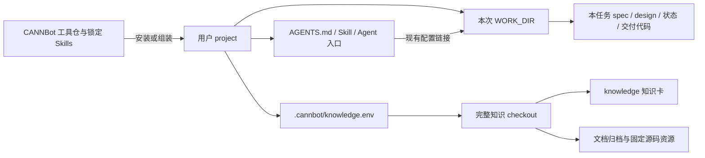

# CANNBot 整体 Workspace 调研：安装根、工程工件、知识仓、源码与规则路由

日期：2026-09-30。承接 [知识系统调研](cannbot-knowledge-deep-research-2026-09-30.md)，本篇只深入解释外层 workspace 与实际位置，不重复索引算法。

后续已完成完整 direct 插件和知识能力的本地组装、依赖源码及 raw 资源恢复，超出本篇最初的局部安装探针。请从 [真实工作区入口](../../.scratch/cann-research-20260930/workspace/README.md) 与 [实装补充](aiotbot-cannbot-architecture-alignment-2026-09-30.md#9-后续实装从实际文件而非工作流推导补齐证据) 查看最新结果。

范围补正：上述实装是 CANNBot direct 开发环境，不是全部 CANN 产品源码工作区。后续另核验 27 个独立组件源码仓及其自身 AGENTS、设计/RFC、技能规则，详见 [软件栈源码仓映射](cann-source-repositories-map-2026-09-30.md)。源码与规则不能只从 CANNBot 安装依赖推断。

## 1. 直接回答

**`cannbot-knowledge/knowledge/` 对应我们的 `docs/llmwiki/` 知识卡层；整个 `cannbot-knowledge` 仓不等于这个文件夹。** 整仓还承载来源资源、知识生产/消费 Skill、Schema/Contract、检索索引、日志和测试。我们把其中一些职责放在 workspace 的 `docs/raw*`、`skills/`、`scripts/` 等位置，物理组织不同。

**他们确实使用 AGENTS.md 与配置做路由，但没有发现一个覆盖所有插件、要求统一 `codebase/ + docs/raw/ + docs/spec/ + docs/llmwiki/` 的总 workspace。** 实际是三层组合：

1. **工具与规则分发层**：cannbot 应用仓、锁定的技能仓、插件资源及安装器。
2. **业务工程与任务层**：用户选定工程根，每个插件定义自己的代码、spec/design、执行状态与实验目录。
3. **知识服务层**：独立知识 checkout，通过配置被工程使用；某些工作流也在自己的 WORK_DIR 内再克隆一份。

因此 raw/spec/源码不是消失了，而是分别属于知识来源、工程交付或工程研究资料。它们不必都位于知识仓外的统一父目录。

本轮沿用并重新核对远端 HEAD：cannbot `918af01713a6ba074512e57ea1a431f1c5702b0e`；knowledge `e7c4942d27aa753cf0a98a1a3edf56aa1e4c8c35`；skills HEAD `94216ba2f0b569cfad22c7794ad99426a07ab7b6`。应用仓实际锁定技能 commit `9ae606b331085597f05b67cfa165f2dcd3369a2e`。以下上游链接固定这些版本，区分源码定义、实际本地验证和适配建议。

## 2. 先区分“仓库目录”“安装目标”“本轮工作目录”

| 概念 | 含义 | 是否必须相同 |
|---|---|---|
| CANNBot 源码 checkout | 保存 Plugin/Agent/Workflow/安装器等的工具仓 | 可独立于业务工程 |
| project / target | 安装器将 Skill、Agent 和入口规则接入的用户工程 | 可以是既有源码仓根 |
| WORK_DIR / work_dir | 一次 workflow 的执行目录，子进程 cwd 与产物根 | 可位于 project 的隐藏任务目录或独立目录 |
| knowledge root | 包含 `knowledge/` 与 `governance/` 的完整知识仓 | 可供多个 project 共享 |
| Bundle root | knowledge root 下的 `knowledge/` | 只是知识正文边界，不是工程根 |

编排器显式接收 workflow YAML、work_dir、provider 和 prompt；启动目录现有规则由链接工具暴露给 work_dir，而不是重新生成一套完整业务目录。[编排器接口](https://gitcode.com/cann/cannbot/blob/918af01713a6ba074512e57ea1a431f1c5702b0e/harness/workflow-orchestrator/README.md#L7)、[规则链接实现](https://gitcode.com/cann/cannbot/blob/918af01713a6ba074512e57ea1a431f1c5702b0e/harness/workflow-orchestrator/scripts/link_agent_config.py#L21)

默认路径也因安装入口不同而不同：npm/Node CLI 的 target 默认当前目录；源码插件 `init.sh` 的默认安装目标是 CANNBot 源码仓根，可以显式指定另一工程。因此有的使用者会把工具 checkout 同时当 workspace，有的会把工具接入既有业务仓，不能只画一种根目录。[CLI 默认 target](https://gitcode.com/cann/cannbot/blob/918af01713a6ba074512e57ea1a431f1c5702b0e/script/bin/cannbot.js#L59)、[源码入口默认值](https://gitcode.com/cann/cannbot/blob/918af01713a6ba074512e57ea1a431f1c5702b0e/script/bin/source-plugin-init.sh#L45)



这是职责关系图，不声称每个插件都使用相同物理树。下文给出具体模式。

## 3. 独立知识仓：raw 在仓内的 ignored 资源区

知识安装器的通常布局为：

```text
<业务工程>/
├── AGENTS.md                         # Codex/OpenCode 等的知识入口提示块
├── .agents/skills/
│   ├── knowledge-query -> <知识仓>/.agents/skills/knowledge-query
│   └── ascendc-api-knowledge-query -> <知识仓>/.agents/skills/...
└── .cannbot/knowledge.env             # 记录完整知识仓绝对路径与安装模式

<知识仓>/                             # 与业务工程可以是完全不同位置
├── knowledge/                        # 类似我们的 llmwiki 正文层
├── governance/{schemas,contracts,specs}/
├── .agents/skills/                   # ingest/query/lint 等规范源
├── docs/、recipes/、evals/、logs/
├── cann-docs-raw/                     # 获取后才出现，Git ignored
│   ├── .complete
│   └── asc-devkit/docs/zh/{api,guide,...}
├── cann-ops-raw/                      # 获取后才出现，Git ignored
│   └── ascendc/<ops-nn等仓名>/
│       ├── .objects.git/             # 来源对象缓存
│       └── <40位commit>/             # detached 源码快照
└── artifacts/
    ├── indexes/knowledge.sqlite3
    └── graphs/                       # 按需生成
```

来源路径是实际配置和脚本定义，不是按我们自己的 raw0/raw1 推测出来的。[Registry 来源注册](https://gitcode.com/cann/cannbot-knowledge/blob/e7c4942d27aa753cf0a98a1a3edf56aa1e4c8c35/governance/schemas/registries.yaml#L85)、[文档恢复目标](https://gitcode.com/cann/cannbot-knowledge/blob/e7c4942d27aa753cf0a98a1a3edf56aa1e4c8c35/get_resources.sh#L40)、[对象缓存和固定源码恢复](https://gitcode.com/cann/cannbot-knowledge/blob/e7c4942d27aa753cf0a98a1a3edf56aa1e4c8c35/.agents/skills/knowledge-ingest/scripts/source_resources.py#L35)

需要注意：

- 浏览 GitCode 看不到这些已忽略的资源，普通 `git clone` 后也没有；`get_resources.sh` 默认恢复文档和固定提交源码，可以选择 `--docs` 或 `--code`。
- `cann-docs-raw` 不是用户上传任意 PDF/DOCX 的通用资料收件箱，而是 Registry 登记的官方文档归档恢复目录；没有在这套布局里建立我们那样统一的 raw0→raw1 双层转换区。
- `cann-ops-raw` 是知识证据使用的固定版本源码，不是当前任务可随意修改的开发 checkout。
- consumer 模式只安装两个查询入口；contributor 增加 ingest/lint/VV/CV。trace producer 保留在知识仓内使用。

知识仓位置有明确选择顺序：显式 `--knowledge-root`，其次安装根环境变量；从完整仓内运行则复用该 checkout；独立下载/远程运行脚本时默认 `~/.cannbot/cannbot-knowledge`。这说明它既支持共享知识仓，也允许项目指定另一份。[安装位置与客户端规则](https://gitcode.com/cann/cannbot-knowledge/blob/e7c4942d27aa753cf0a98a1a3edf56aa1e4c8c35/docs/installation_and_usage.md#L45)、[安装模式](https://gitcode.com/cann/cannbot-knowledge/blob/e7c4942d27aa753cf0a98a1a3edf56aa1e4c8c35/docs/installation_and_usage.md#L164)

## 4. 官方注册算子：spec、参考源码和交付代码并列在 WORK_DIR

`ops-registry-invoke` 的工作流直接安排这些路径：

```text
<WORK_DIR>/
├── .agents/、.codex/等                # harness 从启动目录链接现有配置
├── .workflow/
│   ├── status.json
│   ├── user_prompt.md
│   └── log.jsonl                     # 以及执行会话记录
├── cannbot-knowledge/                # 本流程主动克隆的完整知识仓
│   ├── knowledge/
│   ├── cann-docs-raw/                # 资源恢复后出现
│   ├── cann-ops-raw/                 # 资源恢复后出现
│   └── artifacts/preflight.md        # 读知识后写的工程前置摘要
├── requirements/
│   ├── REQUIREMENTS.md
│   ├── references/
│   │   ├── cann/{ops-nn,ops-math,ops-transformer,ops-cv,ops-rand,canndev}/
│   │   ├── ascend/{op-plugin,torchair}/
│   │   └── competitor/{pytorch,tensorflow}/
│   └── research/                    # 代码走读、设计分析、公式等研究工件
├── spec/spec.yaml                   # 工程规格
├── design/
│   ├── INDEX.md、Overview.md、Interface.md
│   ├── HostTiling.md、Kernel.md、Validation.md ...
│   └── branches/
├── op/                              # 从算子模板生成的待开发/交付工程
├── ops-test-kit/                     # 工程验证工具仓
├── dev-package/                      # 构建安装产物
├── ttk.conf.yaml                     # 测试运行配置，非整个 workspace 路由表
├── xpu-run/                         # 测试配套运行目录
└── npu-arch.json                     # 本次目标/环境记录
```

主要证据：[知识预检 L8–27](https://gitcode.com/cann/cannbot/blob/918af01713a6ba074512e57ea1a431f1c5702b0e/plugins-official/ops-registry-invoke/workflows/op-develop.yaml#L8)、[参考仓 L67–93](https://gitcode.com/cann/cannbot/blob/918af01713a6ba074512e57ea1a431f1c5702b0e/plugins-official/ops-registry-invoke/workflows/op-develop.yaml#L67)、[测试仓与环境 L97–161](https://gitcode.com/cann/cannbot/blob/918af01713a6ba074512e57ea1a431f1c5702b0e/plugins-official/ops-registry-invoke/workflows/op-develop.yaml#L97)、[规格及交付工程 L203–247](https://gitcode.com/cann/cannbot/blob/918af01713a6ba074512e57ea1a431f1c5702b0e/plugins-official/ops-registry-invoke/workflows/op-develop.yaml#L203)。

这棵树由工作流定义重建；本轮没有实际克隆其中十个研究参考仓、执行 NPU 测试或生成真实算子交付物。

其中有两个容易混淆的重复：

1. `requirements/references/cann/ops-nn` 与 `cannbot-knowledge/cann-ops-raw/ascendc/ops-nn/<commit>` 可能来自同一个远端仓，但前者是任务研究 checkout，后者是固定知识证据；不能因为仓名相同就当作同一版本。
2. `requirements/research/.../code_design.md` 是对既有实现的研究分析，`design/*.md` 是本任务待实现方案，`knowledge/...` 才是可复用共享卡。三个地方都有“设计”，身份不同。

知识预检明确禁止修改知识卡，spec/design/代码生成由其他节点完成，没有把整个 WORK_DIR 同步到 knowledge 的收尾步骤。这与上一轮关于 SDD 的结论一致。[只读边界](https://gitcode.com/cann/cannbot/blob/918af01713a6ba074512e57ea1a431f1c5702b0e/plugins-official/ops-registry-invoke/workflows/op-develop.yaml#L25)、[需求消费](https://gitcode.com/cann/cannbot/blob/918af01713a6ba074512e57ea1a431f1c5702b0e/plugins-official/ops-registry-invoke/workflows/op-develop.yaml#L172)

## 5. 官方 Direct Invoke：既有工程根加隐藏任务目录

Direct Invoke 的 Plugin AGENTS.md 明确约定 PM、任务目录与多轮 workflow：

```text
<project，通常是用户当前工程>/
├── 原有业务源码/测试/文档目录          # 交付路径由 task 和具体 Skill 指定
├── AGENTS.md                         # 安装器合入插件规则块
├── .agents/skills/                   # 适配后的技能入口
├── .<客户端>/agents/等               # 专业角色入口
└── .cannbot/
    ├── plugins/                     # 插件资产；本版本 direct 这里保存 agents
    ├── dependencies/ops-direct-invoke/
    │   ├── asc-devkit/
    │   ├── cann-samples/
    │   ├── ops-tensor/
    │   └── cann-bench/
    ├── 环境信息.md
    ├── 环境检查/
    └── <任务>/
        ├── workflow1/
        │   ├── workflow1.yaml
        │   ├── 需求分析.md、环境信息.md
        │   ├── 0.0-知识搜集.md、0.1-黑盒测试设计.md ...
        │   ├── orchestrator.log
        │   └── .workflow/
        └── workflow2/ ...
```

这里的 `<project>` 是安装目标，不要求目录名为 workspace。任务 `work_dir` 是当前 workflow 子目录的绝对路径，PM 通过完整 YAML 让 harness 调度执行/验收。一般 PM 规则默认工件留在本轮目录，写到业务代码/测试/文档目录时要在 task 明确；具体算子 Skill 又要求正式交付进入目标仓正常目录。应把两层规则一起读，不推定所有 Markdown 都搬去知识仓。[项目 PM 与目录契约](https://gitcode.com/cann/cannbot/blob/918af01713a6ba074512e57ea1a431f1c5702b0e/plugins-official/ops-direct-invoke/AGENTS.md#L1)、[算子 Skill 的工作区边界](https://gitcode.com/cann/cannbot/blob/918af01713a6ba074512e57ea1a431f1c5702b0e/plugins-official/ops-direct-invoke/skills/ops-direct-invoke/SKILL.md#L16)

依赖仓位置不是人为推断：安装器读取 `plugin-install.json`，克隆到 `.cannbot/dependencies/<plugin>/<repo>`；Direct Invoke 登记上述四仓。模型插件还能声明 `expose`，在工程根创建便捷链接。插件依赖通常按声明分支或远端默认分支获取，与知识证据固定 commit 的纪律不同。[依赖声明](https://gitcode.com/cann/cannbot/blob/918af01713a6ba074512e57ea1a431f1c5702b0e/plugins-official/ops-direct-invoke/plugin-install.json#L1)、[依赖安装实现 L438–495](https://gitcode.com/cann/cannbot/blob/918af01713a6ba074512e57ea1a431f1c5702b0e/script/bin/cannbot.js#L438)

不能把所有官方插件画成同一种安装结构：当前 registry 插件没有自己的 `AGENTS.md`、manifest 或 `init.sh`，属于源码工作流入口；tracked tree 用 `.agents/{agents,skills}` 及 `.codex/.claude/.opencode/.pi` 链接适配。安装器只有在插件提供 AGENTS 文件时才合入提示块。因此“CANNBot 使用 AGENTS”是事实，“每个 Plugin 都生成完整顶层 AGENTS”不是事实。[条件写入代码 L352–366](https://gitcode.com/cann/cannbot/blob/918af01713a6ba074512e57ea1a431f1c5702b0e/script/bin/cannbot.js#L352)、[打包测试对 source-only 入口的区分](https://gitcode.com/cann/cannbot/blob/918af01713a6ba074512e57ea1a431f1c5702b0e/script/test/install.test.js#L195)

Direct 当前版本的 workflow 模板实际位于 `skills/ops-direct-invoke/workflows/`，不是每个插件根都存在 `workflows/`、`hooks/`、settings。目录图中的可选安装设施不应被当成普遍存在。

### 5.1 模型优化又是另一种目录约定

`model-infer-optimize` 通过依赖声明准备 `cann-recipes-infer`，可在 target 根暴露同名链接。基础优化流程把进度、历史、baseline 和报告放在 `<model_dir>/agentic/`；探索流程另用 `optimization-analysis/<case>/` 保存 scenario、plan-dashboard、plans 和 analysis，分别规定主 Agent 与各 Plan 的写入者。[依赖声明](https://gitcode.com/cann/cannbot/blob/918af01713a6ba074512e57ea1a431f1c5702b0e/plugins-official/model-infer-optimize/plugin-install.json#L1)、[基础流程目录](https://gitcode.com/cann/cannbot/blob/918af01713a6ba074512e57ea1a431f1c5702b0e/plugins-official/model-infer-optimize/workflows/optimize-workflow.md#L1)、[探索流程目录模板](https://gitcode.com/cann/cannbot/blob/918af01713a6ba074512e57ea1a431f1c5702b0e/plugins-official/model-infer-optimize/workflows/templates/plan-dashboard-template.md#L3)

探索流程还允许查询可选的 `CANN-Infer-Wiki`，未挂载则跳过。这是工作流声明的另一个知识入口；本轮未取得该服务实现，不能把它直接等同于 cannbot-knowledge，也不能把全部官方工作流概括成只消费同一个知识仓。[可选 Wiki 来源](https://gitcode.com/cann/cannbot/blob/918af01713a6ba074512e57ea1a431f1c5702b0e/plugins-official/model-infer-optimize/workflows/sota-approach-workflow.md#L158)

## 6. AGENTS.md 和配置究竟如何路由

### 6.1 有入口规则，但职责分散到多个明确接口

| 文件或接口 | 管理什么 | 不等同于什么 |
|---|---|---|
| Plugin `AGENTS.md` → project 提示块 | PM 身份、任务分解、Skill 选择、工作目录、权限、交付 | 全仓模块/符号数据映射表 |
| project 中知识安装提示块 | 单卡直读、API 查询、通用检索入口；只读消费边界 | 自动维护全部工程文档 |
| `plugin-sources.json` | Plugin → Skill 源路径，组装/安装选哪些技能 | 业务模块 → 知识实体映射 |
| `plugin-install.json` | 依赖仓、ref、递归子模块与工程暴露路径 | 知识证据完整快照表 |
| `.cannbot/knowledge.env` | 完整知识根、consumer/contributor 安装模式 | 业务源码目录与跨仓机制路由 |
| `governance/schemas/registries.yaml` | 知识分类、平台、标签、来源根与固定提交 | 全 workspace 的唯一配置 |
| workflow YAML | 节点、角色、依赖、输入输出、验收与写入范围 | 所有仓库长期共享的规格库 |
| `.<客户端>/cannbot-plugin.json` | 已安装 Plugin 的版本、入口、路径、资产与依赖记录 | 业务架构映射或知识事实索引 |
| `.workflow/status.json` | 当前运行任务状态与恢复信息 | 长期技术事实 |
| 任务专用 YAML/JSON | 如测试 endpoint、NPU 架构、算子 spec | 跨所有插件的总配置 |

知识安装器的 AGENTS 提示块直接列出路由表：用户已给唯一卡路径则全文直读；API 契约/头文件走 `ascendc-api-knowledge-query`；未知卡路径或多卡综合走 `knowledge-query`。贡献模式再附加 ingest/lint 流程。这与我们“AGENTS 管怎么走”的想法相近。[实际提示生成代码 L445–500](https://gitcode.com/cann/cannbot-knowledge/blob/e7c4942d27aa753cf0a98a1a3edf56aa1e4c8c35/install.sh#L445)

### 6.2 知识根解析是可执行配置逻辑

Query 的实际优先级：

```text
--knowledge-root
  > CANNBOT_KNOWLEDGE_ROOT 环境变量
  > 从当前目录向祖先查找 .cannbot/knowledge.env
  > Skill 脚本所在的完整知识 checkout
```

根目录必须存在 `knowledge/` 与 `governance/schemas/registries.yaml`。显式位置无效时失败，不偷偷换另一库。env 文件由 parser 读取，不需要每次让 shell `source`。相对路径若出现在该配置中，以 env 文件所在 `.cannbot/` 目录为基准；正常安装器写入绝对路径。[实际解析 L118–143](https://gitcode.com/cann/cannbot-knowledge/blob/e7c4942d27aa753cf0a98a1a3edf56aa1e4c8c35/.agents/skills/knowledge-query/scripts/retrieval/root.py#L118)、[配置写入 L364–410](https://gitcode.com/cann/cannbot-knowledge/blob/e7c4942d27aa753cf0a98a1a3edf56aa1e4c8c35/install.sh#L364)

### 6.3 进入 WORK_DIR 后规则怎么带过去

`link_agent_config.py` 将启动目录已有的 `.agents/.codex/.opencode/.claude` 等，以及 `AGENTS.md/CLAUDE.md`，链接到 work_dir；若目标已存在则保留，不覆盖。它不复制整个工程，也不为每个任务创建新的知识库。`.cannbot` 不在该链接清单中；知识 env 的祖先查找是独立机制，脱离工程树的 work_dir 需要另行保证根定位正确。[精确链接清单与行为](https://gitcode.com/cann/cannbot/blob/918af01713a6ba074512e57ea1a431f1c5702b0e/harness/workflow-orchestrator/scripts/link_agent_config.py#L21)

**与我们 `config.yml` 的差别**：上游已检查接口能定位知识仓、技能、依赖仓和任务工件，但没有发现等价于我们 `repos + architecture + wiki_entities + symbol_aliases` 四张表、统一路由 WiFi 多仓代码索引与实体知识的机制。不能把 `knowledge.env` 当成同等能力，也不能据此推断他们“没有配置管理”。

## 7. 源码在哪里：按职责回答

| 源码身份 | 上游典型位置 | 应怎样理解 |
|---|---|---|
| 智能体工具本身 | cannbot 的 Plugin/harness、`vendor/cannbot-skills` | 工作方法和执行设施，不是业务源码 |
| 本任务开发/交付代码 | registry 的 `$WORK_DIR/op/`；direct 的指定目标仓；模型项目本身 | 允许在任务权限内修改 |
| 研究参考实现 | registry 的 `requirements/references/{cann,ascend,competitor}` | 需求/公式/既有实现分析依据 |
| 插件依赖源码 | `<project>/.cannbot/dependencies/<plugin>/<repo>` | 工具、样例、开发库或评测依赖 |
| 知识卡固定证据 | `<knowledge-root>/cann-ops-raw/ascendc/<repo>/<commit>` | 固定版本来源，不是当前开发工作区 |
| 本地 SDK 头文件 | 用户实际 CANN/Ascend C 安装组件根 + `source_headers` | 声明和实现补证，需核对本机版本 |

同一远端项目可能同时以依赖仓、参考仓、固定证据快照三个身份出现。要判断是否重复建设，先看版本/修改权限/用途，不只看仓名。尤其不能拿最新参考 checkout 静默替换卡片引用的旧 commit。[来源路径基准](https://gitcode.com/cann/cannbot-knowledge/blob/e7c4942d27aa753cf0a98a1a3edf56aa1e4c8c35/.agents/skills/knowledge-query/references/cli.md#L21)

## 8. 对我们 workspace 的含义

现有 [WiFi 主设计](../架构设计.md) 是把多仓代码、raw0/raw1、规范真源和 Wiki 汇聚到一个 AIoTBot workspace，再由顶层 AGENTS/config 管理；CANNBot 更多是在不同业务工程安装插件，再挂接独立知识与运行工作目录。

| 我们的职责 | CANN 中对应机制 | 是否一一对应 |
|---|---|---|
| `docs/llmwiki` 知识卡 | `knowledge/` Bundle | 内容层接近；schema/log 等具体位置不同 |
| `docs/raw0/raw1` | 文档归档资源、固定源码资源、任务研究资料、trace 中间件 | 没有统一双层目录对应 |
| `docs/spec/changes` | 任务 WORK_DIR 的 requirements/spec/design/报告 | 都有工程工件，但跨任务归档方式不相同 |
| `docs/spec/specs` 组件规范真源 | 本轮未找到跨所有插件的统一规格归档库 | 不能从 CANN 中直接复制这一能力 |
| `codebase/<多仓>` | 目标工程、参考仓、依赖仓、固定证据快照 | 物理分散，需按身份映射 |
| 顶层 `AGENTS.md` | 插件提示块 + 知识入口 + harness 规则传播 | 都负责工作入口与流程 |
| 顶层 `config.yml` 四张映射表 | env + manifests + Registry + workflow YAML 各管一部分 | 没有完整等价物 |

建议继续保留现有外层布局，不必为了“仿 CANN”强行挪成隐藏目录。优先借鉴四件事：

1. 明确 workspace 根、任务目录、知识仓根与 Bundle 根，不混用相对路径基准。
2. 给配置划定所有权：AGENTS 管入口，config 管多仓业务映射，卡契约管知识治理，workflow 管任务 I/O。
3. 将“当前开发源码”与“固定证据快照”分开，跨仓定位始终携带 revision、Target、side 和构建条件。
4. 规范原件、临时报告与稳定知识采用不同生命周期；可搜索和可引用不代表可以由同一生产流程覆盖。

以上是 WiFi 适配建议，不是宣称上游已经实现我们所需的多仓概念流和代码索引路由。

## 9. 本地保存与验证

完整核心三仓已在项目内：`E:/FactumCore/.scratch/cann-research-20260930/{cannbot,cannbot-skills,cannbot-knowledge}`。本轮为该审计目录添加 `.git/info/exclude` 本地排除规则 `/.scratch/cann-research-20260930/`，并用 `git check-ignore -v` 验证。没有把它们设成 FactumCore 子模块；没有修改共享 `.gitignore`。周边 dsl/bench/sentry 目录仅保存前轮抽样资料，不冒充完整 clone。

知识路由实际验证：

- 在独立 fixture 调用原始 `root.py`，显式参数、环境变量、祖先项目 env、脚本位置回退及非法显式位置拒绝，5 项通过。
- 手工建立与安装器同格式的 `.cannbot/knowledge.env`，从其嵌套子目录运行原始 query，不传 `--knowledge-root`，成功召回 a2 平台 DataCopyPad 卡。
- 该 fixture 证明真实解析/查询路径，不宣称完整 Bash 安装器在 Windows 上已经跑通。

可检查 [路由探针](../../.scratch/cann-research-20260930/workspace-routing-probe.py)、[五项结果](../../.scratch/cann-research-20260930/workspace-routing-probe/routing-results.json)、[实际查询输出](../../.scratch/cann-research-20260930/workspace-routing-probe/project/query-via-project-env.json)。

另在隔离目录用原始 Node 安装器执行两次 OpenCode 项目安装探针：使用原始 direct plugin 的 `--plugin-dir` 入口，复制了 8 个自包含 Skill、3 个 Agent，生成 AGENTS 管理块及安装 registry。重复安装后自定义 AGENTS 内容仍在、管理块和安装记录均只有一份。当前 direct 没有根 hooks/workflows，实际 `.cannbot/plugins/ops-direct-invoke` 中为 agents，settings/permissions/hooks 为空。[执行证据 JSON](../../.scratch/cann-research-20260930/workspace-installer-probe/installation-evidence.json)、[实际生成的 AGENTS](../../.scratch/cann-research-20260930/workspace-installer-probe/project-opencode/AGENTS.md)

该探针跳过依赖仓和原生客户端执行，没有安装完整 vendor 技能或 harness，**只验证项目内安装布局与重复安装行为，不是完整算子开发环境验收**。Codex 适配器另有用户级 plugin/marketplace 写入，故本轮未执行它，也没有修改 HOME/CODEX_HOME 或用户全局配置；它的路径行为仅做源码审阅。[适配器分支与安装记录](https://gitcode.com/cann/cannbot/blob/918af01713a6ba074512e57ea1a431f1c5702b0e/script/bin/cannbot.js#L837)

Direct workflow 另做了纯文件执行验证：使用上游 guide/assemble/init_status/get_task，展开 basic 模板得到 7 个任务，初始化独立 `.workflow`，读取两个初始可运行节点 `0.0/0.1`，其 prompt 正确带入 WORK_DIR 和 USER_PROMPT 文件路径。所有节点仍为 pending，未启动真实 provider 或 NPU。Windows 首次打印中文遇到 cp1252 错误，保留现场后在独立 workflow2 用 `-X utf8` 完成。[本轮 YAML](../../.scratch/cann-research-20260930/runtime-audit-fixture/direct/workflow2/workflow2.yaml)、[节点 prompt 结果](../../.scratch/cann-research-20260930/runtime-audit-fixture/direct/workflow2/next-tasks.json)

进一步的固定提交与行号记录见 [运行工作区审计](../../.scratch/cann-research-20260930/workspace-runtime-audit.md) 与 [安装器审计](../../.scratch/cann-research-20260930/workspace-installer-audit.md)。克隆来源及本地样例导航见 [审计目录 README](../../.scratch/cann-research-20260930/README.md)。
