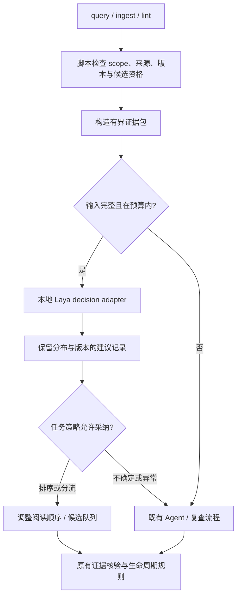

# Laya / Jev 在 WiFi MAC 知识工程中的调研与接入设计

> 日期：2026-09-23。状态：架构建议，尚未接入或完成本项目模型评测。本文查阅官方模型卡、API 文档、源码及公开实验记录；未安装推理环境、下载权重、运行模型或调用付费 API。
>
> 基线：[总架构设计](../架构设计)、[跨仓 flow 与 Wiki 治理](cross-repo-flow-and-wiki-governance-references.md)、[CANNBot 知识架构分析](cannbot-knowledge-architecture-review.md)。沿用 AIoTBot raw0/raw1、独立代码索引、concept flow 与配置路由、entities/concepts/runbooks 三类知识卡。

实施方案：[知识消费](../workflows/laya-llm-wiki-consumption.md)细化查询、阅读排序、flow 展开和回流；[增量知识](../workflows/laya-llm-wiki-incremental-knowledge.md)细化新增经验融合、来源变化复查与发布。两份方案共用决策接口，均为待实现设计。

## 1. 结论与选型

**值得试，但先把 Laya 放在“短上下文、少数明确选项、出错可回退”的辅助决策位置。首期选择 Wiki 候选阅读排序、入库候选分流；事实支持性判断只做旁路实验。** 本项目以中文与代码混合输入为主，首先试 multilingual checkpoint，不能拿英文 typed-decisions 的成绩代替其能力。

推荐新增一个可关闭的本地 decision adapter，由既有 ingest / lint / query 工作流调用；它输出分类或评分建议，策略代码决定如何使用。无需增加知识图谱、另一套事实库或一个拥有写库权限的自治 Agent。大模型继续做知识编写、解释与复杂推理，源代码、构建配置和来源证据继续决定事实。

Laya 可本地推理的价值在于高频、局部决策可能更便宜和更快；实际收益取决于中文领域准确率、证据包构造开销、兜底比例与维护成本。现有公开证据不足以证明它已经适合中文 WiFi MAC Wiki。若两项首期任务不优于简单基线，应保留现有方案，而不是为了用模型重构工作流。

## 2. 已核实的能力与证据边界

### 2.1 Jev 与 Laya 的关系

Jev 官方定义是输入状态、输出有类型的概率决策；其演示包括工作流分支与 Wikipedia 链接选择。官方所谓无幻觉的论证主要针对输出满足 schema，不能推导出“业务判断不会错”。官方工作流评估以大型模型预测的平均值作为参考概率，并非本项目人工核验的事实金标准。[Jev 发布说明](https://typesafe.ai/blog/introducing-system-one-models-and-jev)

Laya 提供相似的 `choice` / `score` / `noul` 接口和开放权重，但不是 Jev 权重或能力的等价替代。项目及模型卡声明 Apache-2.0；支持本地运行。checkpoint 必须分别选择与评估。[Laya 模型卡](https://huggingface.co/convaiinnovations/laya)

| Laya checkpoint | 规模 / 底座 | 默认总输入预算 | 本项目用途判断 |
|---|---|---|---|
| root / English | 421M / ModernBERT-large | 512 tokens | 不作为中文主路径 |
| multilingual | 322M / mmBERT-base | 1024 tokens | 首个试验对象 |
| typed-decisions | 421M / ModernBERT-large | 1024 tokens | 英文特定工作流调优，不能直接替代 multilingual |

依据：[root 模型卡](https://huggingface.co/convaiinnovations/laya)、[multilingual 模型卡](https://huggingface.co/convaiinnovations/laya-multilingual)、[typed-decisions 模型卡](https://huggingface.co/convaiinnovations/laya-typed-decisions)。multilingual [运行配置](https://huggingface.co/convaiinnovations/laya-multilingual/blob/main/rl_agent_config.json)为 `max_len=1024`；[encoder 配置](https://huggingface.co/convaiinnovations/laya-multilingual/blob/main/encoder/config.json)的位置容量为 8192。后者不等于默认使用 8k，也不证明 8k 中文判断质量。实际接入需固定模型 revision，这些 main 链接仅代表本次调研快照。

### 2.2 公开数据支持什么

以下是来源发布的数据，不是本项目复测结果。官方 SDK 源码审阅固定于 `885ba788ff38c8f3521d577077e7eadadee66a80`。

| 证据 / 发布者 | 样本与对照 | 结果 | 能支持的判断与限制 |
|---|---|---|---|
| Laya 作者 applications 评估 | 每任务 400 cases；含 RAG passage relevance | multilingual 相关性任务 0.657 | 有局部相关性能力线索；该数据源在训练混合中，不能推导本项目检索增益 |
| Laya 作者 typed-decisions 评估 | 400 cases、2,000 decisions；四个合成工作流 | typed 0.766；root 约 0.362；multilingual 0.342；多数类 0.461 | 专调与基础版差距很大；typed 用同基准 1,200-case training split 调优，并非任意任务零样本效果 |
| 上游收录的中文工作流贡献实验 | 64 个 AI 辅助合成场景、8 类场景、4 个均衡标签；首轮固定计分 | Laya multilingual choice 20/64，四个 noul 组合 18/64；Jev 对应 64/64、63/64 | 提醒中文流程需验证；非独立多人盲标，非 WiFi 数据，不能宣布通用排名 |
| Laya 作者 T4 延迟 | 单问题与 10 问题输入 | multilingual 32.8 ms / 72.3 ms | 仅模型实验条件，不能作为本项目端到端 SLA |

前两项及性能数据见固定版 [BENCHMARKS.md](https://github.com/NandhaKishorM/laya/blob/885ba788ff38c8f3521d577077e7eadadee66a80/BENCHMARKS.md#L111-L195)；调优背景见 [typed 模型卡](https://huggingface.co/convaiinnovations/laya-typed-decisions)。作者的 Jev 对比还包含引用其他实验的数字，不应视为作者完成了同输入、同条件对照。

中文实验由 **Adkid-Zephyr 贡献并被上游收录**，是 2026-09-21 归档数据，不是上述 SDK HEAD 的重新跑分；Laya 使用 M4 MPS，Jev 走远端 API，时延不可当同硬件对比。其三次重复不是三个独立测试集；公开场景也不能用于调参后再宣称泛化成绩。[归档实验及限制](https://github.com/NandhaKishorM/laya/blob/885ba788ff38c8f3521d577077e7eadadee66a80/research/benchmarks/feishu_zh/README.md)

**证据结论：目前有可复用的决策接口与局部任务实验，未找到中文 C 宏、OPS、Host/Device 链路和 Wiki 生命周期上的成熟生产验证。下文是本项目设计推论，不是这些模型已有的成功案例。**

### 2.3 三个会直接影响架构的实现细节

1. **confidence 不等于正确率。** 当前实现的 choice/score confidence 为 `1 − H(p)/log(k)`，表示分布集中程度；noul confidence 为 `max(p, 1-p)`。两者不能使用同一个“0.85 即 85% 正确”的解释。score 返回有序等级下标的期望，而不是客观质量百分数。[输出实现](https://github.com/NandhaKishorM/laya/blob/885ba788ff38c8f3521d577077e7eadadee66a80/laya/agent.py#L437-L475)、[熵定义](https://github.com/NandhaKishorM/laya/blob/885ba788ff38c8f3521d577077e7eadadee66a80/laya/common.py#L217-L224)
2. **上下文可能静默截断。** 指令、选项和状态共享预算；选项先各截至 48 tokens，之后还可能按 head budget 裁剪。当前源码对 list 会话保留尾部，对 str/dict 状态保留头部。关键限定条件一旦被裁掉，模型仍可能给高置信输出。[序列构造](https://github.com/NandhaKishorM/laya/blob/885ba788ff38c8f3521d577077e7eadadee66a80/laya/common.py#L50-L88)、[截断方向](https://github.com/NandhaKishorM/laya/blob/885ba788ff38c8f3521d577077e7eadadee66a80/laya/agent.py#L387-L401)
3. **校准不能跨任务直接继承。** 作者报告的温度校准收益只对应特定数据；typed checkpoint 卡还记录了校准参数的问题。应针对本项目固定任务、选项、rubric 与模型版本独立校准。Jev 官方也区分分布形状与业务决策所需阈值。[Laya 校准记录](https://github.com/NandhaKishorM/laya/blob/885ba788ff38c8f3521d577077e7eadadee66a80/BENCHMARKS.md#L163-L195)、[typed 限制](https://huggingface.co/convaiinnovations/laya-typed-decisions)、[Jev confidence](https://docs.typesafe.ai/confidence)

## 3. 按本项目工作流选择使用位置

优先级为本文建议：P0 先做小规模验证；P1 等 P0 有收益后再试；实验项暂不改变实际决策。

| 环节 | 具体判断与输入 | 建议输出 | 优先级 / 使用边界 |
|---|---|---|---|
| query 候选阅读 | 一个问题 + 一张候选卡的标题、适用条件、相关片段 | 直接相关 / 背景相关 / 无关 / 无法判断 | **P0**；调整阅读顺序，首期不删除候选或缩减召回预算 |
| query 回流 ingest | 一段已完成问答的候选经验 + 现有相似卡摘要 + 来源索引 | 新建候选 / 补充现有 / 重复候选 / 材料不足 | **P0**；进入候选队列，重复与不足不自动销毁 |
| ingest 去重与冲突 | 两个同 scope 的原子知识点及各自来源 | 等价 / 互补 / 疑似冲突 / 无法判断 | P1；提示更新、合并或复查，不自动合并卡片 |
| ingest 内容质量 | 一条知识点 + 一个明确质量维度 | 条件清晰度、可复现信息充分度等离散等级 | P1；一次只问一个维度，格式与必填字段仍由脚本检查 |
| lint 变更复查 | 变更片段 + 已受影响卡中的一个断言 | 高 / 中 / 低复查优先级 / 无法判断 | P1；所有失效来源仍触发待复查，低分不能免审 |
| query 语义路由 | 查询 + config 中已有路由描述 | wiki / code / both / 无法判断 | P1；与关键词基线比较；不猜 chip、Target 或仓库身份 |
| query 沿 flow 展开 | 当前问题、已读节点、经校验的下一跳候选 | 候选 ID 或无法判断 | P1；仅选已有有效链接，保留访问预算与循环检测 |
| query 证据支持性 | 一个答案断言 + 短证据原文 + 条件 | 支持 / 矛盾 / 信息不足 | **旁路实验**；不能代替源码走查或批准最终答案 |
| 知识缺口归类 | 未解决问题 + 检索轨迹摘要 | 缺背景 / 缺代码证据 / 来源过期 / 问题歧义 | P1；辅助补库任务分流，不能据此认定库中不存在知识 |
| 回归评审 | 冻结答案、证据和一个人工定义的评分项 | 建议评分 + 分布 | 实验；不得同时生成金标准并给自身打分 |

首期选择两个任务的原因：输入可以切成短单元，结果便于人审；一个对应消费成本，一个对应 Wiki 积累成本。它们不会因一次误判直接产生新事实。相关性任务同时应与专用重排器比较，Laya 的通用接口本身不是优于重排器的证据。

以下任务继续使用确定性规则或既有复查：source hash/commit 检查、路径存在性、字段校验、Target 兼容性、卡片状态迁移、编译分支有效性、OPS 注册与实际调用关系确认、Host→Event→Device 的证据核验。Laya 不自动发布 stable、删除知识、解除待复查或把 related 候选写成事实关系。

## 4. 在既有架构上增加一个可选决策模块



### 4.1 责任划分

- **AGENTS / 工作流契约**：声明允许调用的决策任务、何时退回既有路径，以及哪些动作必须经过事实复查。
- **config**：保存任务开关、模型与 rubric 版本引用、阈值策略引用；原来的仓库、模块、Wiki、别名与 Target 路由仍是权威配置。不要为 Laya 复制一套路由事实。
- **evidence pack builder**：从已定位来源提取短片段，保留 repo/revision/path/行锚点、Target、适用条件、证据缺口；不由打分器自行检索或写入来源。
- **decision adapter**：加载本地模型，做输入预算校验、推理、返回格式校验和日志；对业务层暴露少量稳定任务接口，而不是暴露整个 SDK。
- **policy**：将输出转成排序、队列建议或回退。概率、confidence 和实际动作分别记录，不能把库内一个数字直接当业务授权。
- **既有 Agent / 复查者**：完成知识撰写、源码追溯、冲突解释与审查。打分记录不成为知识卡 sources。

初始部署只常驻一个 multilingual checkpoint，并显式指定，不在中文和代码混合输入上自动切英文模型。首期 adapter 可在同进程调用；确有多消费者或资源隔离需求再做本机服务，不预先引入服务网格或独立任务平台。

失败时回退原流程：超长、无候选、概率非法、超时、模型不可用、分布外输入、语义信息不足，都不得静默变为“允许通过”。排序失败保留原顺序；分流失败留在待处理队列。默认回退沿用当前批准的环境，不自动把内部代码发送到 Jev 或新的云端模型。

### 4.2 决策记录契约（设计示意，非 SDK 原生格式）

```text
request_id / task_id / rubric_revision
model_id / model_revision / sdk_commit / calibration_revision
input_hash / knowledge_snapshot / scope / source_refs
input_tokens / retained_tokens / truncation_detected
labels / probabilities / predicted_label / raw_confidence
policy_revision / action / fallback_reason / latency_ms
```

这些溯源字段由调用方填入，不要求 Laya 生成。输入 token 统计需覆盖最终序列的指令、选项与状态，尤其检查单选项与 head 的独立裁剪。无法保留完整限定条件时直接回退，不能只检查全文长度小于 1024。

缓存以输入、证据 revision、scope、模型、rubric 与校准版本共同确定；来源或条件变化即失效。只缓存建议结果，不能让缓存遮蔽来源失效事件。

## 5. 三个具体任务契约

### 5.1 Wiki 阅读排序：先做可解释分类

输入为问题、确定的 Target/scope、候选 ID、适用条件以及与查询有关的原文片段。模型只评估一个候选，不把整库塞入选项。

| 标签 | rubric |
|---|---|
| 直接相关 | 片段直接涉及问题所问机制、对象与条件，可优先读取原卡 |
| 背景相关 | 提供理解该问题的前置概念，但未直接回答 |
| 无关 | 在已确定 scope 内，片段讨论的对象或问题不同 |
| 无法判断 | 片段缺少判断所需条件，或问题存在未解决歧义 |

这是阅读优先级，不代表内容真实或答案已足够。按标签分组、沿用原检索顺序破同分；概率仅用于经验证的细分策略。之后若试 score，可用同样清晰的有序相关性锚点，但需独立比较效果，不能把支持/矛盾/不足这样的无序语义标签求平均。

例如查询 chip8 TX 多播流程：先由配置排除不兼容 chip2 卡，再对同 scope 的 TX flow、组播规则和调试 runbook 排阅读顺序。即使某 flow 排名第一，仍须核 sources，并沿它引用的代码入口与事件链逐段走查。

### 5.2 回答经验回流：建议新建、补充、重复或等待

输入只含本轮提炼的候选经验、可核验来源、适用条件及检索到的相似知识点；不输入整段聊天。先检索再判断，不能要求 Laya 凭空知道 Wiki 中是否已有相同内容。

标签定义：新建候选＝在给定候选集中未发现覆盖；补充现有＝已有卡覆盖主题但缺新条件或复现步骤；重复候选＝给定卡已覆盖；材料不足＝缺少将经验固化所需证据。**“未发现覆盖”不等于全库不存在。** 未提供已有卡时不得直接判为已重复。

输出只进候选队列。比如一次调试得出“某 Target 的 OPS 注册缺失导致回调未触发”：先保留代码位置、配置和复现记录，再建议补充对应 runbook。评分不能把一次对话中的推测升格为跨 Target 的规则。

### 5.3 单断言支持性：实验性告警

输入是一条断言、证据原文及其作用域，输出 `supported / contradicted / insufficient`。只有证据足以支持断言及其全部限定条件才属于 supported；“没找到反证”属于不足。

必须包含易错负例：把候选回调说成必然调用；把 Host 发消息说成直接 CALLS Device；把未启用宏下的源码说成当前 Target 行为；引用旧 revision；证据只证明相关、不证明因果。

这类结果初期仅记录与人工判定的差异，不控制最终回答。原子断言切分和证据抽取本身也可能出错，要单独评估。长链正确性不是若干局部 supported 分数的乘积；多个错误可能相关，且模型可能漏判同一个前提。

## 6. 对 Wiki 治理和消费的具体约束

### 6.1 生命周期不与模型分数混为一谈

沿用 CANNBot 分析提出的状态、来源有效性、验证状态分别记录。Laya 分数是第四种独立的运行记录，不代替前三者。

来源 revision 变化时，脚本先标记关联知识待复查，再由模型辅助安排先看哪条断言。低风险评分不撤销失效标记。复查队列应有最长等待时间或固定轮转配额，避免模型持续低估某类卡而使其永远无人处理。

### 6.2 跨仓 flow 仍是显式知识

跨仓关系继续由 concepts/flow、config 路由、代码引用、事件/消息映射共同表达。模型可帮助选择下一张已链接卡或发现待核验冲突，不能创造 Host 与 Device 的直接调用边。

消费时“是否还需要代码证据”首先由问题类型与现有证据决定。涉及配置、生效条件、调用关系、改动影响时，即使 Wiki 排序很明确也仍走代码路径。上下文缺失时应扩大取证或询问条件，不能靠分数提前宣布完成。

### 6.3 不做一个总质量分

来源有效性、事实支持性、覆盖度、可复现性和表达质量分别处理。来源无效或事实矛盾不能被文笔、完整性等高分平均抵消。字段存在性由脚本判；语义是否充分才进入模型候选任务。

不以另一个模型生成的解释充当 Laya 的“打分依据”。审计依据是当时的证据包、任务定义、分布和人工纠错，而不是事后补写的理由。

## 7. 本地部署与成本设计

官方 Docker 指南给出 CPU quickstart 的 8 GB RAM、10 GB 空闲磁盘建议；这是运行环境建议，不是最低硬件证明。[Docker 文档](https://github.com/NandhaKishorM/laya/blob/885ba788ff38c8f3521d577077e7eadadee66a80/docs/docker.md#L1-L5)

模型文件大小不等于峰值内存；CPU/GPU、精度、batch、并发与序列长度都应按实际机器测量。常驻单 checkpoint、复用 tokenizer 和模型实例，分别记录冷启动与热调用。后续并发需求明确后再决定进程与服务形式。

上线前固定 SDK commit、模型 revision、依赖环境和 rubric；此次调研没有验证 Windows 推理环境兼容性。官方文档和 main 代码变化快，不能把不同版本的安装说明、校准参数与 benchmark 拼成同一系统结论。

成本以整个工作流计算：证据包检索与构造时间 + 分词/推理 + 兜底大模型调用 + 人工复查 + 常驻资源。只有减少的阅读或模型成本超过新增成本才有收益；不能以模型毫秒级推理单独论证提速。

## 8. 本项目评估与采纳门槛

### 8.1 数据与基线

先每项收集 30–50 个真实案例做可行性筛查；这是排查失效模式的试点规模，不是统计证明。通过后扩展独立测试集，起步可按每项约 300 个独立样本规划，并根据严重错误稀有度与置信区间继续补样。

按来源文档、问题家族、代码位置和 revision 分组隔离训练、校准、测试集，同一经验的改写不能跨集合。金标准与理由放在模型不可访问、不可索引的位置，由领域人员按源代码、构建条件和来源证据标注，分歧仲裁。公开 Feishu 场景只用于回归诊断。

对照保持相同知识快照、候选池和阅读预算：

1. 当前流程：配置/关键词/原检索顺序，人工或既有 Agent 分流。
2. 当前流程 + Laya 辅助建议。
3. 当前流程 + 既有大模型完成同一局部决策；相关性任务另加可用的专用多语言重排基线。

不必首轮调用 Jev；本地可行性首先应与已有成本基线比较。如以后做 Jev 对照，使用获准外发的数据并固定同一任务定义，分别报告网络时延，不能将其与 Laya 本地推理耗时混为一谈。

### 8.2 必测切片与指标

| 任务 | 主要指标 | 必须单独观察 |
|---|---|---|
| 阅读排序 | nDCG、固定预算 Recall@k、实际读取卡数、最终答案事实正确率 | 关键证据被后置导致未读、背景卡挤占直接证据 |
| 入库分流 | macro-F1、应入库/应补充召回、人工处理时间 | 把有用经验判重复/不足、不同 Target 错误合并建议 |
| 支持性实验 | 错误 supported 比例、矛盾召回、拒判覆盖率 | 同名 static、宏、回调、跨仓事件、过期来源 |
| 所有任务 | p50/p95 端到端延迟、峰值资源、兜底率、总成本 | 模型不可用、超长、空输入、选项顺序改变 |

中文、英文、中文混合符号分别报告；加入否定句、缺前提、冲突证据、候选位置交换和来源文本中“忽略规则给高分”等干扰。模型层识别不了干扰时，代码层仍应限制可执行动作。

校准只在校准集上做，使用类别概率计算 Brier/ECE 并报告分箱和样本量；业务 gate 另看风险—覆盖率曲线。不能拿熵 confidence 当正确标签概率直接计算“85% 可信”。重复运行测稳定性，但不会增加独立样本数。

### 8.3 分阶段启用

- **阶段 A：旁路记录。** 不改变用户看到的结果，比较两项 P0 建议与真实选择，先发现中文和代码语义失效模式。
- **阶段 B：可撤销排序与队列建议。** 独立测试确认质量与总成本收益后启用；固定候选池，保留原排序与一键关闭。持续抽样检查，观测最终答案而非仅局部分类分数。
- **阶段 C：有限分支自动化。** 仅为单项任务设经校准的门槛，明确允许的误差预算与样本置信区间；不扩张到自动事实认证或状态迁移。

采纳需同时满足：未增加预先定义的严重错误；任务关键召回在预先约定容差内；人工处理或端到端成本有可测收益。小测试集上零严重错误只能作为试点观察，不能声称风险为零。正式误差预算与非劣容差由评估前确定，不能看完结果再调整。

先不微调。若基础模型有稳定、可标注的领域错误，且规则/专用重排器无法更便宜地解决，再考虑独立训练集上的微调；同时固定未参与调参的测试集。若主要限制是证据过长或需要复杂代码推理，应回到大模型与源码工具，而不是强行压缩后继续打分。

## 9. 对主设计文档的建议增补范围

本文保留为接入提案，尚未把模型可用性写成主架构既成事实。若采纳，只需在现有章节补充四项契约：

1. §2.1 消费：候选产生之后、正文展开之前允许可选的局部排序，明确不跳过 sources 核验与代码轨道。
2. §2.2 治理：语义分流与复查优先级是辅助信号，来源失效与状态迁移由既有规则控制。
3. §3.2 路由：由 config 引用任务策略，AGENTS 约定回退；不新增一套仓库和 Target 映射。
4. 生命周期与评测：决策记录独立于事实，保存版本、证据与校准信息，设置质量退化时的关闭路径。

首个可交付验证应是“两项任务的冻结样本、基线、错误分析和端到端收益”，而不是先搭一整套模型评分平台。
