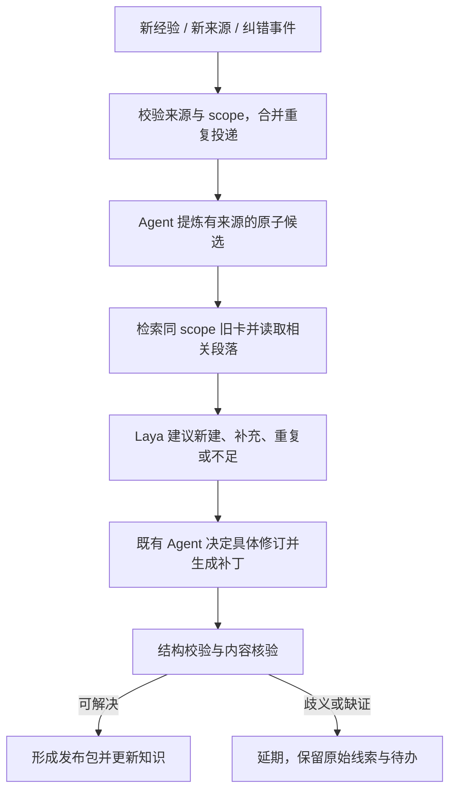

# Laya 辅助 LLM Wiki 增量知识：应用与实施方案

> 2026-09-23 · v0.1 · 可实施设计稿，尚未开发或实测。
>
> 上位约束：[总架构设计](../架构设计)、[CANNBot 分析](../research/cannbot-knowledge-architecture-review.md)；依据：[Laya / Jev 调研](../research/laya-wiki-decision-model-research-design.md)。配套：[消费方案及共用 Decision 协议](laya-llm-wiki-consumption.md)。目录、字段、接口与配置均为建议；不改变 AIoTBot 已确定的 raw0/raw1 处理机制。

## 1. 增量不是每来一条材料就新建一张卡

本方案处理两类不同增量：**新经验、新来源带来的知识增加**，以及**代码、配置、spec 或来源变化造成的旧知识修订**。前者需要判断复用价值与重复，后者首先需要识别受影响范围，再核对旧结论。两者最终都产出可审阅的候选补丁，复用同一发布规则。

Laya 首期只提供入库分流建议；后续可增加同 scope 知识点的等价/互补/冲突分类，以及复查队列优先级。它不负责生成知识正文、不替代原始观察、不决定事实正确性，也不单独将卡置为 stable。

最小实现复用 Markdown、Git、已有 Agent 与本地脚本。事件队列可以是文件，反向引用可以是从卡片生成的 JSON，不先建设消息平台或依赖图服务。

## 2. 哪些事件进入增量入口

| 触发 | 需要提供的最小信息 | 默认行动 |
|---|---|---|
| 已完成问答产生新证据 | query_id、候选结论、scope、来源引用、关联卡 ID | 查重后提出新建/补充/延期建议 |
| 用户或 Agent 发现错误 | 被纠正卡与断言、错误说明、新证据或复核线索 | 进入 correction 队列；先标记影响，不凭反馈直接改事实 |
| 新 raw 归档或已有归档更新 | AIoTBot 归档 ID、新旧内容 hash、可读来源位置 | 读取相关段落，提炼候选知识 |
| spec 批准或修订 | spec ID、状态、版本、变更段落 | 检查预期行为和 Wiki 解释的一致性 |
| 代码/构建配置更新 | repo、from/to revision、变更路径、Target/配置变化 | 先定位受影响卡并标待复查，再安排内容核验 |
| 人工请求重新核验 | card_id、原因、指定快照 | 重走来源及内容复查 |

首期由现有摄入/查询/合入流程显式调用 `submit_increment`，另提供手动 reconcile 命令，对比已处理水位与当前来源。无需新建定时任务。将来有稳定的变更通知接口再接入；事件丢失不能依赖模型补救。

## 3. 统一事件和任务状态

### 3.1 `IncrementEvent` v1（与消费出口共用）

```json
{
  "schema_version": 1,
  "event_id": "example-query-042-correction-01",
  "kind": "correction",
  "origin": {"type": "query", "id": "query-042"},
  "scope": {"target": "chip8-wifi-host", "conditions": []},
  "snapshot": {
    "config_revision": "<fixed-config-revision>",
    "wiki_revision": "<fixed-wiki-revision>",
    "repo_revisions": {"host": "<fixed-host-revision>"},
    "build_config_ref": "<build-evidence-ref>"
  },
  "candidate": {
    "statement": "示例：原卡应补充一个已经核验的注册条件",
    "related_card_ids": ["concept-flow-tx-example"],
    "source_refs": ["<archived-or-fixed-source-ref>"],
    "unresolved": []
  },
  "source_change": null
}
```

示例字符串是占位符，不能作为有效事件上线。`kind` 固定为 `experience | correction | source_added | source_changed | reverify`。代码变更的 `source_change` 包含 source_id、from/to revision、changed_paths；此时 candidate 可以为 null。原始问答文字只能作为线索，不因出现在 source_refs 字段就成为有效证据。

调用方提供稳定 event_id；入口另计算规范化载荷 hash。相同 ID 与 hash 重投返回同一个 Receipt；相同 ID 不同载荷拒绝并要求新事件。不同事件的语义去重是后续工作，不能用字符串相似替代幂等。

### 3.2 运行任务与知识状态分别记录

任务状态：`received → prepared → proposed → reviewing → applied`；旁路为 `deferred / failed / no_change`。每次转换记录输入 hash、处理版本、时间和原因。失败可重试，延期应写明缺什么证据及重启条件；这些状态属于运行队列，不扩展 Wiki 的 draft/stable/deprecated 生命周期。

知识仍分别记录：生命周期、来源、实际核验记录、待复查标记。新增卡在候选区是 draft；现有 stable 卡的候选补丁与已发布版本分离。来源变化可以先发布待复查标记，但不能提前发布未经核验的新正文。

首期对现有卡契约只补以下可选字段，统一定义在已有 schema 文档，再由 ingest/query/lint 共用；字段名是本方案建议，不宣称当前已存在。

| 字段 | 含义与消费规则 |
|---|---|
| reviewed_snapshot | 最后一次内容复核所针对的来源/config/构建快照；不是最后一次保存文件的版本 |
| verified_claims | 已实际核对的稳定断言 ID 或小节锚点、来源引用、核验执行者/方式和时间；不要求起步就把所有正文拆成数据库记录 |
| pending_reviews | event_id、受影响断言/小节、目标快照、原因；未知范围用整卡标记；空列表不代替来源水位检查 |
| superseded_by | deprecated 卡的替代 card_id；无替代时显式为空，不编造跳转 |

卡片的 `status` 与 `sources` 继续沿用现有定义；缺少新增复核字段的老卡按未知处理，逐步补核验记录，不自动填为已验证。

## 4. 线路 A：新增经验与来源的融合



### 4.1 先提炼再查重

长材料由现有 Agent 读来源，提炼为一条候选主张、适用条件、观察、推断、证据位置及未知项。复用 AIoTBot 的归档，不复制 raw1，也不让 Laya 把整场聊天压成结论。

候选按实体、机制和 Target 在三类卡中检索。先读取最相关的旧卡内容，再对单个“候选 × 已有知识点”构造短包；首期每候选最多比较 5 张卡。未检索到重复只是当前检索范围内未发现，不能视为全库无重复的证明。

### 4.2 首期 `ingest.disposition.v1`

| 固定标签 | 判定含义 | 后续行动 |
|---|---|---|
| new_candidate | 给定旧卡中未见覆盖，且当前材料支持一个可复用知识点 | Agent 再核粒度与查重覆盖，准备新卡草稿 |
| supplement | 同主题已有卡，但候选增加条件、例外、步骤或证据 | 准备对应卡补丁，不另建重复主题 |
| duplicate_candidate | 给定旧知识已覆盖该候选 | Agent 确认；确无新增才 no_change，保留事件记录 |
| insufficient | 缺来源、缺作用域或无法判断关系 | 留在待处理队列，指明补证项 |

同一候选比较多个旧卡时不投票取多数：任何潜在补充或冲突都交 Agent 看具体段落；只有确认语义覆盖且没有新增证据，才能 no_change。单纯增加一个独立证据来源也可能有保留价值。模型判重复不得直接删除输入。

首期可以将 Laya 建议全置于 shadow，由 Agent 照常做决定并记录差异；通过评测后用来预分工作队列。不存在“分数高就自动新建 stable”的分支。

### 4.3 由知识类型决定编辑粒度

- **entities**：补职责边界、入口和导航，机制解释链接到 concepts，不把每个函数展开为实体页。
- **concepts**：融合机制、rule、flow 和条件差异。已确认的同一机制优先改旧卡；矛盾若来自不同版本或 Target，要保留各自边界。
- **runbooks**：保留现象、探针/信号、原始观察、原因推断、处置和验证。推断未经验证时显式标记，不将成功的一次操作写成普遍因果规律。

必要时允许合并、拆分、废弃，但这些是 Agent依据来源提出的编辑方案。合并需维护原 card_id 的替代指针与入链，不能直接删除旧卡让消费链断开。

### 4.4 后续实验任务

`ingest.relation.v1` 对两条同 scope 知识输出 equivalent / complementary / conflicting / unknown。疑似冲突只生成复核项，不能选择“更新的那条一定对”。

`ingest.reproducibility.v1` 可判断一个 runbook 的观测与验证描述是否充分；必填字段、引用格式由脚本校验。不得把来源质量、事实正确性与语言完整性平均为总分。

## 5. 线路 B：来源变化后的知识复查

### 5.1 固定新旧快照并发现影响

通过 Git diff 或归档 hash 获得来源差异；config 的 Target/构建条件变动、spec 状态改变也产生事件。事件记录所有涉及仓的新旧 revision，不假设一个代码 merge 就同步更新所有仓。

维护两类水位：`impact_scanned_revision` 表示该变化的影响范围已分析并登记 pending，`applied_revision` 表示相关知识任务已处理到的版本，两者不能混用。收到不连续或乱序的 revision 时，从已知扫描水位对照目标快照重算差异；历史不可达、来源被覆盖或旧档缺失时，保守复查对应模块。reconcile 即使没有收到事件也执行这个对照。

受影响范围依次取并集：

1. sources 直接引用变更文件/章节/符号的卡。
2. 已声明依赖该卡结论的 flow/rule；普通 related 只是导航线索，不自动视为因果依赖。
3. flow 中同一消息/事件的发送、分发、接收两侧关联卡。
4. config 路由关联模块，尤其是公共头文件、宏、结构体字段、OPS 注册与构建条件影响面。

可生成 `source_refs → card_ids` 反向映射加速第一步，来源仍是卡片与配置；缓存缺失或版本不符时扫描重建。无法确定间接范围时扩大到相关模块，标记 `impact_scope=uncertain`，不要把 Laya 的低相关分作为排除理由。

### 5.2 先记录失效，再做排序

受影响卡先增加待复查标记，含 event_id、old/new snapshot、影响到的段落/断言和原因。无法细化时标记整卡。原来源仍固定旧 revision，其历史证据没有消失，但它对新目标快照的适用性尚未核实。

**查询不能等待后台队列全部跑完。** 来源版本与处理水位不一致时，消费端把受影响卡视为取证线索；如果事件尚未分析或反向映射不完整，保守扩大到相关仓/模块。版本匹配只能通过初筛，不能反过来证明内容正确。

后续可用 `review.priority.v1` 对一条旧断言与变更片段输出 high / normal / low / unknown。优先级只调整处理顺序。建议每批 10 项，至少 2 项取最老任务；超过 3 个工作日仍未处理的任务提升优先级。数值为试点调度规则，不是模型阈值或服务承诺。

### 5.3 Agent 复查的四种结果

| 结果 | 对 Wiki 的处理 | 必需证据 |
|---|---|---|
| 原结论仍成立 | 正文可不改，更新真实核验记录与来源快照 | 明确核对了哪些断言、条件和来源 |
| 需要修订 | 提交候选补丁，更新受影响结论与引用 | 新来源支持新正文，旧差异可追溯 |
| 缺证或冲突未决 | 保留待复查标记，列出缺口 | 不伪造 verified，不仅刷新行号 |
| 已被取代 | deprecated 并指向替代知识，维护入链 | 已确认替代关系与适用范围 |

每次只清除实际完成核验的断言标记；其他事件和未覆盖条件保持 pending。同名符号仍存在、索引同步成功、源码可打开，都不足以宣布复查通过。

## 6. 候选补丁、检查与发布

### 6.1 可审阅的发布包

Agent 先完成来源走查、查重、候选正文和必要导航更新，再形成一份简短包：

```text
change_id / event_ids / base_wiki_revision / config_revision
old_snapshot / proposed_snapshot / affected_card_ids
decision_summary / model_suggestions（独立附录，不作证据）
patch / source_refs / verified_claims / unresolved_items
structural_check_result / content_review_record
```

检查分两条：脚本验证 card_id、schema、scope、来源定位、相关链接与替代指针；既有 Agent 对照源码/构建/spec/归档复查断言。若当前项目规则允许自动发布，常规修订通过既有门禁即可发布；只有未解决歧义、冲突或既有规则要求的事项交维护者。无需逐个模型判断都找人确认。

### 6.2 并发、幂等与一致性

首期一个 writer 串行发布；读取可并行。提交前比较 `base_wiki_revision` 和 card 内容 hash，期间被其他任务修改则重建补丁并重新复核，不能用覆盖写解决冲突。来源再次变化时，旧 revision 下的复核可以保留为历史记录，但不能清除新事件的 pending。

知识正文、sources、待复查标记、log 及导航在同一个 Wiki Git 提交中生效；消费固定读取已发布 commit，不直接读取候选工作目录。若 config 在另一个仓，发布包引用其固定版本；需要新路由时先完成路由更新并验证，再发布依赖它的知识，不假设跨仓 Git 提交天然原子。

发布成功后再推进应用水位。若 Git 提交成功但 worker 崩溃，恢复时通过 change_id/event_ids 查到已有提交并补记 receipt，不重复生成卡。待复查标记可先作为单独有效提交发布；候选正文失败不会撤销它。

回滚正文时也要重新检查当前来源，不能把旧版 stable 恢复成“已核实当前版本”。最安全的失败结果是保留旧正文与 pending，继续允许查询回原始来源取证。

## 7. 最小落地结构与配置

复用消费方案的 contracts、decisions、evidence 模块，再增加以下职责。目录是建议位置，实施时放入 AIoTBot 现有知识工具目录。

```text
knowledge_tools/
  increment.py           # 事件、查重与任务推进
  impact.py              # 来源差异、反向引用、模块与 flow 扩展
  publish.py             # 补丁、版本检查、原有门禁与提交记录
.knowledge-runtime/      # 位于 Wiki 外；队列不进入检索索引
  inbox/                 # 持久事件，不是可随意删除的缓存
  jobs/                  # 任务状态、幂等收据与水位
  proposals/             # 待复核补丁，与已发布卡隔离
  source-ref-cache/      # 可由 Wiki/config 重建
```

事件与 jobs 使用单 writer 的临时文件写入后原子替换，恢复时扫描未完成任务。运行目录通常不进知识 Git，但 inbox/jobs 属于待处理业务数据，必须保留和备份；仅 decision-cache/source-ref-cache 可直接清空。无需把整段对话写进队列，只保留必要候选与可访问来源指针。

```yaml
knowledge_decisions:
  # 模型配置与消费端共用同一实例和固定 revision
  increment:
    mode: shadow          # off / shadow / assist
    disposition_rubric: ingest.disposition.v1
    max_existing_cards_per_candidate: 5
    max_pair_decisions_per_job: 20
    max_pending_jobs_per_run: 10
    oldest_jobs_per_run: 2
    priority_age_workdays: 3
    automatic_relation_judgment: false
    automatic_review_priority: false
```

单任务超过 20 次局部判断的部分直接交原流程；预算不影响受影响卡的标记范围。模型超时/不可用时继续规则、查重与 Agent 流程；整个 worker 暂停时 pending 与水位差异仍可供消费端发现，不能表现成“知识已新鲜”。

## 8. 两个实施走查

### 8.1 一次排障经验，优先补旧 runbook

查询完成后形成一条候选：“某 Target 中，某回调未执行与一处注册条件有关”，附代码、构建条件、日志与复现记录。此例为流程示意，不宣称项目已验证该根因。

1. submit_increment 生成 experience 事件，固定来源；仅有聊天推断则先保留 unresolved。
2. 检索发现已有回调排障 runbook，与候选具有相同 scope。
3. Laya 建议 supplement；Agent 确认已有卡有排查步骤，但缺该条件和对应验证信号。
4. 生成旧卡补丁，分别保留观察、原因解释与验证结果；其他 Target 不自动继承。
5. 完成结构与内容检查后更新原 card_id，导航无需产生第二张重复主题卡。
6. 下一次相同事件重投返回已有 receipt；新日志或新 Target 用新事件继续核验。

### 8.2 符号没消失，但 flow 已过期

代码 merge 修改某消息字段解释或 OPS 注册条件，函数名与文件均未变。

1. diff 事件命中直接 sources，并经 flow 消息标识与模块路由发现间接卡。
2. 受影响断言先 pending；普通路径存在检查可能全部通过，但内容复查仍必须执行。
3. Laya 可以建议先看哪个片段，不能把低分卡从待办移除。
4. Agent 对照发送端、分发端、接收端与构建条件，确认旧 flow 哪些说法仍成立。
5. 仅一侧新 revision 可用时保留版本组合缺口，不假定另一侧已同步适配。
6. 发布修订或保留 pending；消费端对未核实链路继续取证，不沿旧 flow 输出确定结论。

## 9. 实施顺序与验收

| 实施项 | 产物 | 验收点 |
|---|---|---|
| I1 无模型事件闭环 | submit、worker、Receipt、候选补丁 | 重投不重复建卡；失败和延期可恢复 |
| I2 新增经验分流 | 同 scope 查重、Laya shadow 建议 | 人工可复盘新建/补充/重复/不足的差异；不直接改 stable |
| I3 来源变更复查 | 反向引用、水位、pending、复核结果 | 符号仍存在的语义变化也被发现；漏事件通过 reconcile 发现 |
| I4 发布一致性 | 单 writer、版本检查、同提交更新 | 并发修改不覆盖，崩溃后无重复提交，新事件 pending 不误清 |
| I5 有限 assist | 队列预分与可选复查排序 | 低分任务不丢失，长等待任务能得到处理，模型停机仍可工作 |

I1–I2 与消费方案 C5 可联调；来源变化能力 I3 不依赖 Laya 评测成功，应独立完成。

至少构造以下端到端验收用例：完全重复经验、新条件补旧卡、不同 Target 表面相同、没有原始验证的推断、源码只改宏/注册、文件重命名、来源删除、跨仓仅一侧更新、模型截断/停机、事件重复/漏报、发布中断、两任务修改同卡。

分别统计增量质量与模型增益：

- **知识维护**：应更新卡的发现召回、错误合并、新增重复卡率、source→pending 延迟、pending 积压年龄、修订后的引用正确性。
- **Laya 分流**：macro-F1、应新建/补充的召回、把有用知识判重复/不足的比例、Agent/人工处理时间及兜底率。
- **发布可靠性**：幂等、恢复、遗漏 pending、旧补丁覆盖新正文等失败数。

先用每类真实增量案例建立小样本闭环，之后冻结独立测试集；对照“规则与现有 Agent”和“相同流程 + Laya”，固定输入材料与处理预算。结构通过率不代替内容正确率，卡片增长数也不等于知识收益。若模型没有降低处理成本或增加误合并，就保留增量治理流程并关闭辅助模型。

模型限制沿用固定源码与调研，尤其是输入截断和 confidence 不等于正确率：[Laya 序列构造](https://github.com/NandhaKishorM/laya/blob/885ba788ff38c8f3521d577077e7eadadee66a80/laya/common.py#L50-L88)、[输出语义](https://github.com/NandhaKishorM/laya/blob/885ba788ff38c8f3521d577077e7eadadee66a80/laya/agent.py#L437-L475)。这些限制决定回退与核验职责，不构成额外知识来源。
