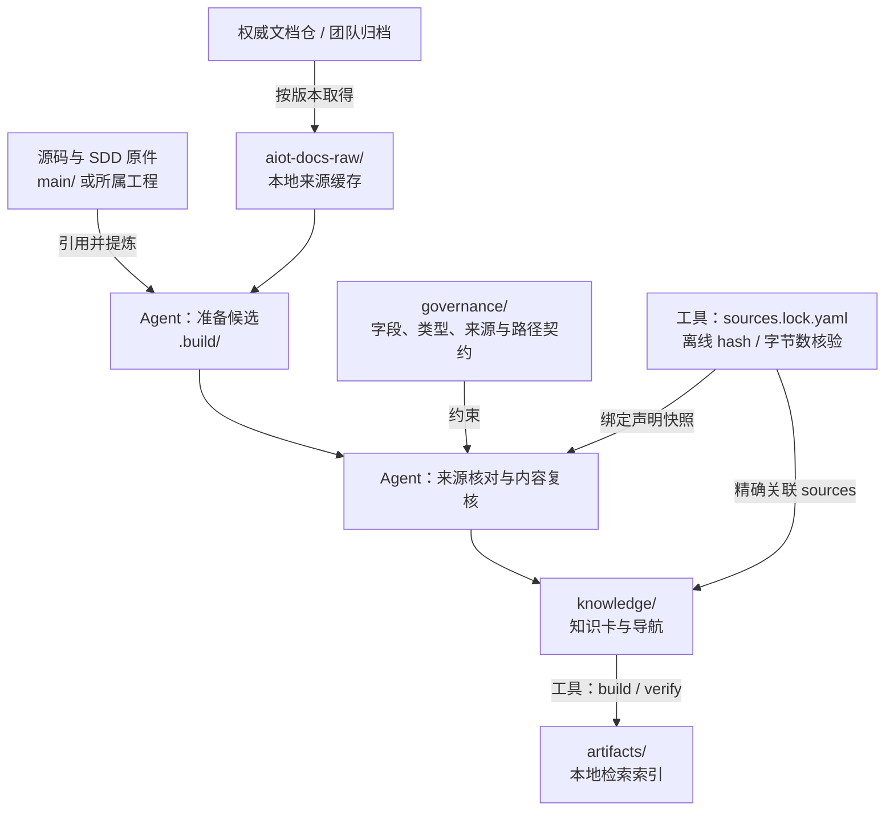
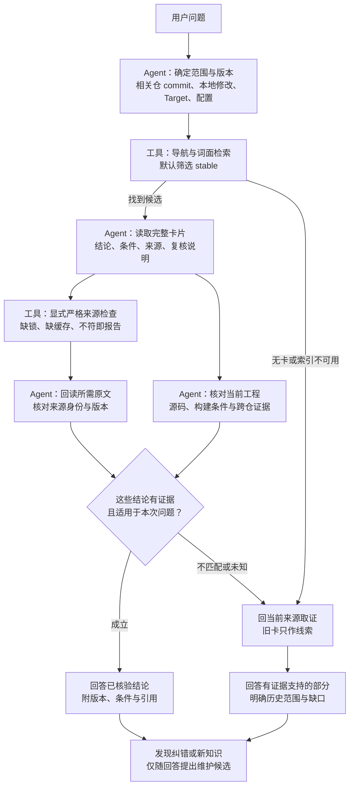
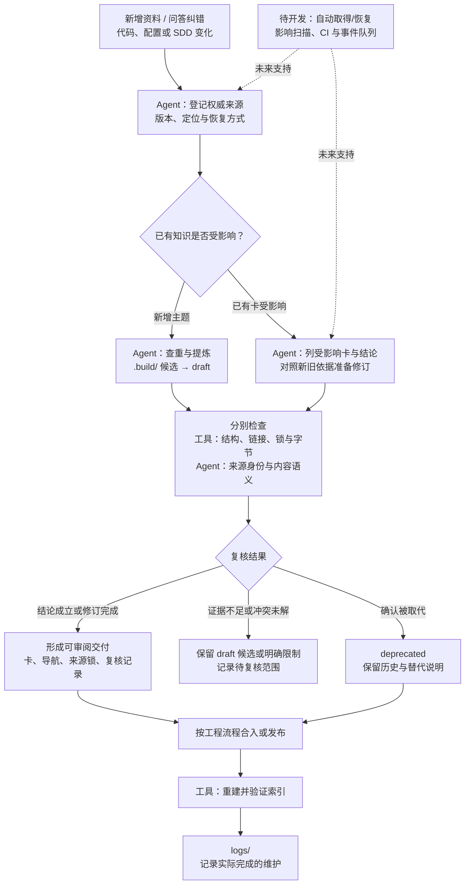

# WiFi MAC 驱动双图谱知识库 · 总架构设计

> **定位**：本文件是项目**主设计文档**——只讲整体架构（workspace 结构、双图谱如何结合、工具选型），不展开各模块的实现细节。
> **阅读对象**：读者先看 §0–§2 的职责与流程；开发者重点看 §2.4、§3 的契约和路由；方案审核者重点看 §1.4–§1.6 的交付、责任与待决定项。
> **状态**：v1.10，2026-10-08。知识仓已有来源锁/离线核验、词面检索，并已搭建规则导航、分层 AGENTS、九类 draft 卡与记录模板、编写及复核流程；技术卡和来源锁条目仍为 0。涉及真实 main/模块/Target 的接入只交付内网方案与非激活模板，整体 workspace 未接入实际产品；自动恢复和工程适用性仍未实现。
> **现行入口**：[安装与使用](https://github.com/Robin-hhc/aiot-knowledge/blob/main/docs/installation_and_usage.md)、[治理与消费流程](https://github.com/Robin-hhc/aiot-knowledge/blob/main/docs/workflows/governance-and-consumption.md)、[知识契约](https://github.com/Robin-hhc/aiot-knowledge/blob/main/governance/specs/okf.md)。发布前同步 FactumCore 远端后，已取得 [01–04 旧版细化稿](https://github.com/Robin-hhc/FactumCore/tree/main/docs/设计文档)；它们仍包含旧目录/字段与未核验工具承诺，现行实现以本文和知识仓契约为准。05 未在当前仓发现。
> **审阅记录**：[三视角意见与处理结果](https://github.com/Robin-hhc/aiot-knowledge/blob/main/docs/reviews/architecture-review-2026-10-07.md)。
> **文档版本**：知识仓内 `docs/架构设计.md` 作为后续团队发布版本，FactumCore 的同名文件保留同步阅读副本；当前修改后人工校验两者字节一致，自动同步尚未实现。历史版本摘要移至文末。

---

## 0. 一句话架构

源码索引用来寻找实现，知识卡保存解释、适用条件与证据入口；回答时核对两侧版本和实际工程条件。两者各自维护，在查询时按路由和证据衔接。

**双图谱、三环节、一个卡契约**：代码侧先以 CodeGraph 为试点候选，生成可重复的符号与关系索引；文档侧以 LLM-Wiki 方法维护 Markdown 卡与审查后的链接。知识生产（Ingest）→ 治理（Lint 与内容复核）→ 只读消费（Query）形成闭环。代码解析覆盖、工具替换成本与效率收益仍需验证，后台维护不是现有服务。

| 层次 | 当前状态 |
|---|---|
| 已有工具与资产 | 独立知识仓、81 份原字节导入材料、共享基础校验、SQLite 词面检索；来源锁与离线完整性检查；规则/领域导航、AGENTS、九类草稿及复核/维护模板。技术卡 0，锁条目 0，来源缓存为空 |
| Agent / 维护者执行 | 来源登记与回读、实际多仓/Target 核对、内容复核、生命周期维护及审阅交付；需要人和 Agent 的实际投入 |
| 目标蓝图 | 外层 main/aiot-skills/路由接入、产品代码图协同、来源自动取得/恢复、适用性门禁、CI、事件队列、Laya；均未完成端到端落地 |

本文的“文档图谱”指带契约的知识卡和经审查的正文链接，当前没有另一套语义图数据库。术语约定：**domain** 是 WiFi/Platform 领域，**route** 是已登记的技术或 Host/Device/shared 范围，**Profile** 是 concepts/runbooks 等卡类，**Contract** 是执行结构约束的校验规则，**Target** 是本次问题对应的构建/芯片选择条件。route 与 Target 不等同；shared 必须有跨实现复用的依据。

---

## 1. 目标与边界

### 1.1 目标

为 WiFi MAC 驱动迭代开发中的 Agent 提供受治理的知识底座：

1. **代码结构索引**：定位 WiFi 各代码仓（device 侧 mp1x/mp12/… + host 侧 drivers/wifi）的符号与仓内关系；跨仓链路由消息、注册与收发证据逐段核对。可重复生成不代表解析完整或关系正确，关键实现结论仍回源码核验；
2. **知识文档图谱**：把协议、设计、调试经验编译为可检索、可引用、可验证的知识卡，回答"为什么这么设计、这个流程怎么走、这个报错怎么解"；
3. **两线消费时对接**：Agent 提问时先定位知识节点，再沿卡契约、sources 与链接通道逐层展开，减少无差别读取原始材料，把 Token 集中在与决策直接相关的证据上。

### 1.2 范围

- **长期覆盖**：WiFi 各代码仓（device 侧 mp1x/mp12/mp12c/alg/features/… + host 侧 drivers/wifi）及相关协议、设计、SDD 和排障知识；Platform 保留同级领域入口，当前不展开。Hi1105/WiFiDemo 等研究语料不自动代表实际产品基线。
- **试点范围**：先选一个真实 WiFi 主题、其最小相关仓组合和一个明确 Target，按 §1.4 验证完整闭环；具体仓、完整 revision、资料与业务问题仍待团队选定，不承诺一次覆盖全部仓。
- **SDD 边界**：proposal/spec/design/tasks/验收原件留在所属业务工程或任务目录；只提炼可复用结论。系统研究工件与量产组件规范真源分别管理。
- **效果评测**：至少覆盖“自然语言定位实现”和“从代码解释业务/流程”两类题，对关键结论与证据逐项评分；记录正确性、来源质量、严重错误、查询/建库/更新耗时及 Token、人工复核成本。既有 [Hi1105 评测协议](https://github.com/Robin-hhc/aiot-knowledge/blob/main/evals/protocols/hi1105-a-b-benchmark.md) 是研究试验设计，不能直接作为真实产品成绩或已批准试点配置。

### 1.3 四条边界纪律（先立规矩再建库）

| 边界 | 规则 | 依据 |
|------|------|------|
| **Skill vs 知识** | Skill 保存"如何完成任务"（流程/工具/小型参考）；可复用领域事实经治理进知识库，多个 Skill 引用同一份知识 | 减少重复事实与规则漂移；属于设计取舍，不以未给统计口径的数字证明效果 |
| **raw 边界** | 代码仓与 SDD 原件不进 raw；SDD 原件由对应业务工程或任务目录维护，可复用内容经治理提炼进 `aiot-knowledge/knowledge/<领域>/`；来源根保存登记资料原件，生产中间件暂存 .build，人策展、LLM 只读 | "产物 vs 证据/真源在哪"两问 |
| **来源纪律** | 知识卡正文不复制原始材料；sources 指向固定可核验位置（文档归档 / 固定 commit 源码）；卡间关系经审查后记录正文链接，不从关键词共现推定关系 | 防幻觉固化、防关键词共现误当关系 |
| **人机分工** | Agent 起草正文、交叉引用及维护补丁；来源与领域维护者承担原件可取得、语义复核和发布责任。必要的人工修订遵守同一契约 | 目标是降低重复簿记负担；人工复核成本与效率收益仍需实测 |


### 1.4 阶段交付与最低验收

以下是推进顺序与完成定义，不是已批准的工期或预算。确认架构方向后，优先准备真实主题试点；来源、人员和基线未落实前，不把建目录视为知识交付。

| 阶段 | 范围与交付 | 完成条件 |
|---|---|---|
| 已有基础 | 仓结构、导入清单、基础 Contract 与词面索引 | 81 份导入快照检查匹配、基础工具可运行；只证明基础设施，技术卡覆盖仍为 0 |
| 首个完整主题（待执行） | 一个真实 WiFi 主题；来源说明 → draft → 内容复核 → stable → 导航/索引 → 只读回答 | 明确相关仓完整 commit、dirty、Target 与固定文档版本；重要结论可回读证据，登记真实复核；另一位成员能取得相同依据并复现查询。未落实发布责任或来源共享时不晋级 stable |
| 变化与错误条件验证（待执行） | 对同一主题做一次源内容/宏/注册或消息变化，另测缺来源、错误 Target、陈旧索引 | 能列出受影响结论、修订或保留 unknown；不能只更新行号。错误条件不被当作当前事实；Query 不静默写卡或重建；跨仓主题还需逐段核对收发/注册证据 |
| 扩展与自动化（后续决定） | 扩展主题/仓/Target；按试点瓶颈扩展来源恢复、门禁或后台维护 | 先记录知识质量与总维护成本，再由团队决定扩展范围与阈值；不要求为首张卡先建设完整平台 |

最低效果验收：在固定资料/代码、相同问题、模型、提示词与预算下，关键结论有准确证据；版本或 Target 混用、无依据的跨侧关系应被识别或明确未知。正式评分资料由外部 harness 隔离。耗时和 Token 作为实测指标，不能抵消严重事实错误，也不预设收益百分比。

### 1.5 责任与发布

以下是职责，不代表人员已经指定；同一人可以兼任。Agent 的复核建议不能替代团队对 stable 发布的责任。

| 角色 | 负责事项 | 交付或处理边界 |
|---|---|---|
| 来源责任者 | 权威原件、固定版本、访问权限和旧版本恢复条件 | 无可共享依据时先补来源，不以个人缓存发布共享事实 |
| 领域维护者 / 发布责任人 | 重要结论、适用范围、冲突处理、真实复核记录和生命周期 | 决定何时晋级 stable；未决部分保留 draft 或明确限制，责任人待团队指定 |
| 工具维护者 | Schema/Contract、索引故障、命令接口与路由适配 | 解决结构与检索问题，不用工具成功替代业务语义裁决 |
| Agent | 查重、提炼、回读依据、比较变更、形成卡片/导航/复核补丁 | 在任务授权范围内工作；未核验项明确列出，发布与提交按团队工程规则执行 |

### 1.6 尚待团队确定的事项

1. 首个真实主题、最小仓组合、完整代码基线、Target 与用于验收的业务问题。
2. 领域发布、来源持有和工具维护的责任人，以及共享知识版本的发布方式。
3. 权威资料的团队存储位置、权限与旧版本保存方式。
4. 依据试点质量和维护成本制定的推广阈值；不预先承诺全部仓覆盖、节省比例或无人维护。

这些事项影响正式试点启动与共享发布，不妨碍继续审阅架构和完善本地工具；本稿不虚构已完成的组织审批。

---

## 2. 总体架构

### 2.0 资料、知识与索引的整体关系

以下三张图中，**工具**表示已有脚本，**Agent**表示目前需要执行的核对步骤，**待开发**表示尚未实现的自动化。虚线连接表示未来能力。当前技术卡仍为 0，图表达执行流程与职责，不表示已建立产品知识覆盖。



`aiot-docs-raw/` 承担缓存职责，权威原件必须能由团队持续取得。系统设计、研究和评测材料继续放在 `docs/`、`evals/`，不会自动变成知识卡；业务 SDD 原件也不整包复制进 Wiki。

### 2.1 消费视角：在同一版本与适用条件下双轨取证

本节描述现行 Agent 流程与整体目标架构。**当前已实现**的是知识导航、SQLite 词面候选检索、生命周期筛选和索引指纹检查；显式 `check.py --strict-sources` 可检查来源锁与已物化文件字节，但 Query 不自动执行该检查。来源自动恢复、多仓适用性和自动代码图协同尚未实现，由 Agent/维护者核对可访问证据。完整执行入口见 [现行治理与消费流程](https://github.com/Robin-hhc/aiot-knowledge/blob/main/docs/workflows/governance-and-consumption.md)。



- **来源层**：外部资料有团队可取得的权威位置，raw 仅物化缓存；自有文档和业务 SDD 原件可在对应 Git 工程。源码不复制进 raw。来源并非都集中在一个目录。
- **知识层**：正文仅在 `knowledge/`，按 domain、route 和 Profile 组织；研究稿、工程原件和 gold 不直接进入卡片索引。知识索引是派生定位工具，具体收录范围、来源路径基准与建库前置条件见 §2.4。
- **代码层**：代码图在各源码仓独立生成；固定输入下可重复生成不等于解析完整或关系正确。跨 Host/Device 仍靠 flow 的消息、分发、注册、接收证据与仓路由逐段核对。
- **消费层**：默认检索 stable，但“已发布”“来源可回读”“适用于当前工程”分别判断；不能用 stable 或索引有效代替后两项。
- **回答层**：规范、实现、观察、设计动机与推断分开。实现结论核实际源码、构建配置及必要运行证据；文档约束与实现冲突分别报告，不能一律用静态索引裁决。

#### 动态走查：一次查询的五步

1. **固定范围与版本。** 确定知识根、domain；记录知识版本及相关仓 commit/dirty、Host/Device 组合、Target 和配置。缺少条件时说明未知范围，不猜测芯片或把未知当 shared。
2. **检索候选。** 从知识导航进入词面 CLI，默认 stable。无卡时报告覆盖缺口，在既有授权范围内回原始来源/代码取证；索引不可用交维护，不在 Query 中静默重建。
3. **读卡并核对适用性。** 阅读完整正文、sources、versions、verified 与限制。缺来源、版本或条件不匹配、待复查的断言只作线索，不能直接认作当前事实。
4. **双轨取证。** 显式执行严格来源检查，区分未锁定、未物化和字节不符；再回读所需原件，人工核对权威身份与版本；实现结论核当前实际源码、构建和必要运行证据，跨仓 flow 逐段检查消息/注册/接收。
5. **分别回答并回流候选。** 输出有证据支持的结论、历史范围、冲突与缺口；新发现或纠错仅随回答提出候选，获授权维护后进入 Ingest。

Query 全程只读，不自动恢复来源、重建索引、写卡或写运行队列。索引缺失/陈旧转维护；个人工程分支不同不直接废弃共享 stable 卡。来源锁与后续适用性门禁见 §3.5，当前不能从 search 成功推断来源核验已执行。

### 2.2 治理视角：保存依据、复核内容、发布与维护

治理围绕“卡的结论由哪个版本的证据支持”执行。机器工具检查基础契约、来源锁声明、引用文件字节和派生索引；来源权威身份、多仓适用性及业务语义由 Agent/维护者核对。**自动取得/恢复、影响扫描、CI 与后台看护仍属于目标能力**。



#### 动态走查：生产与增量维护

1. **确认材料角色。** 业务源码、spec/design/tasks 原件仍随工程维护；研究原件留 docs、评测留 evals。只把有来源支持的可复用知识提炼进卡，不能整个工程包灌入 Wiki。
2. **确认依据可取得。** 原件有权威位置及版本；外部来源按资料集/组件与版本缓存，旧快照不被“最新版”覆盖。人工取得固定原件并登记来源锁，工具离线核验被引用文件的 SHA-256/字节数；恢复或核验不了的内容如实报告。若卡片引用本地缓存，check/build 前须恢复整个 Bundle 中各卡所引用的本地来源，不只是本次命中的卡（§2.4）。
3. **准备候选。** `.build/` 保存转换与候选补丁；查已有卡后决定新建、合并或修订。实体/流程分别归 `concepts/entities/`、`concepts/flows/`，按实际 Profile 建卡，新卡保持 draft。
4. **拆开复核。** `check.py --strict-sources` 检查当前契约、81份历史导入快照和被引用来源的锁/文件字节；来源权威性、版本真实性与正文结论是否成立要另行核对。以真实多仓 commit/dirty、Target、宏、注册和消息条件复查，不能仅刷新行号。
5. **发布可审阅结果。** 只有真实证据支持的明确范围才可更新生命周期及 verified。未决问题记录正文限制或维护说明，不添加 schema 未声明的字段。现有卡仍可能适用于旧版本，不因个人 checkout 不同自动改为 draft/deprecated。
6. **维护派生产物。** 检查通过后显式重建并验证知识索引；业务代码图按各仓版本/工具配置另行维护。索引同步不代表知识语义同步，logs 只记实际已完成动作。
7. **来源变更后复查。** 先按引用、模块路由及差异列受影响卡，考虑公共头文件、宏、消息与注册等间接影响，再审查内容。初期由 Agent 扫描，不要求先建统一依赖图服务。

默认检索 stable；显式维护或历史查询可以读取 draft/deprecated。卡片是否能作为本次工程事实，仍由可核验来源与适用条件决定。正式评测仍由外部 harness 隔离 gold，技能和目录边界不代替进程隔离。

### 2.3 落地骨架（AIoTBot workspace 与知识仓）

> **命名对齐**：完整知识仓为 `aiot-knowledge/`，唯一正文根采用 CANN 的 `knowledge/` 命名。共享设施沿用 `governance/`、`.agents/skills/`、`docs/`、`recipes/`、`evals/`、`logs/` 和 `artifacts/`。
>
> **来源分层**：采用 CANN 的来源资源方案，取消 `raw0/raw1` 固定持久层。`aiot-docs-raw/` 按来源资料集或组件原布局组织，转换/规范化/候选中间件放 `.build/`，最终卡片放 `knowledge/`。来源缓存 Git 忽略；持久取得位置与恢复方式须随真实资料登记。
>
> **当前实物**：已在 FactumCore 内建立独立 `aiot-knowledge` 本地 Git 仓。81 份现有设计、研究和评测材料按角色导入，原字节和原状态保留；目前受治理的技术卡为 0。以下 main、aiot-skills、workspace 顶层入口仍是整体目标布局，不表示已经把产品代码搬到本机。可直接使用的 Wiki 文件及内网交付分界见 §2.5。

```text
AIoTBot workspace/
├── AGENTS.md            # 入口：领域/流程路由、卡契约指针、config.yml 说明
├── config.yml           # 代码仓 ↔ 架构元素 ↔ 领域知识实体 ↔ 符号映射
├── main/                # 原代码仓工作区，原有内部结构保留
│   ├── build/
│   ├── device/
│   │   ├── wifi/
│   │   │   ├── mp1x/
│   │   │   │   ├── .codegraph/    # [新增]代码图谱db文件，本地生成不上库
│   │   │   │   └── …
│   │   │   ├── mp12/
│   │   │   │   ├── .codegraph/    # [新增]代码图谱db文件，本地生成不上库
│   │   │   │   └── …
│   │   │   ├── mp12c/
│   │   │   │   ├── .codegraph/    # [新增]代码图谱db文件，本地生成不上库
│   │   │   │   └── …
│   │   │   ├── alg/
│   │   │   │   └── .codegraph/    # [新增]代码图谱db文件，本地生成不上库
│   │   │   ├── features/
│   │   │   │   └── .codegraph/    # [新增]代码图谱db文件，本地生成不上库
│   │   │   └── …
│   │   └── platform/
│   ├── drivers/
│   │   ├── wifi/
│   │   │   ├── .codegraph/        # [新增]代码图谱db文件，本地生成不上库
│   │   │   └── …
│   │   └── platform/
│   └── …
├── aiot-skills/              # 技能库
└── aiot-knowledge/                  # 独立知识仓，对齐 cannbot-knowledge 的核心结构
    ├── AGENTS.md                    # 知识边界、规则指针与技能入口
    ├── README.md                    # 定位、实际能力、资料导航
    ├── CONTRIBUTING.md              # 生产、核验和贡献流程
    ├── check.py / check.sh          # 结构、来源完整性及历史导入快照检查
    ├── knowledge/                   # 唯一知识正文根；不直接索引研究稿和工程原件
    │   ├── AGENTS.md                # 正文规则支持文件，不作为知识卡
    │   ├── index.md                 # Bundle 与全域导航
    │   ├── wifi/
    │   │   ├── AGENTS.md            # WiFi 领域规则，不虚构实际模块与 Target
    │   │   └── index.md             # 当前仅入口，无技术卡；以下 Profile 随真实建卡创建
    │   │       # concepts/entities/ # 原实体页：wal、hmac、dma 等，使用 Concept 类型
    │   │       # concepts/flows/    # 流程卡，文件用 snake_case
    │   │       # runbooks/          # 现象、信号、根因、解法、边界与验证闭环
    │   │       # glossaries/        # 正式术语知识卡
    │   └── platform/
    │       ├── AGENTS.md            # Platform 规则，内部不展开
    │       └── index.md             # Platform 仅保留入口，内部省略
    ├── aiot-docs-raw/               # ignored 来源缓存，按来源资料集/组件原布局组织；当前为空
    │   └── <登记的来源资料集或组件>/… # 获取后物化；不与 knowledge 分类强制一一对应
    ├── .build/                      # ignored 转换、规范化、候选暂存，按需产生
    │   └── <producer>/<批次>/…
    ├── governance/
    │   ├── AGENTS.md / index.md      # 共享治理维护规则与任务导航
    │   ├── templates/               # 9类 draft 卡、目录导航、复核和维护记录模板
    │   ├── sources.lock.yaml        # source → 声明版本/落点/hash/bytes/恢复说明；当前空锁
    │   ├── schemas/
    │   │   ├── frontmatter.schema.json
    │   │   ├── sources.schema.json   # 来源锁字段形状
    │   │   ├── profiles.yaml
    │   │   └── registries.yaml       # 本地来源根等注册项
    │   ├── contracts/               # knowledge、source_resources 与共享 validation
    │   └── specs/                   # 共享契约及编写、复核、生命周期规范
    ├── .agents/skills/
    │   ├── index.md                 # 查询/摄入/检查技能选择
    │   ├── knowledge-query/         # 初版 SQLite 词面检索与索引工具
    │   ├── knowledge-ingest/        # Agent 建卡、融合和统一收尾流程
    │   └── knowledge-lint/          # 结构、来源检查与语义复核流程
    ├── docs/
    │   ├── AGENTS.md / index.md      # 系统资料规则与导航
    │   ├── intranet/                # 内网接入方案；workspace AGENTS/config待填模板
    │   ├── 架构设计.md              # 当前总体设计
    │   ├── design_principles.md      # 知识仓当前分层与边界
    │   ├── installation_and_usage.md
    │   ├── research/                # 导入的研究资料，保留原状态
    │   ├── workflows/               # 现行消费/治理入口；2份历史 Laya 稿保留原字节
    │   ├── engineering/             # 历史研究原件与新知识系统计划，index分别导航；不是量产 SSOT
    │   ├── reviews/                 # 本设计的多视角审阅与修订记录
    │   └── archives/                # v1.3 主设计及根目录旧材料原件
    ├── recipes/                     # index + 首次建库/证据回答/贡献维护指南
    ├── evals/
    │   ├── protocols/               # 原实验设计，不代表已经执行的成绩
    │   ├── wifidemo/                # 公开问题与基线定义
    │   ├── hi1105/                  # 文档来源清单
    │   ├── restricted-review/       # gold/判分草案；受测 Agent 仍须外部 allowlist 隔离
    │   └── test_knowledge_contract.py # 初版契约/索引回归
    ├── logs/                        # 按日期记录已发生的导入与维护
    └── artifacts/                   # 本地派生索引、验证报告，Git 忽略
        ├── indexes/knowledge.sqlite3
        └── …
```

#### 资产边界与现有内容归位

| 资产 | 当前职责 |
|---|---|
| `knowledge/` | 仅正式知识卡及导航。WiFi/Platform 是领域，concepts/runbooks/glossaries 等才是 Profile；实体页归 concepts/entities，不新设 entities 类型 |
| `docs/research/`、`docs/workflows/` | 系统研究与现行流程入口；历史方案原件保留字节，旧目录与未实现字段不覆盖现行契约，不自动转成 stable 卡 |
| `docs/engineering/` | 原研究工程 specs/plans 的存档。业务组件 SDD 原件仍由相应业务工程或任务目录管理，可复用结论另行提炼成卡 |
| `governance/` | Schema 定义字段形状；Profile 定义卡类/组合；Registry 登记领域、范围和来源；Contract 执行跨字段/路径/导航/链接与来源锁、字节检查 |
| `.agents/skills/` | 本仓知识能力的规范源。aiot-skills 保留工程技能，接入本仓入口，不复制一套知识规则 |
| `evals/` | 评测协议、问题、判分草案和契约回归；不纳入知识索引。目录隔离不等于已实现受测进程访问控制 |
| `aiot-docs-raw/`、`.build/` | 单一来源资源根与生产暂存区；取消 raw0/raw1 固定层。源码开发 checkout 不复制进来源缓存，当前没有生产协议/芯片/日志原件可自动恢复 |
| `artifacts/`、`logs/` | 前者为可重建索引和报告，后者为真实维护记录；均不作为技术事实正文 |

**业务 SDD 在图外的位置**：开发中的 proposal/spec/design/tasks/验收可位于任务工作目录；确认后的组件规范应由所属业务工程的版本管理流程归档并固定引用。当前没有统一的业务 SDD 子目录契约，因此不在树中虚构 `main/<组件>/specs` 已存在。首个主题需登记“所属仓/任务、实际相对路径、版本、确认状态及责任人”；临时任务目录不能是已发布规范的唯一副本。`aiot-knowledge/docs/engineering/` 仍只是历史研究工件。

workspace 的 `config.yml` 继续承担代码仓、架构元素、知识实体和符号映射，`knowledge.root` 指完整 `aiot-knowledge/`；实体路径改指 `knowledge/wifi/concepts/entities/`。这些路由只定位证据，不证明跨 Host/Device 的语义关系。

本次实现的是仓结构、资料导入、共享基础校验和 SQLite 词面检索，不等价于 CANN 的全部检索/审计/图谱工具。完整源码图谱、来源获取、SDD 自动维护、Laya 和后台增量任务仍按原设计分阶段实现。真实覆盖由知识卡和来源核验决定，不能以目录或索引文件存在推断。

#### 与 CANN 来源目录的对应

| CANN | AIoT 当前采用 |
|---|---|
| 完整 cannbot-knowledge / 内部 knowledge | 完整 aiot-knowledge / 内部 knowledge |
| cann-docs-raw（完整知识仓内、Git 忽略） | aiot-docs-raw（完整知识仓内、Git 忽略），按来源原布局恢复 |
| cann-ops-raw 固定源码快照 | 当前不重复建立源码缓存；来源指向外部 main/组件仓的固定版本，具体恢复契约后续适配 |
| 工程 spec/design/tasks 在业务工程或任务工作目录 | 同样与知识正文分开；仓中导入的研究工程原件明确标为历史资料 |

已取消/替换的 raw0/raw1、entities、spec/dts/issue/graphify 等旧设计项逐项列于新仓 `docs/migration.md`，明确区分空设计项与真实内容。原始导入清单及每文件 SHA-256 见 [migration-manifest.json](https://github.com/Robin-hhc/aiot-knowledge/blob/main/docs/migration-manifest.json)；当前入口见 [知识仓 README](https://github.com/Robin-hhc/aiot-knowledge/blob/main/README.md)。CANN 结构依据见 [独立 CANNBot Workspace 文档](research/cannbot-knowledge-workspace-design-2026-10-06-github.md)。


### 2.4 知识卡与索引的现行接口

| 项目 | 当前契约与能力 |
|---|---|
| 卡片位置 | `knowledge/<domain>/<profile>/.../<name>.md`，或 `knowledge/<domain>/<registered_route>/<profile>/.../<name>.md`；仅支持一层已登记 route，不任意叠加技术与 scope |
| 导航与类型 | 每级 `index.md` 是导航，`AGENTS.md` 是规则支持文件；其余 Markdown 是卡。导航只列直接子卡/子目录，不枚举 AGENTS；两类支持文件不入卡片索引，仍参与指纹。实体/流程归 Concept 下的 `concepts/entities/`、`concepts/flows/`，不是新 type；文件用 snake_case |
| Frontmatter | `sources`、`versions` 是字符串数组，`verified` 是对象数组；字段要求以 [Frontmatter](https://github.com/Robin-hhc/aiot-knowledge/blob/main/governance/specs/frontmatter.md) 和 [Profiles](https://github.com/Robin-hhc/aiot-knowledge/blob/main/governance/schemas/profiles.yaml) 为准，不从示意配置推造新字段 |
| 来源路径 | 本地 `sources` 相对 **aiot-knowledge 仓根**，须在 Registry 登记的仓内来源根中且实际存在；不接受 `../main/...` 或任意 workspace 路径。业务源码优先引用固定完整 commit 的 HTTP(S) 证据 URL，正文另记仓/文件/符号/Target；当前检查不是 URL 内容或版本真实性验证 |
| 来源锁 | `sources` 字符串精确关联锁条目；全部条目校验声明，仅被卡片引用的文件做离线 SHA-256/字节数核验。`check.py --strict-sources` 拒绝 unlocked/not_materialized/mismatch/invalid；默认兼容模式只对前两者警告，不能以默认通过冒充来源齐全。详见 [来源锁契约](https://github.com/Robin-hhc/aiot-knowledge/blob/main/governance/specs/sources.md) |
| 机器索引 | 仅收 `knowledge/` 中排除 index.md/AGENTS.md 后的 Markdown 卡片；标题、摘要、正文和 aliases 参与词面匹配。domain/status 筛选和简单排序产生候选；不提供语义关系推理、中文分词、向量或自动 Target 筛选 |
| 新机器前置条件 | clone 不恢复 ignored raw。当前 check/build 校验所有卡的本地来源存在性，**必须先手工恢复各卡引用的全部本地缓存**；缺失时检查/建库失败，没有按本次命中卡延迟恢复的实现。没有外部源码可核验入口时先解决来源契约，不能用本机示意路径冒充支持 |
| 维护与失败 | build 先校验 Bundle 和兼容模式来源完整性，已知字节不符或声明无效即拒绝，再原子写索引；verify 检查知识/治理指纹。Query 缺索引或指纹陈旧时报错，由维护任务处理；来源缓存或业务源码变化不会触发当前指纹 |

这意味着共享卡发布前必须检查另一位成员能否取得来源；“路径格式通过”“索引可查询”“来源字节一致”“适用于当前工程”“结论正确”分别判断。本地 source 缺失仍会被基础契约拒绝。远端 URL 的物化缓存缺失可在兼容模式给出警告并建候选索引，但严格检查失败，不能视为证据已经可用。

---

### 2.5 Wiki 基础文件与内网接入交付

本批按“与实际代码弱相关的先落地”划分，当前可用入口如下：

| 内容 | 本地状态与位置 |
|---|---|
| 规则与导航 | 知识根/领域 `AGENTS.md` 和 index；governance、docs、研究/工程资料、技能、recipes、logs 导航已建立 |
| 卡片与记录起点 | `governance/templates/` 提供九类既有 Profile 的 draft、目录导航、真实复核和维护记录模板；模板不在 knowledge，不造空 Profile 或假卡 |
| 编写与复核 | `governance/specs/authoring.md`、`review.md` 定义正文、证据、链接、冲突和生命周期步骤；人工门槛不冒充机器认证 |
| 首次真实主题 | [建库操作](https://github.com/Robin-hhc/aiot-knowledge/blob/main/recipes/bootstrap_wiki.md) 给出填模板、登记来源、维护导航、复核和显式索引步骤 |
| 实际业务工程 | [内网交付](https://github.com/Robin-hhc/aiot-knowledge/blob/main/docs/intranet/README.md) 提供仓/模块/符号/Target/SDD 接入方案与 AGENTS/config 模板；真实值、代码图与权限验收由内网完成 |

精确命名的 AGENTS 是支持文件例外，不能以 README、agent.md 或空规则目录绕过卡契约。模板只有填入实际证据后才形成 draft，strict/build 通过也不授予 stable。当前技术卡和来源锁条目均为 0，真实产品工程尚未接入；内网模板不由当前 CLI 自动读取，内网事实不因公共框架维护而自动外发。

---

## 3. 双图谱如何结合

> **总机制**：两侧**不共享引擎、不预建统一图**——代码图（索引库）与文档图（wiki 页）各自独立，靠**三层约定**在消费时拼接：① 模块与实体命名约定（同名必须带仓身份消歧）→ ② config.yml 映射（仓 ↔ 架构元素 ↔ wiki 实体）→ ③ 知识卡内证据定位（仓 + commit + 文件/符号；行号仅辅助阅读）。当前由 Agent 按流程维护并执行已有结构检查；自动路由与跨仓门禁待实现。

> 下文保留原方案的 ut_agent 源码主题（host: `drivers/wifi/hmac/...`，device: `device/wifi/mp1x/...`），本轮未重新实测源码位置或 CLI 命令。卡片路径均为按新命名编写的待建示例，当前不存在；实际使用须核对对应仓、版本、Target、工具版本及命令接口。

### 3.1 config.yml：仓、模块、实体与符号的路由映射

config.yml 是目标 workspace 的路由配置，不是现有解析器接口。当前 CLI 要求显式知识根，不读取它；下例的占位 URL/commit 和待建卡路径不能直接部署。内网实际填写入口见 [接入方案](https://github.com/Robin-hhc/aiot-knowledge/blob/main/docs/intranet/workspace-integration-plan.md) 和其中独立模板，外网不填真实内部值。四类映射使用以下统一定位规则：

- `knowledge.root`、`repos.*.path/index`、`wiki_entities` 的路径均相对 workspace 根。
- `architecture.<repo>.<module>` 的值相对该 `repos.<repo>.path`，不再拼一次 main/；规范键为 `<repo>.<module>`。
- `wiki_entities` 使用同一规范键；别名候选带 `repo + element + symbol`，element 必须能回到 architecture 的键。别名允许多候选，不能把不同仓的同名符号合并成唯一实现。
- `repos.*.revision` 是声明的路由基线，`origin` 用于识别仓；卡片固定证据版本及本地实际 HEAD/dirty 另行核对，不把配置值当作当前 checkout 事实。

```yaml
# 目标 AIoTBot workspace/config.yml；占位值必须用实际证据替换
knowledge:
  root: aiot-knowledge

repos:                          # ① 仓注册；index 为工具查询项目路径，非统一数据库格式
  host:
    path: main/drivers/wifi
    origin: "<Host 组件仓规范 URL>"
    revision: "<实际完整 40 位 commit>"
    index: main/drivers/wifi
  device_mp1x:
    path: main/device/wifi/mp1x
    origin: "<mp1x 组件仓规范 URL>"
    revision: "<实际完整 40 位 commit>"
    index: main/device/wifi/mp1x
  # mp12/mp12c/alg/features 等按真实需要登记，不在示例中虚构基线

architecture:                   # ② 相对对应代码仓根；规范键示例 host.hmac
  host:
    hmac: hmac
    hmac_tx: hmac/tx
    wal: wal
    dpe: dpe
    oam: oam
  device_mp1x:
    dmac: dmac
    frw: frw
    hal: hal
    chip_mp18: chip/mp18

wiki_entities:                  # ③ 与 architecture 使用完全相同的规范键
  host.hmac: aiot-knowledge/knowledge/wifi/concepts/entities/hmac.md
  host.hmac_tx: aiot-knowledge/knowledge/wifi/concepts/entities/hmac_tx.md
  host.wal: aiot-knowledge/knowledge/wifi/concepts/entities/wal.md
  device_mp1x.frw: aiot-knowledge/knowledge/wifi/concepts/entities/mp1x_frw.md

symbol_aliases:                 # ④ 每个术语可指向多个仓内候选
  "DHCP加速":
    - {repo: host, element: host.hmac_tx, symbol: hmac_tx_data_set_dhcp_cb}
  "多播帧":
    - {repo: host, element: host.hmac_tx, symbol: hmac_tx_data_mcast_process_ap}
  "vdec/vsp":
    - {repo: host, element: host.hmac, symbol: g_default_vdec_ops}
```

> 代码索引仍按独立源码仓维护：host 一个项目路径，device 每个仓一个。CodeGraph 的 `-p <index>` 在此表示其试点查询路径；换工具时命令与索引格式需适配，不以本配置证明可直接替换。外层技能安装和路由仍待接入。

- **消费时用途**：Agent 按 architecture 定位仓内模块，再按同一规范键找实体候选，按带仓身份的别名定位符号；关键结果回实际证据核验。
- **维护规则**：新增或调整仓/模块/实体时，同批审阅映射和导航，检查 origin 身份、路径基准及键可闭合。当前知识 check.py 不校验外层 config；自动维护和映射门禁未实现。
- **断链说明**：函数指针/OPS 表可能无法由静态图恢复调用关系。返回 caller=0 只说明本索引未找到边，不证明运行时无人调用；别名只负责定位，分发语义须由 `concepts/flows/ops_dispatch.md` 等待建流程卡及注册/调用证据补充（§3.3）。

### 3.2 AGENTS.md：入口路由与工作流契约（"怎么走"，区别于 config.yml 的"往哪走"）

> config.yml 是**数据**（四张关系映射表 + 知识根定位，LLM 直接查）；AGENTS.md 是**流程**（怎么干活的规则，LLM 按它执行）。两者一个"往哪走"、一个"怎么走"：AGENTS.md 定义"问题进来先干什么、按什么路由分派、数据去哪查、新知识怎么落库"。

以下是目标 workspace 顶层 AGENTS.md 的四块内容；当前知识仓已有自己的 AGENTS.md 和三个技能入口，外层安装/路由尚未完整落地。技能执行步骤见现行流程，来源恢复与工程适用性自动化仍按 §3.5 待实现：

**① 指针导航**——数据在哪（对应 §3.1 四张表与文档图谱仓位置）：

```markdown
## 数据在哪
- config.yml → 仓 / 模块 / wiki 实体 / 业务术语映射 + knowledge.root
- aiot-knowledge/AGENTS.md → 知识仓规则；governance/ 是共享卡契约规范源
- aiot-knowledge/.agents/skills/ → 本仓知识技能，由 aiot-skills/ 引用或链接
- aiot-knowledge/knowledge/wifi/ → WiFi 知识卡（LLM 维护；先读 index.md 定位候选，再读正文；concepts（含实体/流程）、runbooks 与 glossaries）
- aiot-knowledge/aiot-docs-raw/ → 已登记外部原件的本地缓存；权威原件仍须可持久取得
- 对应业务工程或任务目录 → WiFi spec/design 原件与规范真源（SDD 维护）
- main/ → 多组件、多独立仓源码 + 各仓 .codegraph 索引（索引路径查 config.yml repos）
```

**② 提问路由**——问题进来怎么分派（对应 §2.1 动态走查图·消费视角第 1 步）：

```markdown
## 提问路由
- 先确定领域、知识版本和相关仓 commit/dirty、Host/Device 组合、Target 与配置；未知条件明确限制。下例展开 WiFi。
- 「为什么 / 业务背景 / 设计取舍」→ wiki Agent：查 aiot-knowledge/knowledge/wifi/
  （先导航/词面候选，再读完整正文并核 sources、版本与本次适用性；stable 不单独证明当前适用）
- 「谁调用 / 在哪定义 / 影响面」→ 代码 Agent：codegraph CLI -p <index> 查询
  （索引路径查 config.yml repos；命令见 wifi-codegraph skill）
- 业务术语翻译：查 config.yml symbol_aliases → 找不到 → 查 concepts 下的规则卡 → 再无则用 rg 回实际来源定位
- 模块归属：查 config.yml architecture（模块 → 仓 + 目录）
```

**③ 工作流契约**——建卡/变更/沉淀的操作步骤（对应 §3.4 生命周期维护；以下展开 WiFi 示例，各领域共用契约并选择相应 Profile 与适用条件）：

```markdown
## 工作流
- 摄入：登记权威来源与版本 → 核对可取得原件 → .build 预处理/候选 → 查重与 draft → 分别进行结构、来源、语义复核 → 同批交付卡片、来源说明与导航 → 显式索引维护
- 新术语沉淀：建对应 Concept 卡并维护 symbol_aliases 的可审阅修改；自动路由维护尚未实现
- 来源变更：代码/配置/SDD/原件更新 → 按引用、路由及差异列影响范围 → Agent 复查内容与适用条件 → 修订/说明限制并记录真实复核；显式来源锁/字节核验已实现，自动影响核查待实现（§3.4/§3.5）
```

**④ 卡契约摘要**——知识卡 Frontmatter/对应 Profile 的正文要求/生命周期速查（机器声明在 `aiot-knowledge/governance/schemas/`，校验实现在 `aiot-knowledge/governance/contracts/`，语义说明在 `aiot-knowledge/governance/specs/`；AGENTS.md 只放摘要指针，不放全量，避免两处维护）。

- **与 skill 的分工**：AGENTS.md 不重复技能内容——wifi-structure（目录结构怎么用 PowerShell 看、有哪些项目）、wifi-codegraph（codegraph 命令怎么敲）都是**工具说明书**，留在 aiot-skills/；AGENTS.md 只放"本 workspace 的规则与数据位置"。环境级配置（SSH 主机/盘符/密钥）属个人环境信息，也不进 AGENTS.md。

### 3.3 链接四通道怎么玩起来

**通道 1 · 符号定位**（优先查代码图；结果不足时回源码）

- `sources` 使用相对 **aiot-knowledge 根**且已登记的来源路径，或固定完整 commit 的 HTTP(S) URL（§2.4）；正文另记仓身份、commit、文件/符号/定位和 Target。`main/...:line@revision` 以及 `../main/...` 只是 workspace 定位示意，不是当前 source 语法。
- 消费时：代码 Agent 拿函数名 → `codegraph query -p main/drivers/wifi hmac_tx_data_set_dhcp_cb`（或 node/callers）→ 返回 file:line / 签名 / callers → 沿调用链展开。
- 例子：`concepts/flows/tx_path.md` 卡写"DHCP 报文在 TX 数据路径上打标" + 锚点 hmac_tx_data.c:369。问"DHCP 加速在哪做的？"→ wiki 卡定位 → 代码图查符号 + callers 找上下游，再回实际源码确认；图查询不可用或覆盖不足时用 rg/read。

**通道 2 · 语义 → 符号映射**（业务术语 ↔ 代码符号，`concepts/rules/` 下的 Concept 卡 + config.yml `symbol_aliases`）

- `concepts/rules/` 下的 Concept 卡维护术语表："多播帧"→`hmac_tx_data_mcast_process_ap`、"VSP 编解码"→`hmac_vsp.c` 的三个 ops 表。
- 消费时：问题带业务词 → config.yml `symbol_aliases` 翻译成符号 → 走通道 1。
- 示例：若查询 `g_default_vdec_ops` 返回 caller=0，转查注册、函数指针赋值和调用点，再与 `concepts/flows/ops_dispatch.md` 待建卡对照。本轮未重现该查询结果；静态边缺失不能直接变成动态分发结论，流程卡也须有可回读依据。

**通道 3 · 仓内关系候选展开**（入口符号 → 调用/影响候选 → 回源码核验）

- 仓内调用链可以写入口与意图，不必枚举全部函数；跨仓 flow 仍必须记录消息/事件及发送、注册、分发、接收证据与条件。以下仅示意入口："RX 通路入口：device 侧 RX 数据流（device/wifi/mp1x 的 dmac/frw 层）→ host 侧 `hmac_rx_process_data_filter`（drivers/wifi/hmac/rx/hmac_rx_data.c:1206）；意图：报文从空口到上层的完整处理链"。
- 消费时：代码 Agent 从入口符号 → 按试点工具的 callees/impact 等接口展开仓内候选 → 回源码核关键边并与卡片对照；解析缺边时用 rg/read 定位证据，不把自动展开当作完整链路。
- 跨仓：host（drivers/wifi）↔device（device/wifi/mp1x|mp12）主要依靠 concepts 中的 flow 描述跨侧衔接及其来源证据，结合 config.yml 的仓/模块路由、卡内锚点和各仓代码查询完成。flow 记录消息/事件标识、发送与分发/注册/接收入口及适用条件；路由负责定位下一仓，代码查询继续展开仓内关系（host↔device 跨仓串链是验收点）。

**通道 4 · 双 Agent 对账**（wiki 答 Why / 代码答 How / 主 Agent 互证）

- 问"为什么 DHCP 加速放在 TX 数据路径而不是别处？"
- wiki Agent：查 `concepts/rules/dhcp_offload.md` 卡 → 答设计动机（Why）；
- 代码 Agent：查 `hmac_tx_data_set_dhcp_cb` 实际代码 + 调用位置 → 答实现细节（How）；
- 主 Agent：在同一版本与适用条件下互证；实现结论回实际源码/构建/必要运行证据，文档约束与实现冲突分别报告。不能以静态索引或表面一致裁决设计动机；发现旧结论问题则提出维护候选。

### 3.4 链接的生命周期维护（Agent 步骤；自动触发待实现）

- **生成时（建库）**：遵循 Profile、snake_case 命名、导航及当前来源契约；机器检查格式/路径，Agent 核对来源真实版本和正文语义；
- **消费时（问答）**：先确定知识与工程版本/条件，再按需走四通道；stable、索引有效与当前适用性分别判断（§2.1）；
- **治理时（来源变更）**：代码合入、配置、SDD 或原件更新应进入维护流程。当前由 Agent 按引用/路由列影响范围并复查；自动触发与影响扫描尚未实现。索引同步或符号仍存在不代表结论有效。
- **断链互补原则**（不变）：代码图提供可重复生成的结构索引，但不保证关系完整或静态事实 100% 准确；ops 表、条件编译、中断回调等关系可能受工具解析能力和配置影响，文档图谱补充解释及证据入口，无法核验时保留候选或未知，不强让代码图做做不到的推断。


内容复查的最低要求：

1. **定位范围**：结合新旧来源差异、卡片 sources、流程卡的衔接关系和仓/模块路由定位相关卡片。除直接引用的函数外，还要考虑公共头文件、宏配置、消息字段、OPS 注册等间接变化；无法精确判断时扩大到相关模块，并说明范围不确定性。
2. **分别检查**：锚点校验回答“引用是否有效”；内容复查回答“该 revision / Target 下，来源是否仍支持卡片的结论、适用条件和跨仓关系”。Agent 对照来源处理旧断言、冲突和缺口，不能仅刷新行号或索引后宣告更新完成。
3. **处理结果**：仍成立则记录真实核验版本，需要修改则修订并说明；未决影响通过正文限制或独立维护记录表达，查询 Agent 显式检查，不能添加当前 schema 未声明的字段或假称 CLI 已筛掉待复查卡。确认被取代后再 deprecated；个人版本差异不直接改变共享生命周期。
4. **验证闭环**：保留一个“符号仍存在，但宏、注册关系或消息字段改变”的变更用例，检查关联卡片能否被发现并复查；结构校验和内容复查分别报告。自动流程无法裁决的歧义由维护者处理。

上述要求是现行 Agent 流程约定；结构/索引与离线来源锁工具已存在，自动来源恢复和语义复查闭环仍需后续实现。先利用引用和路由，不要求新建索引引擎或依赖图服务。公开实践及边界见 [跨仓 flow 与 Wiki 治理：成熟实践参考](research/cross-repo-flow-and-wiki-governance-references.md)。
### 3.5 多人协作的来源一致性（首批已实现）

`aiot-docs-raw/` 是可恢复的本地缓存，不是所有文档的总仓，也不能成为原件唯一副本。系统设计/研究在 docs，评测在 evals，知识卡在 knowledge；真实业务 SDD 与源码随对应工程维护。自有小型来源可以进入文档或业务 Git 仓，大型资料由团队受控归档或 LFS 保存不可变版本。

已增加 `governance/sources.lock.yaml` 和对应 Schema/Contract，登记 source、authority、version、materialized_path、sha256、bytes、recovery。卡片 sources 保留字符串数组，按完整字符串精确关联；ID 只用于锁内管理。文件落点须在知识仓登记来源根内，禁止越界路径或目录。`knowledge_repository/knowledge_checkout` 表示仓内来源，hash 锁定字节，不认证 Git 跟踪状态；已识别 Git URL 的完整 commit 必须与 version 一致，但工具不访问远端核实对象。当前锁为空，未把 81 份历史快照自动登记为技术来源。

`python check.py --strict-sources` 离线检查全部声明以及卡片实际引用的文件；匹配报告 matched。未锁定为 unlocked，缓存未恢复为 not_materialized，字节不符为 mismatch，声明/路径非法为 invalid。默认兼容模式允许前两者并警告，严格模式全部拒绝；后两者始终失败。未引用条目的缓存不读取、不要求恢复。工具不联网、不执行 recovery、不修改原件。卡片、锁与真实复核记录须共同审查/提交；原件缓存可以不上 Git，但必须有团队可取得的权威副本。

本地 source 存在性规则保留；新机器仍需按 §2.4 人工恢复所有卡引用的本地文件。对远端 URL 的缺缓存兼容并不构成证据恢复成功。完整规则和维护步骤见 [来源锁契约](https://github.com/Robin-hhc/aiot-knowledge/blob/main/governance/specs/sources.md)。

多人协作要分别解决：

- **同一依据能否恢复**：同一知识版本应获取相同来源版本并通过 hash 核验。缓存缺失或同名文件内容不同，不能当作证据已恢复；来源新版本另建快照，不覆盖旧卡的固定依据。
- **是否适用于当前工程**：对比卡片所依据的 repo/commit、Host/Device 版本组合、Target、构建条件与实际 workspace。还需识别相关本地未提交修改；仅比较 HEAD 不够。版本不匹配时显示历史适用范围并回当前源码取证，不直接作为现行事实返回。
- **来源更新后如何维护**：发现新版本 → 按引用/路由和差异定位受影响卡 → 内容复查 → 共同发布新来源锁与卡片 → 重建本地派生索引。函数仍存在或 hash 校验通过都不能代替语义复核；本地版本差异不直接改变共享卡的生命周期。

CANN 已审阅版本对源码资源锁定 commit 并核对本地状态，但文档使用滚动归档且不固定内容 hash；因此沿用其目录结构后，仍需补齐文档版本一致性。我们当前 SQLite 的陈旧检测只覆盖 knowledge/governance，不会检测 raw 或业务源码内容变化。来源锁及离线字节核验已经存在；自动取得/恢复、真实 checkout/Target 适用性门禁与自动更新闭环仍为后续实施项。匹配来源字节只证明等于声明快照，不证明来源可信或技术正确。

详细源码依据、共享策略与验收用例见 [来源一致性与版本锁设计](research/source-consistency-and-version-lock-design-2026-10-06.md)。

---

## 4. 工具选型概要

### 4.1 代码事实图谱（怎么连）

| 候选 | 定位 | 状态 |
|------|------|------|
| **CodeGraph** | 当前优先试点的代码符号/关系索引候选；按实际版本验证解析、增量与查询接口 | 未完成真实产品验收，不保证静态关系完整 |
| **codebase-memory-mcp** | 同类需求的备选候选 | 能力覆盖、命令/索引适配及替换成本待验证，不能安装即视为等价 |
| **Graphify** | 研究对照候选，观察代码与文档组织方案的收益和维护成本 | 尚无本项目正式成绩，不预判效果优劣，不承担当前主链路 |

**选型策略**：先用 CodeGraph 验证最小真实主题；不因题库未齐而停止落地，也不因此宣布工具等价。轻量验收必须覆盖符号定位、宏/Target 隔离、OPS/回调缺边、跨仓消息证据、索引陈旧和 rg/read 回退。固定工具版本、源码/配置与模型条件，分别报告关系准确性、缺失边和成本；是否替换以关键用例实测决定。两侧独立、按证据衔接的架构可以保留，但命令适配、代码索引重建和回归验证仍是实际工作。

### 4.2 知识文档图谱（为什么/业务背景）

- **知识正文**：以受治理的 Markdown 卡为规范源；"编译"由 LLM Agent 按共享契约完成，检索与 lint 使用本仓知识技能。机器索引为可重建产物，不成为知识真源；
- **目录分层**：aiot-docs-raw 保存登记来源，.build 保存生产中间件；knowledge 仅收知识卡与导航；governance 保存共享契约，logs/docs 保存系统资料，业务 SDD 原件随业务工程/任务维护，artifacts 保存本地派生索引；
- **生命周期**：draft → stable → deprecated，CLI 默认筛 stable；来源与适用性由 Agent 另行核对。受影响未复查的断言记录限制，不作当前已核验事实；显式来源完整性门槛已实现，自动工程适用性门禁待实现（§3.4/§3.5）。
- **可选工具层**（不装不影响工作）：Obsidian（可视化展示/双链图）、本地搜索（qmd 或自建脚本，规模增长后引入）。

---

## 附：版本沿革

> 旧版本条目记录当时设计，不覆盖本文现行目录、字段或能力状态。

> **v1.10**：2026-10-08，搭建 Wiki 导航、分层 AGENTS、九类草稿/记录模板与编写/复核规范，保留 0 技术卡；真实代码相关只交付内网方案及非激活模板。

> **v1.9**：2026-10-08，落实来源锁 Schema/Contract、离线引用文件字节核验、check 严格模式及建库拒绝已知不符；同步流程、技能与本文。自动恢复/工程适用性/语义复核仍待后续。

> **v1.8**：2026-10-07，纳入三路独立审阅，澄清路由/来源契约、现行入口、试点验收与发布责任，收敛未经验证的工具承诺；仅修订设计和流程说明。

> **版本**：2026-10-07 v1.7——将整体关系、消费与治理三张 Mermaid 图纳入总设计，替换文字流程示意并保留工具/Agent/待开发边界；2026-10-07 v1.6——同步消费/治理主图与技能入口，明确来源和多仓适用性由 Agent 核对、自动化待实现，历史 Laya 原件另设现行入口；2026-10-06 v1.5——补充来源版本锁、缓存恢复与多仓适用性治理（待实现）；2026-10-06 v1.4——实际建立独立 aiot-knowledge；正文命名为 knowledge，采用单一来源资源根与 .build 生产暂存，取消 raw0/raw1 固定层，现有材料分类导入并保存哈希。2026-10-01 v1.3——采用 main/aiot-skills/aiot-knowledge 精简布局；知识正文、来源、SDD 原件、共享治理、技能、日志与派生索引分别定义，标注 CANN raw 的磁盘/Git 落点。2026-09-30 v1.2——workspace 源码根改为 main，device/drivers 并列 wifi 与 platform；领域资产统一按 wifi/platform 分层，WiFi 原有下级结构保留。2026-09-21 v1.1——澄清索引准确性边界、concept-flow 与路由的跨仓协作；治理增加来源变更后的内容复查，依据见 [成熟实践参考](research/cross-repo-flow-and-wiki-governance-references.md)。2026-09-21 v1.0——总设计**面向完整未来蓝图**（不限定当前三仓等初期限范围，落地细节见各编号说明书）；删 §5 实现步骤 / §6 说明书索引 / §7 开放问题（与总架构本文无关）。2026-09-21 v0.9——§2 重构为两节各一整套图：§2.1 **消费视角**（静态分层图 + 动态走查图）；§2.2 **治理视角**（同款样式的治理架构图 + 动态走查图，体现代码/文档增量进来时两侧图谱与 Schema 契约如何同步）。2026-09-21 v0.7——§2.3 llmwiki 目录去内层 wiki/（知识卡直接放根下）+ 三类起步（entities/concepts/runbooks），其余按需再引入。2026-09-21 v0.5——§3 新增 3.2 AGENTS.md 入口路由与工作流契约（AGENTS.md=流程 vs config.yml=数据）。2026-09-21 v0.4——§2.1 新增动态走查图（消费流转）。2026-09-21 v0.3——§2.3 codebase 改为 ut_agent/main 真实结构镜像，docs 本质即 LLM-Wiki 图谱仓。2026-09-21 v0.2——§2.3 嵌入部门 AIoTBot 工作区，仅新增 AGENTS.md、config.yml。2026-09-20 v0.1——基于合稿提取。
